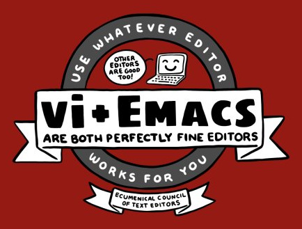
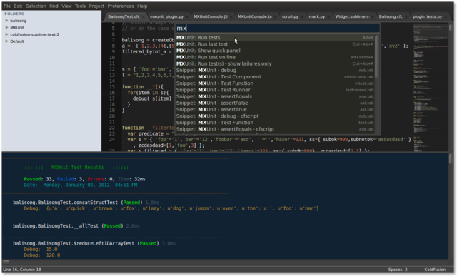
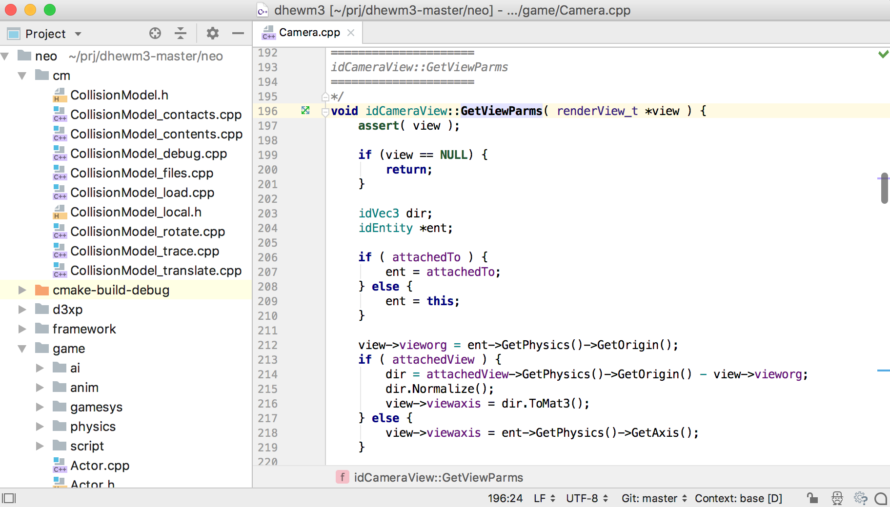

.. _software-environment:

Software Environment
====================

This page describes the software environment you will need to complete your coursework, along with some recommended development tools.

The CS Software Environment
---------------------------

The Department of Computer Science has an officially supported Linux software environment that can be found on the CS Linux login servers and on the Linux machines in the CSIL labs in Crerar. All of these machines run Ubuntu 16.04 and have most of the tools and software libraries required to complete your CS coursework. Unless told otherwise by your instructor, any code you write must compile and run correctly on this software environment.

However, that doesn't necessarily mean that you have to *write* your code on a CS machine (although you're welcome to do so), nor does it mean you have to be physically sitting in front of a CS machine to compile and run your code. There are multiple mechanisms to write your code on your own computer (using other software environments, including Windows and Mac operating systems) and to access a CS software environment remotely, all of which are discussed in the :ref:`working-remotely` page.

The CS Virtual Machine
----------------------

The CS department also provides a virtual machine (VM) that approximates the software environment found in the CS machines. You can find the latest version of the CS virtual machine on `this page <https://howto.cs.uchicago.edu/vm:index>`__, which also includes instructions on how to install and run the VM. Make sure to also check out the `VM FAQ <https://howto.cs.uchicago.edu/vm:faq>`__, which covers a number of common issues when running the VM (including how to deal with a slow/sluggish VM).

Running the VM will effectively run a full Linux operating system from inside your current operating system, and will feel as if you were logging into one of the Linux machines in the CSIL labs. However, take into account that it is possible to run the VM in "Headless Mode", which is more similar to running a Linux *server* inside your computer, which you'll then be able to access following the same steps found in the :ref:`working-remotely` page. This will allow the VM to run faster and consume fewer resources, because you'll be doing your work on your personal computer, and only accessing the VM to compile and run your code. The CS VM documentation also includes `instructions on how to set up the VM in Headless Mode <https://howto.cs.uchicago.edu/vm:headless>`__.

Recommended code editors
------------------------

This section provides a few recommendations on code editors you may want to consider. Some of them are included in the CS machines, but you can also install them on your own computer to write your code there (and then follow the steps found in the :ref:`working-remotely` page to compile and eun your code on a CS machine). All of these tools are available on Windows, Mac, and Linux.

You may find that some people are very opinionated about their choice of editor, and will sometimes `argue passionately <https://en.wikipedia.org/wiki/Editor_war>`__ about why their editor is right and yours is wrong. You should ignore these people and ultimately use whatever editor works best for *you* (and don't judge other people for their choice of editor!)

   *Design by Borja Sotomayor, artwork by Sarah Becan*

Terminal-based editors
~~~~~~~~~~~~~~~~~~~~~~

Terminal-based editors, like `vim <https://www.vim.org/>`__, `Emacs <https://www.gnu.org/software/emacs/>`__, and `nano <https://www.nano-editor.org/>`__ have the advantage of being found on practically every UNIX system and not requiring a graphical desktop, which means they can be used when logging into a machine remotely via SSH, or on older machines that may feel sluggish when running some of the graphical editors we discuss below. They can also be extremely powerful, and can be customized to work with pretty much any programming language under the sun.

Even if you don't use a terminal-based editor as your primary development environment, we recommend building at least some basic familiarity with  vim, Emacs, or nano in case you are ever in a situation where you can only edit a file through a terminal (and can't launch a graphical editor).

Visual Studio Code
~~~~~~~~~~~~~~~~~~

If you want to use a graphical text editor (i.e., one that uses a graphical user interface from the Linux desktop), a popular option is `Visual Studio Code <https://code.visualstudio.com/>`__ (not to be confused with its older sibling, `Visual Studio <https://visualstudio.microsoft.com/vs/>`__). It is more powerful than a regular text editor, with features like syntax highlighting, auto completion, Git integration, plugins that integrate with other tools, etc. but it is not a full-fledged `Integrated Developent Environment <https://en.wikipedia.org/wiki/Integrated_development_environment>`__ (and, as such, is a more lightweight piece of software requiring less resources).

Visual Studio Code is open source software and is available for free.

.. figure:: _static/vscode.png
   :align: center
   :alt: Screenshot of Visual Studio Code

   *Source:* https://code.visualstudio.com/

Sublime Text
~~~~~~~~~~~~

Another popular graphical text editor is `Sublime Text <https://www.sublimetext.com/>`__, which tends to be a bit more lightweight than Visual Studio Code. Please note that Sublime Text is not free: while you can download it and use it for a period free of charge, you will be nagged frequently about paying for a license.

   *Source:* https://commons.wikimedia.org/wiki/File:Sublime_text_mxunit.png

JetBrains IDEs
~~~~~~~~~~~~~~

The next step up from code editors like Visual Studio Code and Sublime Text is to use a full-fledged Integrated Developent Environment (IDE). Besides allowing you to edit code, IDEs usually include build automation tools and integrated debuggers. We recommend checking out the `suite of IDEs <https://www.jetbrains.com/products.html#type=ide>`__ provided by `JetBrains <https://www.jetbrains.com/>`__, including `CLion <https://www.jetbrains.com/clion>`__ for C/C++ development, `PyCharm <https://www.jetbrains.com/pycharm>`__ for Python development, and `IntelliJ IDEA <https://www.jetbrains.com/idea>`__ for Java development.

The JetBrains IDEs are commercial software, but they provide free licenses for students and educators, and some of their IDEs also have community editions that are free to use (but less powerful than the paid version).

   *Source:* https://www.jetbrains.com/clion/

