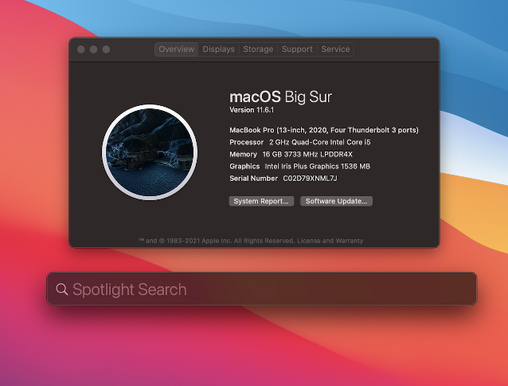
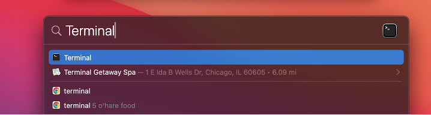
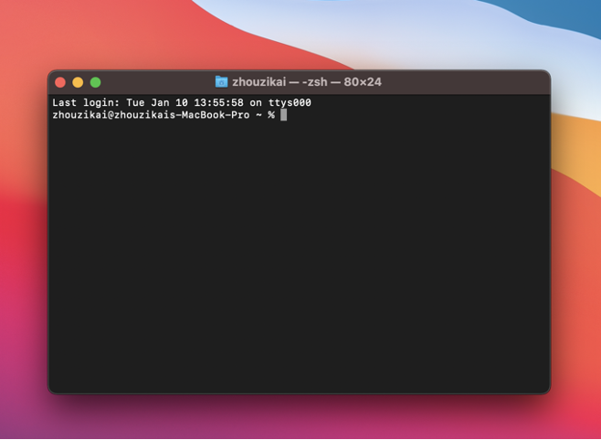
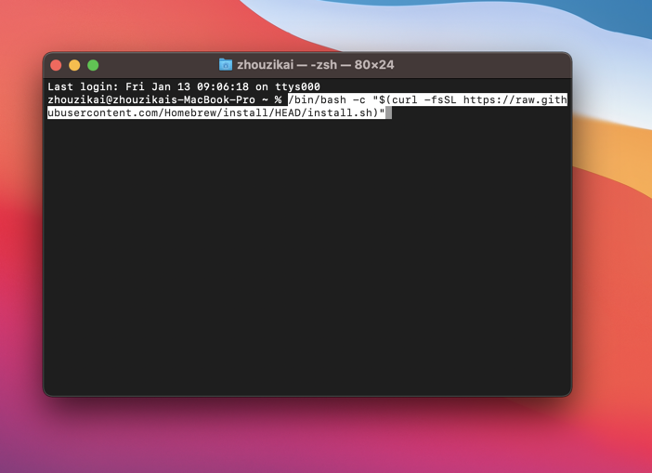
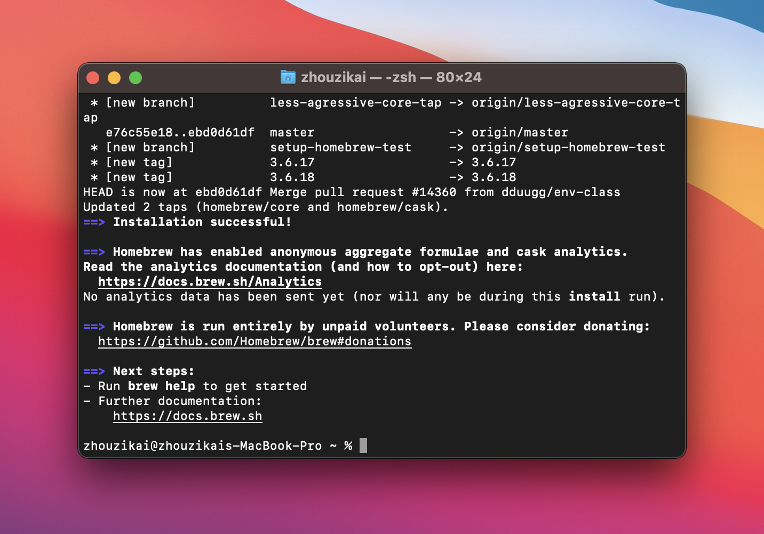
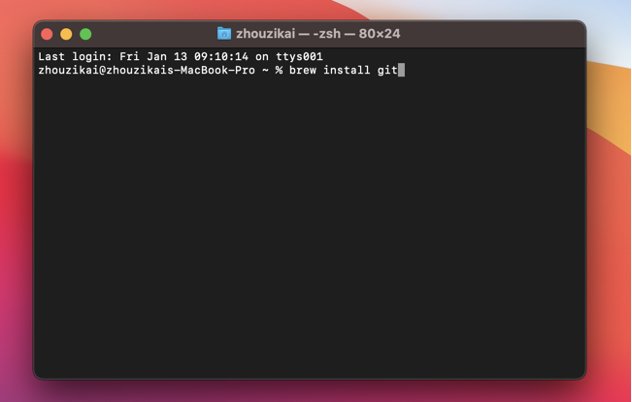
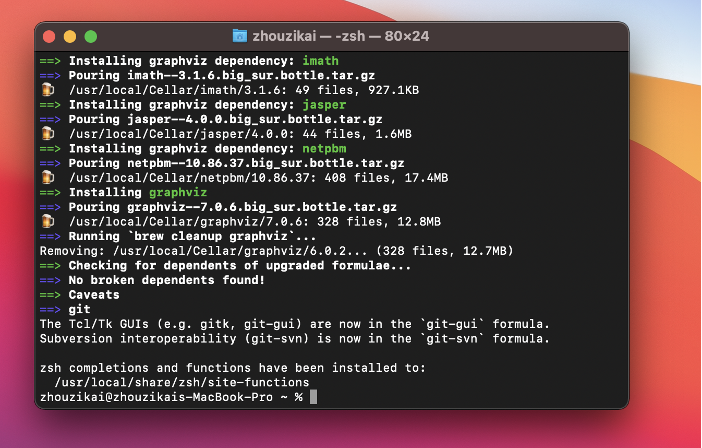
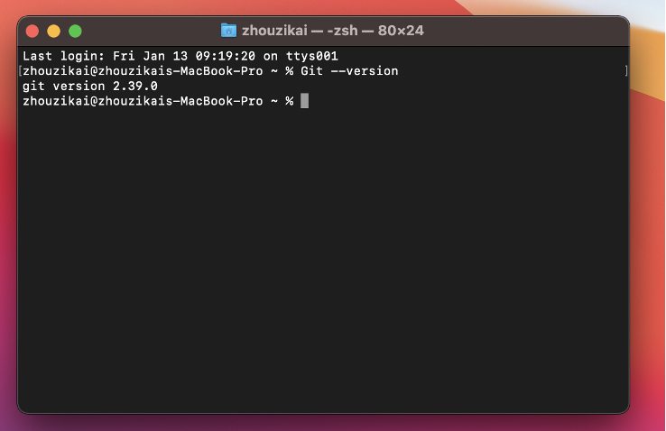
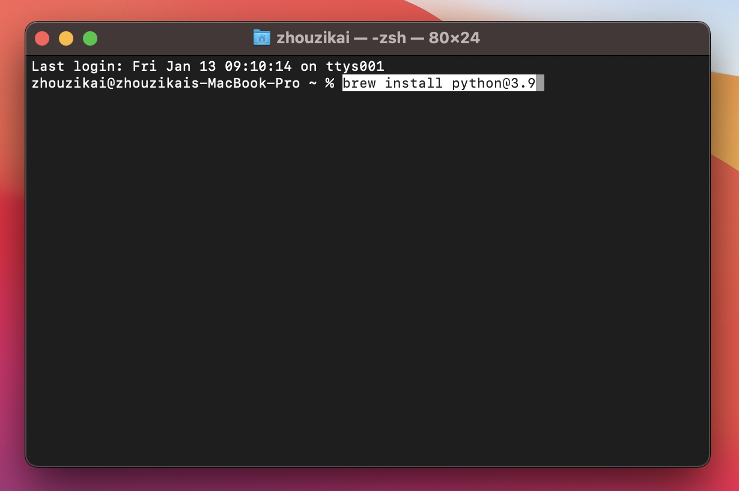
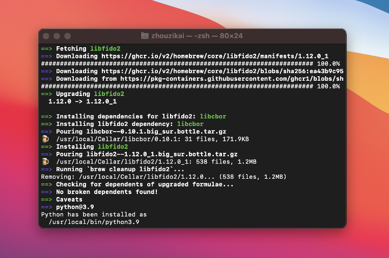

Working on a Mac
================

The following instructions were tested on Big Sur, but should be essentially the same on other versions of MacOS.

Installing Homebrew
-------------------

Homebrew is an useful package manager for MacOS. To install it first press `Command + Space`. This should open a search bar. 

Type "Terminal" in the search bar and open the Terminal application.

Copy and paste the following command to install Homebrew:::

    /bin/bash -c "$(curl -fsSL https://raw.githubusercontent.com/Homebrew/install/HEAD/install.sh)"

You will see a screen similar to the one below. Hit enter to continue. 

Homebrew should install as follows. If it does not succeed, please reach out to the course staff.

Before continuing, please make sure to read the messages printed by the Homebrew installer at the end. It may ask you to run a series of commands to finalize the installation.

Most notably, if you are unable to run the brew command as described below, it likely means you need to run the commands mentioned at the end of the Homebrew installer. You can generally also resolve the situation by running this:::

    export PATH="/opt/homebrew/bin:$PATH" >> ~/.zshrc

And restarting your terminal.

Installing Git
--------------

Before proceeding, make sure you have installed Homebrew on your computer. Once you have installed Homebrew, you can install git by running the following command in the terminal:::

    brew install git

This would run the Git installation process as follows. If it fails, please reach out to the course staff.

You can verify that Git is installed on your computer by typing in `git --version`. If it has been successfully installed, the command will return a version number, as follows.

Installing Python
-----------------

Python may actually already be installed on your computer. To check whether Python is installed, run the following command:::

    python3 --version

If the command succeeds, and the version printed out is 3.10 or higher, you are all set. Just skip straight to the “Cloning Your Repository” section.

If Python is not installed on your computer, you will need to install it. You will be able to do so with Homebrew. On your terminal, run the following:::

    brew install python3

Note that the following demo shows how to install version 3.9 specifically; please ignore the command shown in the screenshot, and make sure you run the command above.

Python 3 should install as follows. 

.. Is this section necessary? We already have VS Code tutorials for both systems elsewhere.
.. Using VSCode
.. ------------

Troubleshooting / FAQs
----------------------

**I get a “command not found” error when running python3 or pip3 (or python3.11/pip3.11)**

    When installing Homebrew, make sure to read the messages printed out at the end of the installation, as they will sometimes ask you to run a few commands to finalize the installation (these commands will make your system aware that Python is now available in your system).

    If you no longer have access to those commands, try running the following:::

        (echo; echo 'eval "$(/opt/homebrew/bin/brew shellenv)"') >> /Users/$USER/.zprofile

        eval "$(/opt/homebrew/bin/brew shellenv)" 

**I installed Python with Homebrew but, if I run “python3 --version”, it still shows an older version.**

    Please follow the same steps as in the previous question. It is likely that you installed Python correctly, but your system is not yet aware that it should use it as a default.

**I get a “command not found” error when running pytest, mypy, or ipython**

    ou may need to run the commands we give you in a slightly different manner:

    *   Instead of python3, run python3.11
    *   Instead of pip3, run python3.11 -m pip
    *   Instead of pytest, run python3.11 -m pytest
    *   Instead of mypy, run python3.11 -m mypy
    *   Instead of ipython, run python3.11 -m IPython
