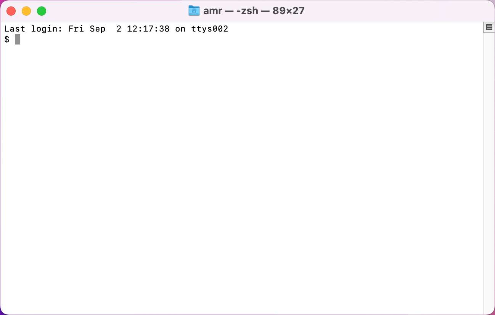
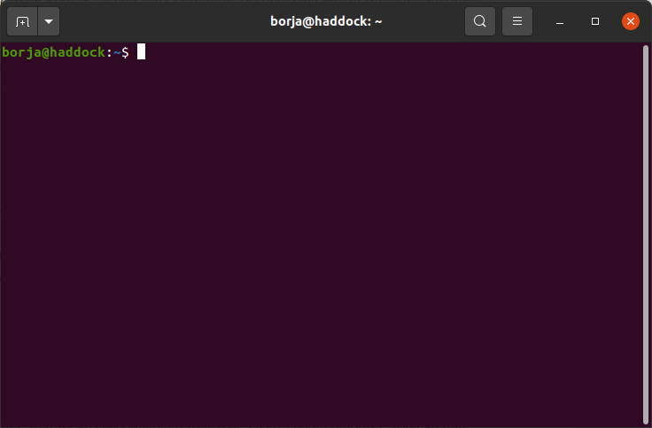
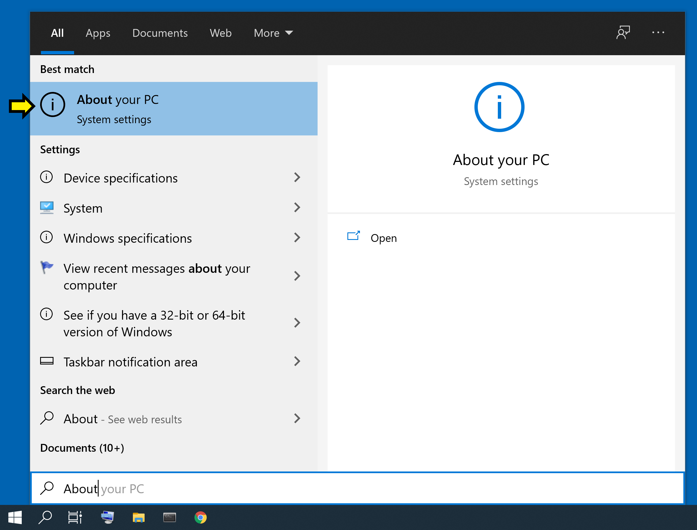
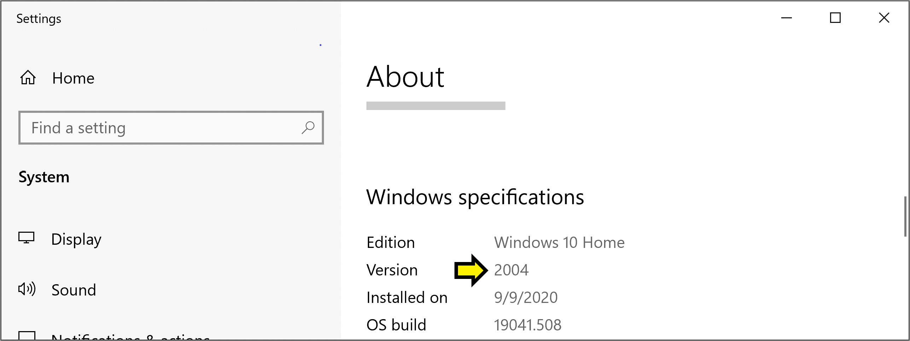
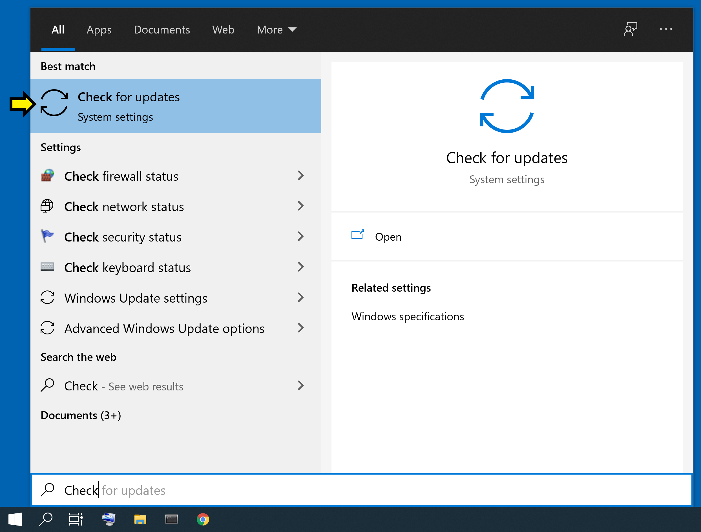
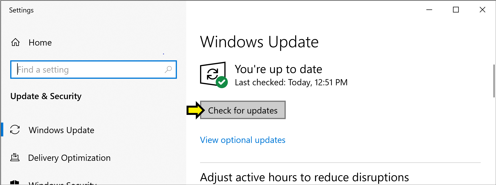
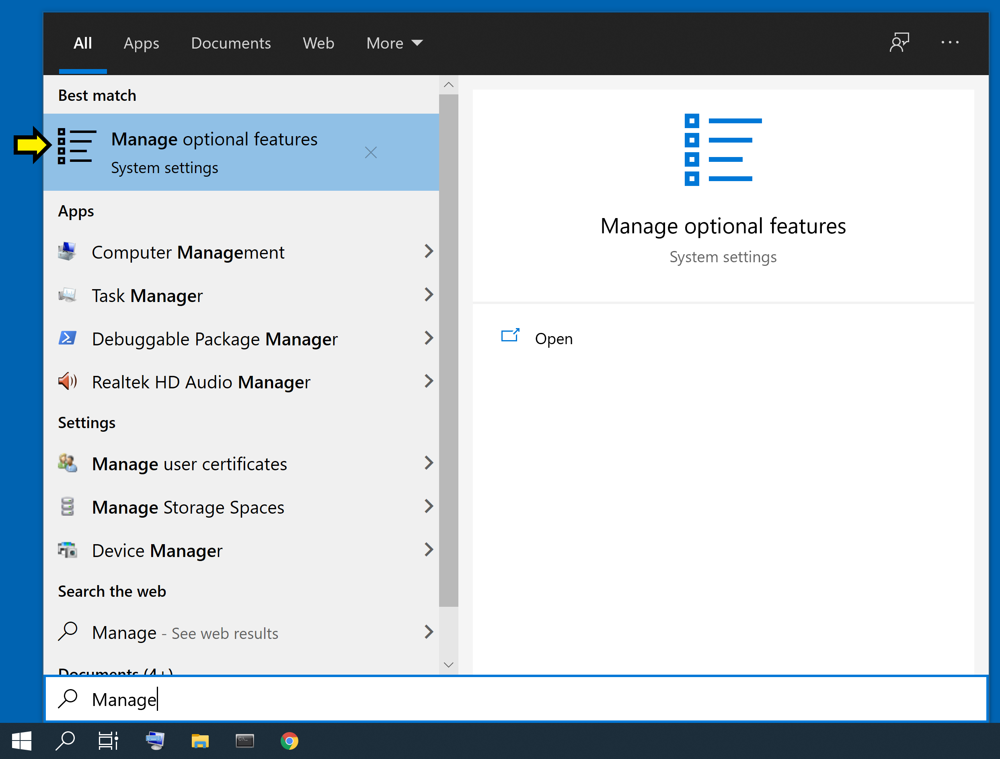
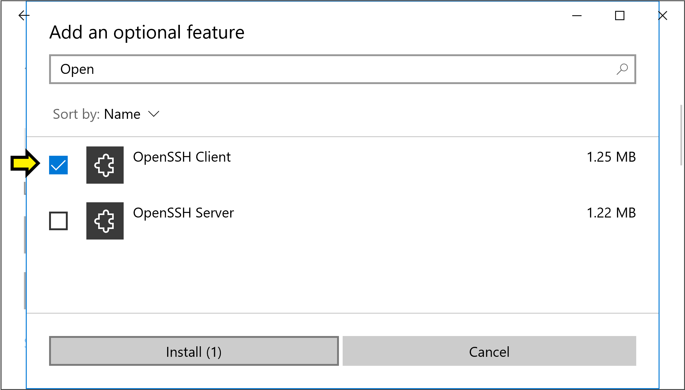
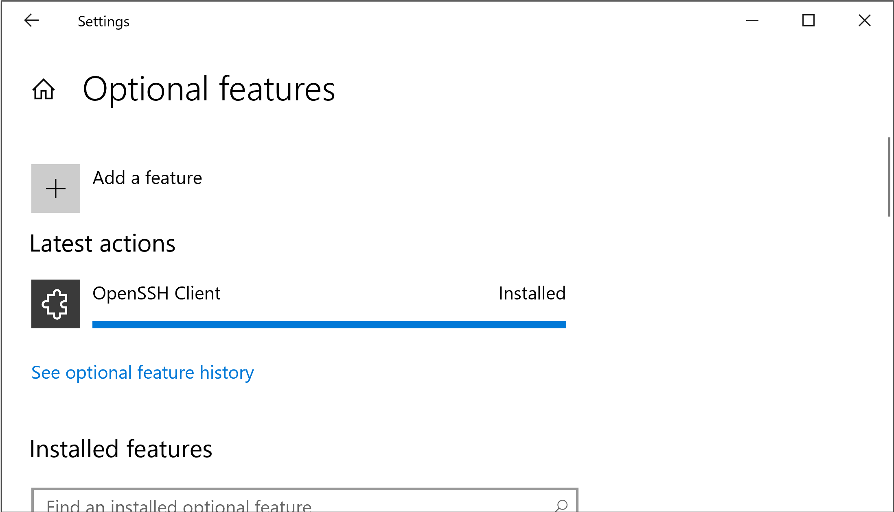

.. _ssh:

Remote SSH Access
=================

A common way of interacting with the CS Linux environment is via **SSH**,
which will allow you to connect to a Linux server from your own personal
computer (which doesn't have to run Linux).

Nowadays, most operating systems include an *SSH client*, so you will likely
not have to install any additional software. We'll start by checking that
you can run the SSH client on your computer (if not, we provide installation
instructions further below in this page).

The first step will be to open one of the following:

- **Windows**: "Command Prompt" or PowerShell
- **MacOS**: Terminal
- **Linux**: Terminal

Try searching for these tools on your operating system (e.g., by using the Start
menu on Windows, or the search icon on MacOS). If you can't find them, try
following one of these instructions:

- **Windows**: `How to Open Command Prompt (Windows 11, 10, 8, 7, etc.) <https://www.lifewire.com/how-to-open-command-prompt-2618089>`__
- **MacOS**: `Open or quit Terminal on Mac <https://support.apple.com/guide/terminal/open-or-quit-terminal-apd5265185d-f365-44cb-8b09-71a064a42125/mac>`__
- **Linux**: In most Linux distributions, pressing Ctrl-Alt-T will open a terminal.

On Windows, the command prompt should look something like this (if you're using the PowerShell,
it will look basically the same, except it will say "PowerShell" at the top):

.. figure:: ssh-img/windows-command-prompt.png

On MacOS, the terminal should look something like this:

On Linux, the terminal should look something like this:

Regardless of the operating system you're using, the command prompt or terminal
will allow you to enter text-based commands. To use SSH to connect to
one of the UChicago CS Linux servers, you will need to type the following,
taking care to replace ``CNETID`` with your CNetID::

    ssh CNETID@linux.cs.uchicago.edu

Press Enter. If you get any sort of error message telling you that there
is no ``ssh`` command available on your computer, that means you will
need to install SSH on your computer. You can find instructions
on how to do this in the "Installing an SSH Client" section below.

If SSH is installed on your computer, the command may first
print out a message like this::

    The authenticity of host 'linuxX.cs.uchicago.edu (128.135.XXX.XXX)' can't be established.
    ECDSA key fingerprint is SHA256:...
    Are you sure you want to continue connecting (yes/no/[fingerprint])?

If so, just type ``yes``.

Then, when prompted for a password, just enter your CNetID password. If your
connection is successful, you may see a series of messages, ending with
this::

    CNETID@linuxN:~$

Where ``CNETID`` will be your CNetID, and ``N`` will be a number between 1 and 7.

If you see the above, you've connected successfully to a UChicago CS Linux server!
If you came to this page from the :ref:`Linux Basics tutorial <tutorial-linux-basics>`,
you should continue working on the tutorial through the SSH connection you just opened.

Installing an SSH Client
------------------------

If your operating system does not have an SSH client installed, please following
the instructions below to install it. Please note that MacOS systems always include
an SSH client, so we have not included instructions on how to install SSH on MacOS.

Windows 10
~~~~~~~~~~

In these instructions, you will open various applications and settings by searching for them. To do this, open the Start menu by pressing the Windows key on the keyboard, or clicking the Windows icon in the corner of your screen. Begin typing the name of the application or setting, like *About your PC* (even though there is no visible search bar, one will appear when you begin typing). When the *About your PC* option appears, click on it.

**Checking your version of Windows 10**

You need to be running a recent version of Windows 10. To check your current version, open the Start menu, begin typing *About your PC*, and click on the option when it appears.

Scroll down to the heading *Windows specifications*. Next to *Edition*, you should see *Windows 10 Home* or *Windows 10 Pro* (or similar).

Below that you should see *Version* and a number like 2004. If this number is less than 1803, then you need to update Windows 10.

**Updating Windows 10**

To update Windows 10, open the Start menu, begin typing *Check for updates*, and click on the option when it appears.

The window that opens should have the heading *Windows Update*. It may tell you that you have updates avialable; otherwise, click the button that says *Check for updates*.

Follow the instructions to install the available updates. This may take a few minutes, and your computer may restart. When the update completes, check your version of Windows 10 again, and verify that it now reads as 1803 or greater.

**Installing Windows OpenSSH Client**

Open the Start menu, begin typing *Manage Optional Features*, and click the option when it appears.

You should see a window that looks like this, with the heading *Optional features*.

.. figure:: ssh-img/install-ssh-win10-6.png

Scroll through the list of *Installed features*. If *OpenSSH Client* appears in the list, you are done with this step. Otherwise, click on *+ Add a feature* at the top of the page. You will get a pop-up window with the heading *Add an optional feature*. Start typing *OpenSSH Client*. When the option appears, click on the checkbox next to it.

Then click on the button labeled *Install (1)*. Wait for the progress bar to fill.

The installation is complete. You should now re-try the instructions at the top of this page.

Linux
~~~~~

Linux systems typically include an SSH client but may occasionally not include one.
The exact process to install the client may vary from one Linux distribution to another,
but the following commands should allow you to install SSH in some of the most popular
Linux distributions out there:

- **Debian/Ubuntu**: Run ``sudo apt-get install openssh-client``
- **RHEL/Fedora/CentOS**: Run ``sudo yum install openssh-clients``

Once you've installed SSH, you should re-try the instructions at the top of the page.