Using Visual Studio Code and SSH
********************************

Visual Studio Code (VS Code) is a text editor that is particularly well suited for programming in a variety of languages, including Python. It also provides a way to remotely connect to the Linux computers on campus, via SSH (Secure Shell). You can use it to do your work for CS 121, and you should especially consider it if the :ref:`virtual_desktop` is running slowly for you.

This document covers installing the software you need, and how to use Visual Studio Code and SSH for this class.

Installation
============

Step 1: Install Visual Studio Code
----------------------------------

Follow the instructions for your operating system:

Windows
~~~~~~~

Go to https://code.visualstudio.com/. You should see a blue button labeled *Download for Windows, Stable Build*.

.. figure:: code-img/install-code-win-1.png

Click this button to download. Once it is downloaded, run the installer (``VSCodeUserSetup-<version>.exe``).

After you accept the licence agreement, click *Next >*. On the page titled *Select Additional Tasks*, we recommend you check all the boxes (but it is up to you).

.. figure:: code-img/install-code-win-2.png

Click *Next >*, then click *Install*. When the progress bar fills, click *Finish*.

macOS
~~~~~

Go to https://code.visualstudio.com/. You should see a blue button labeled *Download for Mac, Stable Build*.

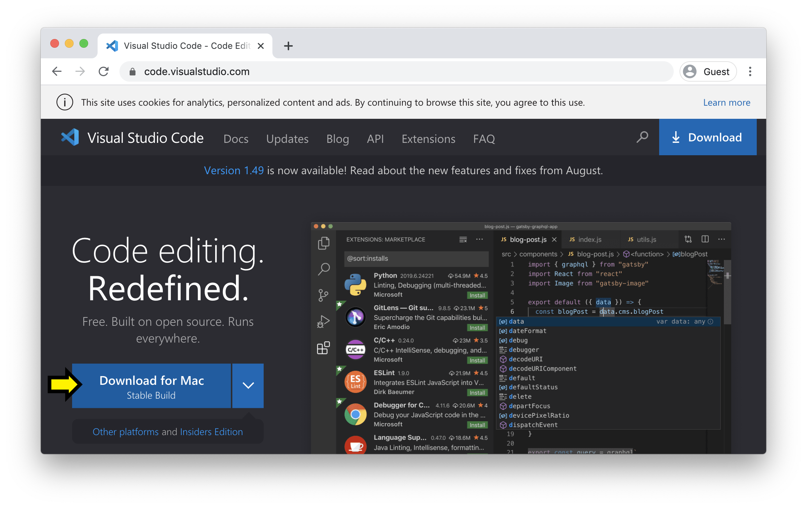

Click on this button to download. When the download is complete, you will have a new application file called *Visual Studio Code* (You might instead have zip file, with a name like ``VSCode-darwin-stable.zip``; in this case, open the file to unzip it, and the *Visual Studio Code* application file should appear). Open a *Finder* window and navigate to *Downloads* (it will likely be listed under "Favorites" in the left sidebar). Locate the file named *Visual Studio Code*, and drag it on top of *Applications* in the left side bar.

.. figure:: code-img/install-code-mac-2.png

Now, you can find VS Code in your Applications folder, and can open it with a click.

Linux
~~~~~

Go to https://code.visualstudio.com/download to view installation options.

Step 2: Install an SSH client
-----------------------------

Follow the instructions for your operating system:

Windows 10
~~~~~~~~~~

*These instructions are specific to Windows 10. If you are running Windows 7 or Windows 8, please contact us on Ed Discussion for instructions.*

In this step, you will install Windows OpenSSH Client.

For this step, you will open various applications and settings by searching for them. To do this, open the Start menu by pressing the Windows key on the keyboard, or clicking the Windows icon in the corner of your screen. Begin typing the name of the application or setting, like *About your PC* (even though there is no visible search bar, one will appear when you begin typing). When the *About your PC* option appears, click on it.

**Checking your version of Windows 10**

You need to be running a recent version of Windows 10. To check your current version, open the Start menu, begin typing *About your PC*, and click on the option when it appears.

.. figure:: code-img/install-ssh-win10-1.png

Scroll down to the heading *Windows specifications*. Next to *Edition*, you should see *Windows 10 Home* or *Windows 10 Pro* (or similar).

.. figure:: code-img/install-ssh-win10-2.png

Below that you should see *Version* and a number like 2004. If this number is less than 1803, then you need to update Windows 10.

**Updating Windows 10**

To update Windows 10, open the Start menu, begin typing *Check for updates*, and click on the option when it appears.

.. figure:: code-img/install-ssh-win10-3.png

The window that opens should have the heading *Windows Update*. It may tell you that you have updates avialable; otherwise, click the button that says *Check for updates*.

.. figure:: code-img/install-ssh-win10-4.png

Follow the instructions to install the available updates. This may take a few minutes, and your computer may restart. When the update completes, check your version of Windows 10 again, and verify that it now reads as 1803 or greater.

**Installing Windows OpenSSH Client**

Open the Start menu, begin typing *Manage Optional Features*, and click the option when it appears.

.. figure:: code-img/install-ssh-win10-5.png

You should see a window that looks like this, with the heading *Optional features*.

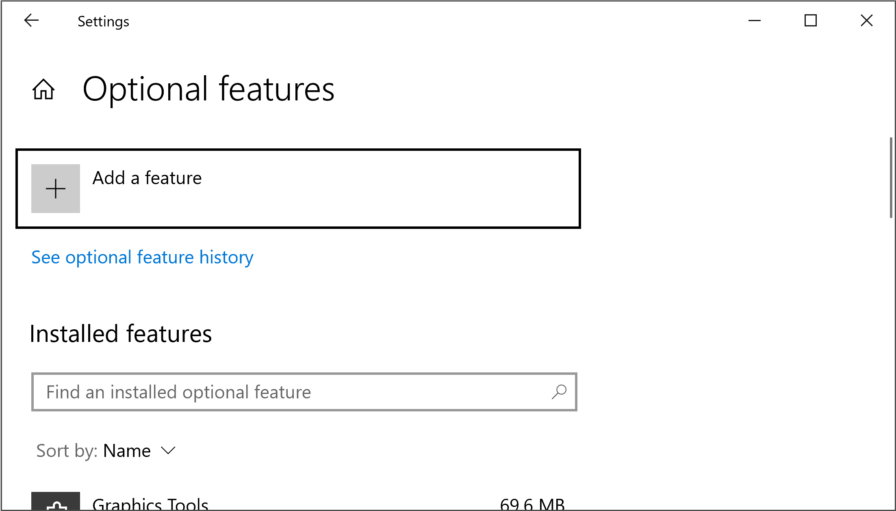

Scroll through the list of *Installed features*. If *OpenSSH Client* appears in the list, you are done with this step. Otherwise, click on *+ Add a feature* at the top of the page. You will get a pop-up window with the heading *Add an optional feature*. Start typing *OpenSSH Client*. When the option appears, click on the checkbox next to it.

.. figure:: code-img/install-ssh-win10-7.png

Then click on the button labeled *Install (1)*. Wait for the progress bar to fill.

.. figure:: code-img/install-ssh-win10-8.png

The installation is complete.

.. Does this process add ssh to the PATH?

**Checking that the installation was successful**

Open the Start menu, begin typing *Windows PowerShell*, and click on the option when it appears.

.. figure:: code-img/install-ssh-win10-9.png

Note that Windows PowerShell looks similar to the Linux terminal, even though is *not* the same as the Linux terminal. At the prompt, type

::

    ssh username@linux.cs.uchicago.edu

where ``username`` should be replaced by your CNetID.

.. figure:: code-img/install-ssh-win10-10.png

You should be prompted for your password. If you are not, check that you followed the SSH installation steps correctly, and try again. If you are still not prompted for your password, ask us about it on Ed Discussion.

Type the password associated with your CNetID and press enter (nothing will appear on the screen as you type your password, but this is normal; your keypresses are still being registered).

You should see a message about when you last logged on, followed by a prompt that looks like

::

    username@linuxX:~$

where ``username`` is replaced by your CNetID, and `X` is replaced by a number from 1 to 5. You are now connected to the Linux computers on campus. Try running a few terminal commands, like ``pwd``, ``ls`` and ``cd``.

Type ``logout`` and press enter to close your connection to the campus Linux computers. Type ``exit`` again and press enter to exit Windows PowerShell.

macOS
~~~~~

An SSH client comes pre-installed. However, you should check that it works as expected before moving on.

Press Command-Space to open Spotlight Search. Begin typing *Terminal*, and click on the option when it appears.

.. figure:: code-img/install-ssh-mac-1.png

At the prompt, type

::

    ssh username@linux.cs.uchicago.edu

where ``username`` should be replaced by your CNetID.

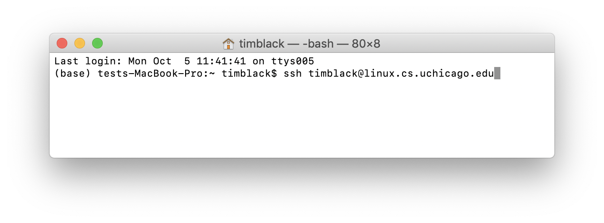

You should be prompted for your password. Type the password associated with your CNetID and press enter (nothing will appear on the screen as you type your password, but this is normal; your keypresses are still being registered).

You should see a message about when you last logged on, followed by a prompt that looks like

::

    username@linuxX:~$

where ``username`` is replaced by your CNetID, and `X` is replaced by a number from 1 to 5. You are now connected to the Linux computers on campus. Try running a few terminal commands, like ``pwd``, ``ls`` and ``cd``.

Type ``logout`` and press enter to close your connection to the campus Linux computers and return to your own computer's terminal prompt.

Linux
~~~~~

.. These instructions are essentially copied from https://code.visualstudio.com/docs/remote/troubleshooting#_installing-a-supported-ssh-client .

Debian/Ubuntu: Run ``sudo apt-get install openssh-client``

RHEL/Fedora/CentOS: Run ``sudo yum install openssh-clients``

After installing, you should verify that you can connect to the Linux computers on campus. In the terminal, type,

::

    ssh username@linux.cs.uchicago.edu

where ``username`` is replaced by your CNetID. You should be prompted for the password associated with your CNetID. Then you should be able to run terminal commands on the campus Linux computers.

Step 3: Install Extensions for VS Code
--------------------------------------

At this point, Visual Studio Code should be among your installed applications. Open it. In the left sidebar, there is an icon consisting of four squares, with one square separated off from the other three. This is the icon for VS Code extensions. Click it (alternatively, you can press Ctrl-Shift-X, or Command-Shift-X on macOS).

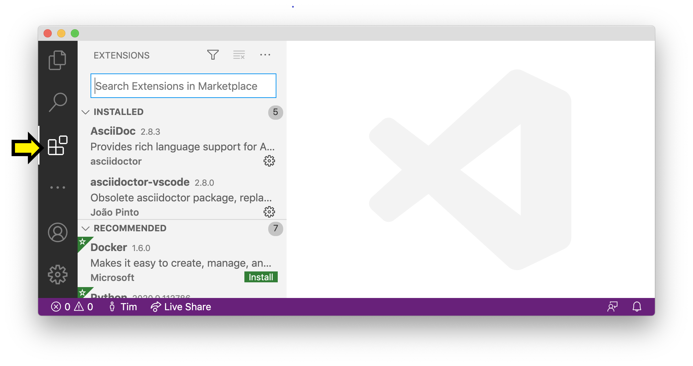

This opens the *Extensions* panel. From here, you can search for and install extensions. You should install the following extensions:

- Python (Microsoft)

- Remote - SSH (Microsoft)

To do this, click in the search bar ("Search Extensions in Marketplace") and start typing the name of the extension. When it appears, make sure the name and publisher matches exactly, and click *Install*.

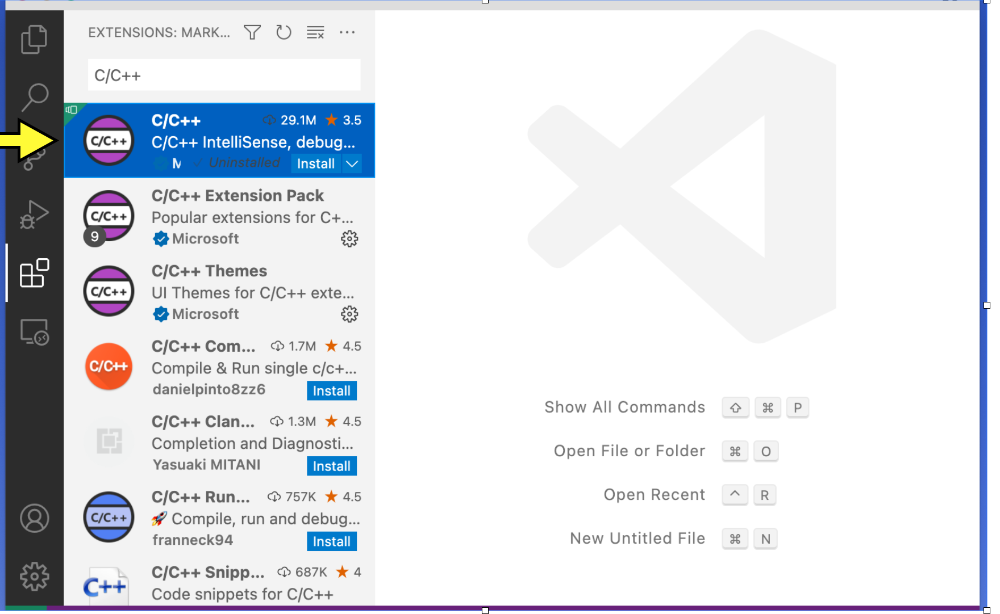

.. figure:: code-img/install-ext-3.png

Using Visual Studio Code and SSH
================================

You will be able to use Visual Studio Code to replicate the two most important features from the Virtual Desktop. You will be able to remotely connect to the Linux computers on campus to (1) use the terminal (to execute shell commands, run Python code, and conduct automated tests), and (2) edit text files (usually Python code).

Open Visual Studio Code now.

Remotely connecting to the CS Department Linux computers
--------------------------------------------------------

**Initial setup**

You only need to follow the steps in this section once (or more accurately, once per computer). If you've already done this part, you can continue to "Connecting".

In the lower-left corner of VS Code, there should be a rectangle with an icon that looks like *><*, but skewed. In the example images, it is green, but depending on the color scheme you select for VS Code, it may be purple, or a different color. If you do not see this icon, check that you have completed *all* the installation steps above. Click on this icon.

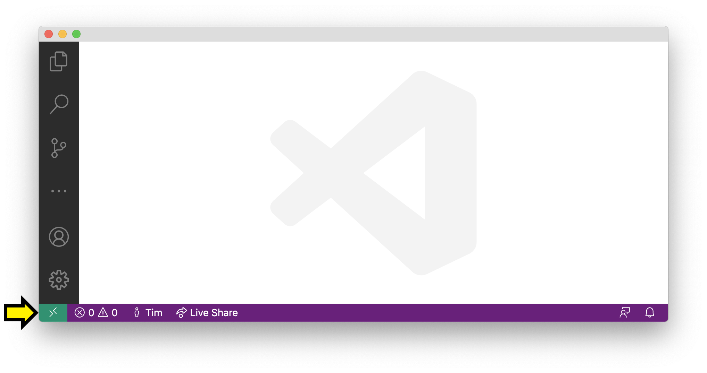

In the menu that appears, click *Remote-SSH: Connect to Host...* (Note: this may appear just as "Connect to Host...")

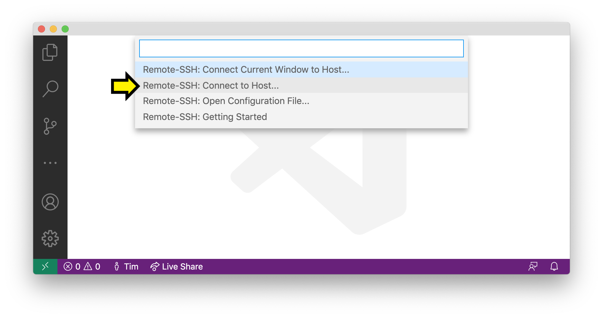

You should see the heading *Select configured SSH host or enter user@host*.

Click *+ Add New SSH Host...*.

A textbox will appear with the heading *Enter SSH Connection Commnand*. The
command you use will depends on the *first letter of your last name*:

+----------------------------------+-----------------------------------------+
| If your last name starts with... | Use this command:                       |
+==================================+=========================================+
| A-C                              | ``ssh username@linux1.cs.uchicago.edu`` |
+----------------------------------+-----------------------------------------+
| D-G                              | ``ssh username@linux2.cs.uchicago.edu`` |
+----------------------------------+-----------------------------------------+
| H-K                              | ``ssh username@linux3.cs.uchicago.edu`` |
+----------------------------------+-----------------------------------------+
| L                                | ``ssh username@linux4.cs.uchicago.edu`` |
+----------------------------------+-----------------------------------------+
| M-R                              | ``ssh username@linux5.cs.uchicago.edu`` |
+----------------------------------+-----------------------------------------+
| S-V                              | ``ssh username@linux6.cs.uchicago.edu`` |
+----------------------------------+-----------------------------------------+
| W-Z                              | ``ssh username@linux7.cs.uchicago.edu`` |
+----------------------------------+-----------------------------------------+

Enter the appropriate command, replacing ``username`` with your CNetID, and press Enter.

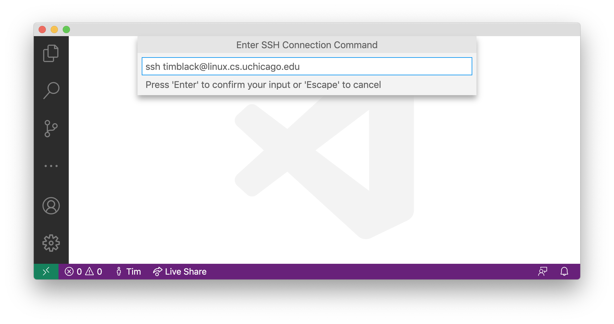

Next, you will see the heading *Select SSH configuration file to update*. Press enter to select the first option (which should contain the string "User" or "home").

You are ready to connect.

**Connecting**

Click the green rectangle in the lower-left corner with the *><* icon. Click *Remote-SSH: Connect to Host...*. You should see the heading *Select configured SSH host or enter user@host*. This time, you should see the option *linuxN.cs.uchicago.edu*, where *N* is a number between 1 and 7 (if not, you should retry "Initial Setup"). Click on this option.

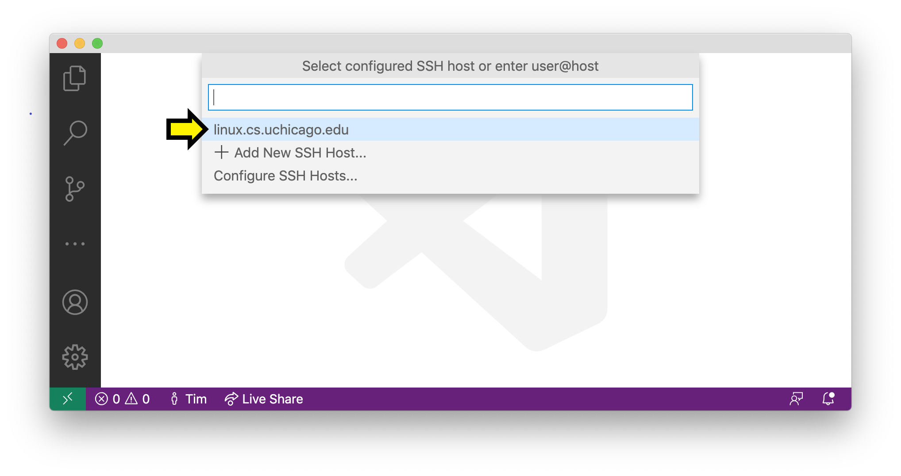

A new VS Code Window will open. After a moment, you will see a pop-up.

You may see a message starting with "linuxN.cs.uchicago.edu has fingerprint..." and asking "Are you sure you want to continue?". You can safely select "Continue" here.

You may see a pop-up prompting *Select the platform of the remote host*; if so, click *Linux*. You will then see a box with the heading *Enter password for username@linux.cs.uchicago.edu* (with *username* replaced by your CNetID). Enter the password corresponding to your CNetID, and press enter.

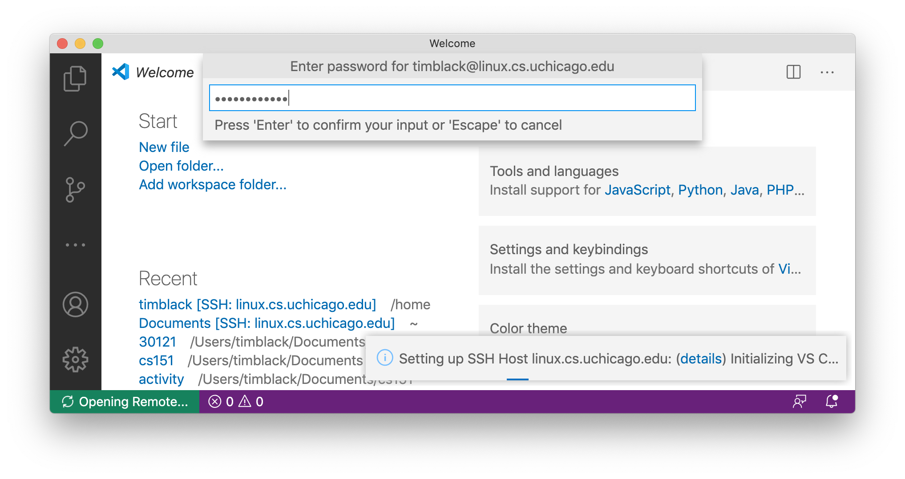

If the connection is not successful, you may be given an option to try again; click *Retry*.

If you succeed at connecting, there will be a green box in the lower-left corner of the window with the text *SSH: linuxN.cs.uchicago.edu*.

.. figure:: code-img/connect-8.png

**Getting Disconnected**

If at any point you get disconnected from the server unintentionally, this will be indicated in the green box in the lower-left corner (with text such as "Disconnected from SSH").

.. figure:: code-img/connect-9.png

VS Code may show a pop-up asking if you want to reconnect. You can follow the prompts to reconnect. If that does not work, go back and follow the steps under *Connecting* again.

If you would like to disconnect from the server intentionally, click the green box in the lower-left corner with the text *SSH: linuxN.cs.uchicago.edu*, then click *Close Remote Connection*.

Using the terminal
------------------

Have your VS Code window open, and check that you are connected to SSH. Open the *View* menu from the menu bar and click *Terminal* (as a shortcut, you can instead press Ctrl-Backtick, even on macOS). This will split the window into two panes. The top pane will be empty for now (or may have some "welcome" text). The bottom pane has the terminal.

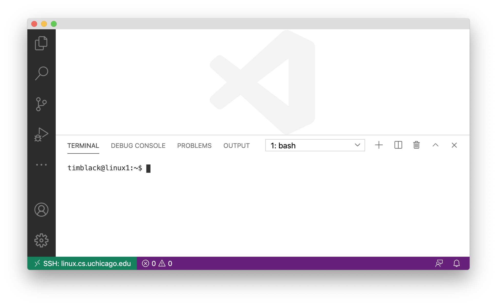

You will see the bottom pane has several tabs: *Terminal*, *Debug Console*, *Problems*, and *Output* (if your window is narrow, some of these may be hidden under a three-dots menu icon). We only care about *Terminal* for now, so make sure that is selected. To the right of these tabs, you will see a dropdown menu and some additional icons. You will use these later, but you won't need them for now.

In the body of the bottom pane, you will see a Linux prompt of the form

.. code-block:: bash

    username@linuxN:~$

Where ``N`` will be a number between 1 and 7.

Editing text files
------------------

When you get down to the section of the Virtual Linux lab titled `Using an Editor <../labs/lab0/index.html#using-an-editor>`__, you will see it asks you to open a file in the editor by running

.. code-block:: bash

    code test.txt

If you are using VSCode in your machine, and connecting to a Linux server via SSH, you can
run that same command to open a file from the terminal into your VSCode.

You *can* run this command (so if you had previously completed the lab up to this point, you can now continue). You will see the file open in the top pane of your VS Code window.

.. figure:: code-img/connect-11.png

Working with VS Code via SSH works almost the same as using VS Code from CSIL or on the virtual desktop (except if you are using macOS, replace Ctrl with Command in most shortcuts --- so Command-s instead of Ctrl-s). When you save, you are saving to the Linux computers on campus (it may take a few moments). Make sure to save often!

.. admonition:: Optional Note

   When you use VSCode in CSIL (or the Virtual Desktop) or with SSH from your computer, the effect is the same: you are opening files stored on the Linux computers on campus, not files stored locally on your own computer. While not necessary for this class, it is also possible to use the ``code`` command in your computer's own terminal to open files on your own computer (or just to launch VS Code).

    To enable this feature...

    - *...on Windows:* This feature is enabled by default. If you are familiar with Windows PowerShell or Command Prompt, you can open VS Code by typing ``code`` at the prompt. If you are not familiar with Windows PowerShell or Command Prompt, you do not need to learn them for this class; while they look a bit like the Linux terminal, they use different commands.

    - *...on macOS:* Open VS Code, then press Command-Shift-P to open the Command Palette. Begin typing *Shell Command: Install 'code' command in PATH*, and click on the option when it appears. From this point on, you will be able to open VS Code from the macOS terminal by typing ``code``.

Running multiple instances of the terminal
------------------------------------------

When working on assignments, you will want to have two instances of the terminal running, one for testing code by hand, and the other for running automated tests.

Make sure you are connected to SSH, and open the Terminal pane if is not yet open. To the right of the tab names (*Terminal*, *Debug Console*, etc.), you will see a dropdown menu and some icons. Here is what these do:

- The dropdown menu lets you select between the instances of the terminal that you currently have running. Right now, *1: bash* will be selected. Right now, we only have one instance of the terminal running, but...

- Clicking the *+* icon allows you to create a new instance of the terminal (the equivalent of opening another terminal window).

- To the right of this is an icon of a rectangle divided vertically in half; this allows you to see two terminal instances at once. You probably do not need to use this.

- Next is an icon of a trash can; clicking this will close the current terminal instance.

- Clicking the *^* icon will allow the terminal pane to take up the entire window.

- Clicking the *x* will close the terminal pane.

Troubleshooting
---------------

If you run into issues with VSCode and SSH, please make sure to check out
the troubleshooting guide prepared by the CS Techstaff: https://howto.cs.uchicago.edu/techstaff:vscode