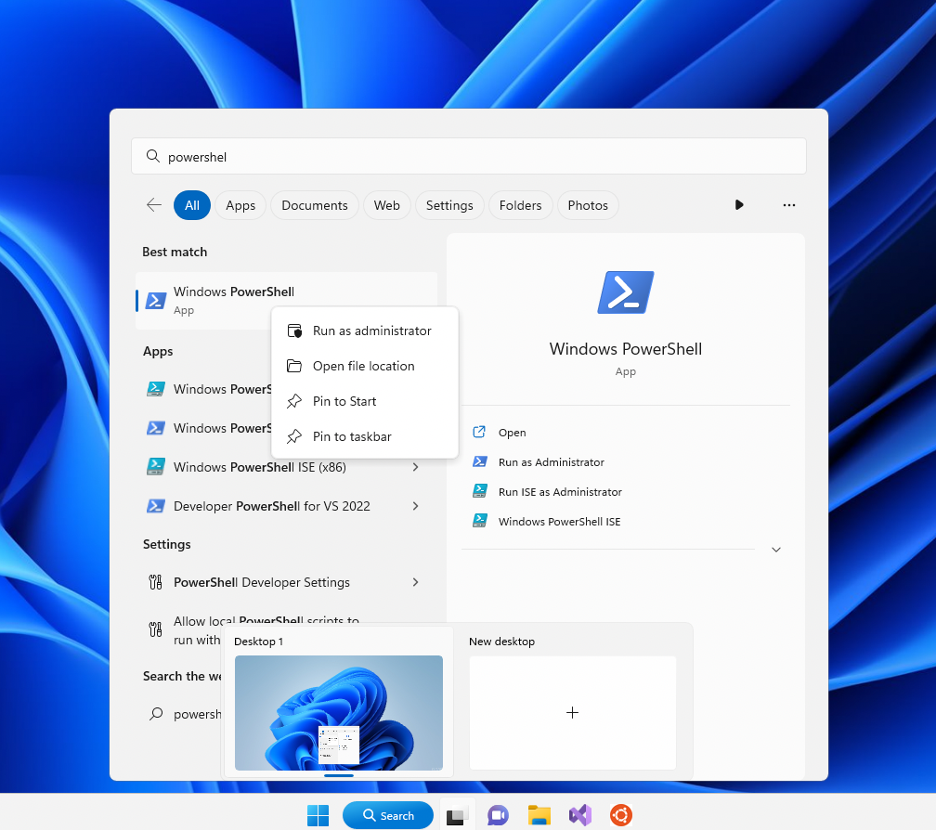
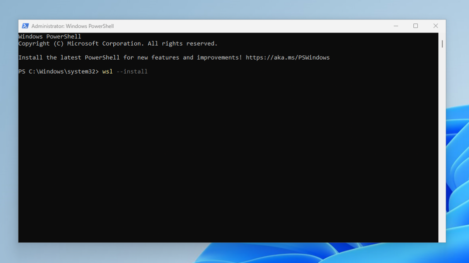
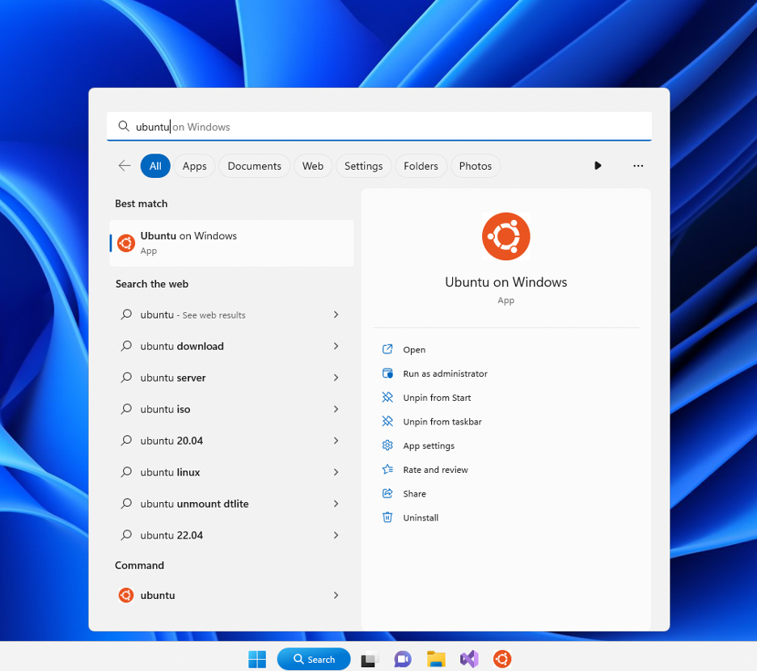
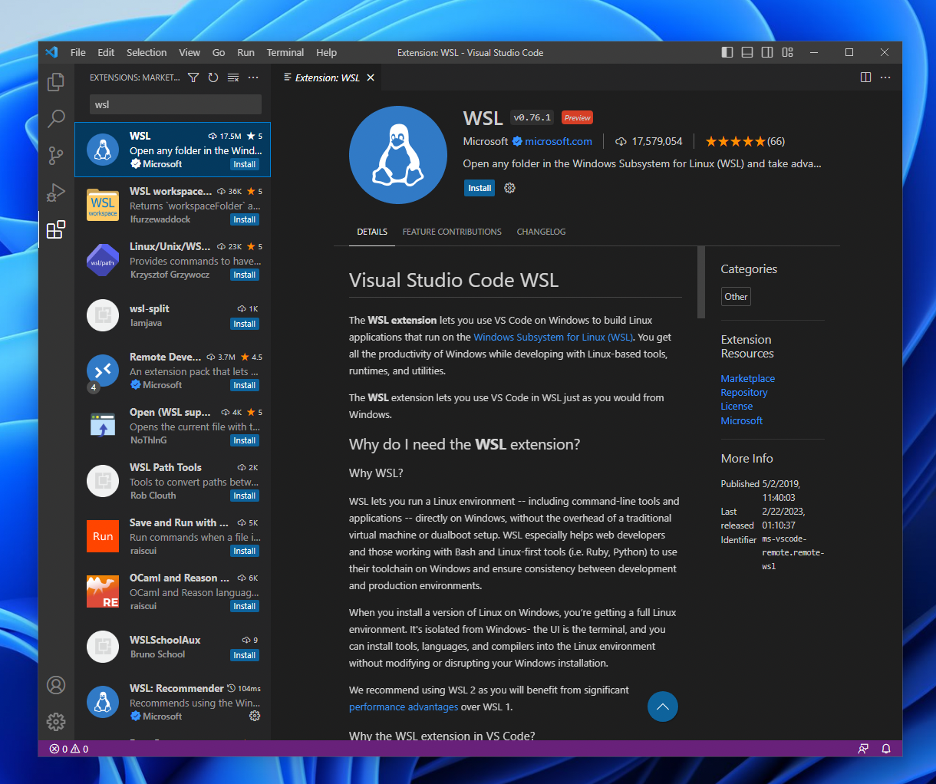
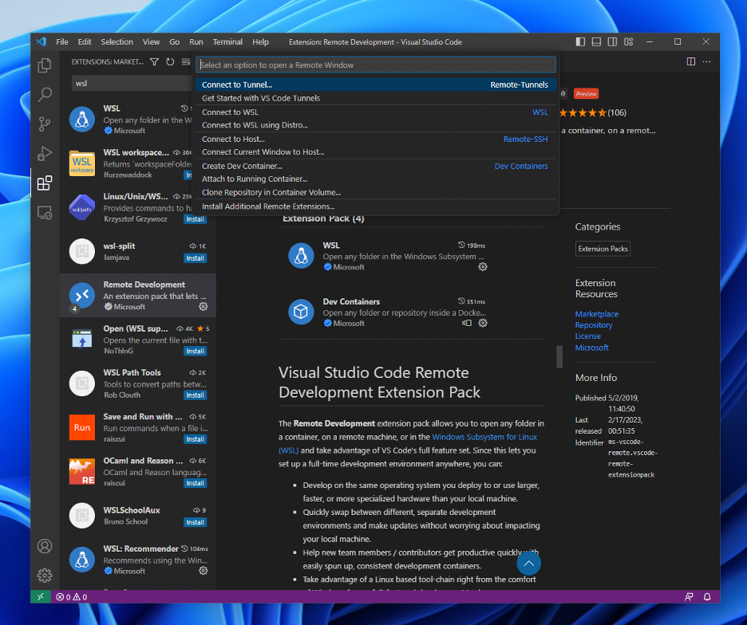

Working on Windows
==================

Installing WSL
--------------

The Windows Subsystem for Linux (WSL) is a feature on Windows that allows users to run a Linux environment without the need for a virtual machine or a dual boot. We recommend that you install WSL on your local machine so that you may have your own working environment for this and future classes (many of which will expect you to have access to a Linux system).

To install WSL, first check the operating system of your machine. If you are using Windows 10 or 11, open Powershell in administrator mode:

and type the following command:::

    wsl --install

It should look like this:

After running the command, make sure to restart your machine.

If you are using earlier versions of Windows, follow the instructions `here <https://learn.microsoft.com/en-us/windows/wsl/install-manual>`_ for a manual installation.

To run WSL, open Powershell and run the following command:::

	wsl

Alternatively, you may open WSL by looking up the name of the Linux distribution used by WSL (Ubuntu) on the Windows home search.

The first time you run WSL, a terminal window will open and you will be asked to wait for files to decompress and be stored on your machine. All future launches should take less than a second.

Installing Git
--------------

Git generally comes pre-installed in most WSL distributions. To check if Git is installed on your subsystem, run the following command:::

	git --version
	

If the command fails, you can install Git using the following command:::

	sudo apt update
	sudo apt install git

Installing Python
-----------------

To install Python, run the following command:::

	sudo apt-get update
    sudo apt-get install python3

We recommend the use of Python 3.8 or higher, to match the version that is running on the CS Linux Servers.

Please note that an alternate way of running Python on Windows is through a software package called Anaconda. Please **do not** use Anaconda in this class, as some of the instructions we provide may not work with Anaconda. Using WSL ensures that you are using a Linux system, which means all the instructions we provide for the CS Linux Servers should work just as well (or, at most, with very minor changes) on your Windows machine with WSL.

Using VSCode + WSL
------------------

To use VSCode with WSL, it is necessary to install the WSL extension. To install it, open VSCode and go to the extensions panel. In the search bar, type in "WSL." Among the first results should be an extension called "WSL" developed by Microsoft. Install the extension.

Once the extension is installed, you will see a green icon in the bottom left corner to connect to a subsystem. Click on that and select your WSL instance. Note that while you are running VSCode with WSL, you may need to reinstall some extensions. VS Code will display a warning icon if that is the case.

Troubleshooting / FAQs
----------------------

**When running git/python3/pip3/pytest/etc., I get an error message telling that it is “not recognized as the name of a cmdlet, function, script”**

    You will get this error message if you try to run any of these commands in the Windows command prompt or PowerShell. Please note that you must run all these commands inside a WSL terminal.

**I get a “command not found” error when running pytest, mypy, or ipython**

    You may need to run the commands we give you in a slightly different manner:

    *   Instead of pytest, run python3 -m pytest
    *   Instead of mypy, run python3 -m mypy
    *   Instead of ipython, run python3 -m IPython
    