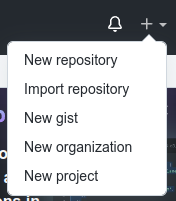

.. _tutorial-git-basics:

Tutorial - Git Basics
=====================

In many of your CS classes, you will use a system called Git to manage code. 
In a nutshell, you can think of Git as a system for tracking changes to your code, storing your code on a remote server, 
sharing your code with the course staff, and, eventually, in later courses, internships, and jobs, for working collaboratively with others.

More specifically, Git is a version control system that maintains files in a 
repository that contains not just files, but also a record of all the changes made 
to those files. Using Git, we can (logically) encapsulate a set of changes---creating 
a new file, changing one or more existing files, etc---into a revision or a *commit* and 
track a sequence of commits over time. You can think of a commit as a checkpoint that 
represents the work done since the previous checkpoint. 
This mechanism makes it possible to look at and even revert to older versions of a file by going back to your code 
as it was when you “checkpointed” it with a commit.

In this tutorial, you will first learn the basics of using Git to
manage a collection of files locally and then you will learn how to
take advantage of remote servers, such as **GitHub**, to backup your
work and share it with others.

Where to Run This Tutorial
--------------------------

This tutorial needs to be completed on a CS Linux server.  If you are
not already logged in, open a terminal window and log into one of CS
Linux servers using SSH.  (If your course has a bank of servers
assigned to it, make sure to use your assigned server.)  More
information on SSH can be found in the `Remote SSH Access <https://uchicago-cs.github.io/student-resource-guide/environment/ssh.html>`__ tutorial.

Once you are logged in to your CS Linux server run::

  $ cd

to ensure that you are in your home directory. (Recall that we use
``$`` to indicate work to be done at the Linux command line.)

Configuring Git
---------------

Before creating your first repository, it is a good idea to register
your name and email address with Git using the following commands::

  $ git config --global user.name "YOUR NAME"
  $ git config --global user.email "YOUR UCHICAGO EMAIL ADDRESS"

Replace ``"YOUR NAME"`` with your name in quotes in the first command
and ``"YOUR UCHICAGO EMAIL ADDRESS"`` with your UChicago email address
in quotes in the second command.

Git stores this information in a hidden file named ``.gitconfig`` in your
home directory. You can see the contents of this file using the command::

  $ cat .gitconfig

or you can run the command::

  $ git config --list

The output from this command may include a few other values. You can
ignore them.

Verify that your name (``user.name``) and email address
(``user.email``) are correct.  If you mistyped your name or email
address, you can rerun the appropriate ``git config`` command with the
correct information.

Once the values are set correctly, you will not need to run these
commands again on the CS Linux machines.

Getting The Tutorial Materials
------------------------------

To get the materials you will use for this tutorial, run::

  $ wget -nv https://uchicago-cs.github.io/student-resource-guide/_static/git-basics-tutorial.zip
  $ unzip git-basics-tutorial.zip

The first command, ``wget``, downloads a compressed directory (aka,
folder) from the web. The second, ``unzip``, decompresses it.

Once you have completed these commands, you should have a directory
named ``git-basics-tutorial``.  In your terminal window, navigate to the
``git-basics-tutorial`` directory using ``cd``::

  $ cd git-basics-tutorial

and run ``ls`` to view the contents of the directory. It should
contain two files: ``hello.py``, and ``hola.py``.  The first is a
simple Python program to print a few greetings in English.  The second
is a simple Python program to print the same greetings in Spanish.

Working Locally
---------------

We will start by converting an existing directory into a repository

The first step to placing a directory under version control using Git
is to run the git initialization command from within the directory.
Use ``pwd`` to make sure that you are in your
``/home/CNETID/git-basics-tutorial`` directory.  Once you are in the
right directory, run::

  $ git init

The result should be::

  Initialized empty Git repository in /home/CNETID/git-basics-tutorial/.git/

(If the directory listed in the result is something other than
``/home/CNETID/git-basics-tutorial/.git/``, please ask for help.)

This command creates a hidden folder, named ``.git``, used by Git to
track the state of the repository.  Notice that the message indicates
that the repository is empty, which may be surprising given that the
directory holds two files.  This seeming anomaly illustrates a
fundamental aspect of working with Git: Git's understanding of the
state of the repository and the actual state of the files in the file
system may be not match up.  This section explains the commands needed
to bring Git's view of the files up to date.

Here is a figure that shows the contents of the files in the file
system and Git's view of those files.

.. figure::  img/git-a.png
   :align: center
   :width: 100%

The Git repository side of the figure has four areas:

- the list of commits,
- the latest version of the files (from Git's perspective),
- a list of files that are staged to be part of the next commit, and
- a list of untracked files.

The first three are empty, since we have not committed anything to the
repository yet.  The untracked files section lists files that exist in
the directory, but that have not been placed under Git's control.  In
this case, the "Untracked files" section includes ``hello.py`` and
``hola.py`` because they exist in the directory and have not been
placed under Git's control.

The ``git status`` command will allow you view to some of the
information shown in this figure.  Here is the result of running this
command immediately after initializing the repository::

  $ git status
  On branch master

  No commits yet

  Untracked files:
    (use "git add <file>..." to include in what will be committed)
  	  hello.py
	  hola.py

  nothing added to commit but untracked files present (use "git add" to track)

The first line contains the name of the branch:
``master``.  We'll change this name to the more commonly used name
``main``, in a few steps.

The next line tells us that no commits have been added to this
repository yet and that there are two files in the directory that Git
is not tracking yet.  Notice that Git provides a helpful hint about how to
add the files to the list of files that will be part of the next
commit.

We'll take advantage of this hint in a minute.  First, it is important
to understand that creating a commit is a two step process.  First,
you need to *stage* the files that you want to be part of the commit
and then, once you have staged the right set of files, you need to
create the actual commit.

The command for staging a file for the next commit is ``git add``.
(Yes, it is somewhat confusing that the add command does not directly
add files to the repository.)

We can stage files for a commit one at a time or in a batch.  Here is
the command to add (stage) both of our files at once::

  $ git add hello.py hola.py

This command is silent, that is, it does not generate any output when
it runs successfully.

We can run ``git status`` to verify that Git's view of the files has
changed::

  $ git status
  On branch master

  No commits yet

  Changes to be committed:
    (use "git rm --cached <file>..." to unstage)
  	  new file:   hello.py  [text is green in actual output]
	  new file:   hola.py   [text is green in actual output]

Notice that ``hello.py`` and ``hola.py`` have moved from the
"Untracked files" section to the new section "Changes to be committed",
which holds the files that have been staged to be part of the next
commit.

Here is a figure that shows Git's updated view of the repository:

.. figure::  img/git-b.png
   :align: center
   :width: 100%

Now that the files are staged, we can package them into a commit using
the ``git commit`` command.  Each commit has an associated commit
message.  These messages should be descriptive enough to help you (and
your collaborators) find specific versions as needed.  Short commit
message can be provided as part of the commit command using the ``-m``
flag.

.. warning::

   If you forget the ``-m`` parameter, Git will think that you forgot
   to specify a commit message. It will graciously open up a default
   editor so that you can enter such a message. This behavior can be
   useful if you want to enter a longer commit message (including
   multi-line messages), but is irritating most of the time.

Here is the result of committing our staged files::

  $ git commit -m"Added Python files"
  [master (root-commit) e1d3a0f] Add Python files
   2 files changed, 6 insertions(+)
   create mode 100644 hello.py
   create mode 100644 hola.py

If you run this command, your result will look slightly different. In
particular, your result will have a different value in place of
``e1d3a0f``.

And here is the result of running ``git status`` after the commit::

  $ git status
  On branch master
  nothing to commit, working tree clean

This message tells us that Git's view of the files and the actual
files in the file system are in sync.

Here's a figure that provides a more complete view of Git's updated
view of the repository:

.. figure::  img/git-c.png
   :align: center
   :width: 100%

Notice as expected:

- a commit has been created,
- the files are the same in Git and on the file system, and
- there are no untracked files and no files staged for commit.

The file system and Git are now in sync.

Now that we have created a commit, we can rename the branch to
``main`` using the following command::

  $ git branch -M main

This command does not generate any output and only needs to be run
*once* per repository.  We can verify that it ran successfully using
``git status``::

  $ git status
  On branch main
  nothing to commit, working tree clean

Notice that the branch name has changed from ``master`` to ``main``,
which is the name that is now commonly used for the primary branch.

In this tutorial, you will be working with the ``main`` branch.  Later
tutorials will cover working with other branches.

Changing tracked files
~~~~~~~~~~~~~~~~~~~~~~

Let's make a change to the files to fix the capitalization in
``hola.py``.  Using an editor, change ``h`` to ``H`` in all three
print statements.  (Make sure to save your changes.)

As this figure illustrates, once you modify the file on disk, Git's
view of the file becomes out-of-date:

.. figure::  img/git-d.png
   :align: center
   :width: 100%

Notice that the file system version of ``hola.py`` and Git's view are
different.  This difference is highlighted in the figure with an
exclamation point.  Using ``git status`` this change is reflected
in a new section named "Changes not staged for commit"::

  $ git status 
  On branch main
  Changes not staged for commit:
    (use "git add <file>..." to update what will be committed)
    (use "git restore <file>..." to discard changes in working directory)
  	  modified:   hola.py

  no changes added to commit (use "git add" and/or "git commit -a")

To get the repository back up to date, we need to stage the changed
file (again) and we need to create the commit.  There are two ways to
stage the file.  We can explicitly add the file using::
  
    $ git add hola.py
    
or we can use a git shortcut::

    $ git add -u .

The ``-u`` flag for the ``git add`` command tells Git to stage files
that it is tracking *and* that have changed since the last commit.
The period tells Git to add only files in the current directory (and
its subdirectories).  Technically, the period is optional, but it is
good practice to be thoughtful about adding files to your repository.
In this case, being thoughtful means limiting the scope of the ``add``
command to the current directory.

On a related note, **never** use either of the following two commands::

   $ git add *    # NEVER DO THIS
   $ git add .    # OR THIS

These commands add *everything* in the current directory (including
files in subdirectories), which will likely add files, such as, editor
backup files, large data files, etc, that should not be stored in a
repository.  Again, you should also be thoughtful about the files that
you choose to include in your repository.

Let's package this change into a commit::

  $ git add -u .
  $ git commit -m"Forgot to capitalize in Spanish version"
  [master 94be5be] Forgot to capitalize in Spanish version
   1 file changed, 3 insertions(+), 3 deletions(-)

   
Now the two views of the files are in sync:

.. figure::  img/git-e.png
   :align: center
   :width: 100%

and the status is clean::

  $ git status .
  On branch main
  nothing to commit, working tree clean

Notice that we added a space and a period to the ``git status``
command to indicate that we are only interested in looking at the
status of the files in the current directory (including any
subdirectories).  In a large repository, it can be useful to focus
your attention on the current directory.

Exercise 1: Modifying Existing Files
~~~~~~~~~~~~~~~~~~~~~~~~~~~~~~~~~~~~

In this exercise, you will make some changes to the files and
package them up into a commit.

**Step 1**:

Add the line::

    print("Hello, multiverse!")

to the end of ``hello.py`` and the line::

    print("Hola, multiverso!")

to the end of ``hola.py``.  Make sure to save the files after you make the necessary changes.

**Step 2**

Run ``git status .`` to see the current state of the files.  Both
``hello.py`` and ``hola.py`` should appear in the "Changes not staged
for commit" section of the output.  If one or both are missing, verify that
you saved the files.

An aside: the Linux `cat` command is useful for looking at small
files.  For example, we could check the changes to ``hello.py`` by
running::

  $ cat hello.py 
  print("Hello!")
  print("Hello, world!")
  print("Hello, universe!")
  print("Hello, multiverse!")

Getting in the habit of frequently running ``git status .`` and
verifying that the results match your expectations will reduce
the likelihood that you run into problems with Git.

**Step 3**

Stage the files for commit using ``git add -u .``.

Then use ``git status .`` to verify that the changed files are now staged.

**Step 4**

Commit the files using ``git commit``.  Don't forget to include the
``-m`` flag and a message.  If you want your output to match ours, use
the message ``"More salutations"``.

Again, use ``git status .`` to verify that the commit has been
completed.  Does the result say ``"nothing to commit, working tree
clean"`` or does it show one or more changes not staged for commit?

Exercise 2: Adding a New File
~~~~~~~~~~~~~~~~~~~~~~~~~~~~~

In this exercise, you will create a new file and add it to the
repository:

**Step 1**

Create a new file named ``bonjour.py`` with the contents::

  print("Bonjour!")
  print("Bonjour le monde!")
  print("Bonjour l’univers!")
  print("Bonjour multivers!")

Make sure to save your changes!

**Step 2**

Run ``git status .`` to verify that there is now a new untracked file
named ``bonjour.py`` in the directory.

**Step 3**

Use ``git add bonjour.py`` to add the file to the repository.

**Step 4**

Use ``git status .`` to verify that the file has been staged for the next commit.

**Step 5**

Create a new commit.  Don't forget the ``-m`` option and the commit
message (in double quotes).  (Use ``"Added French version"`` as the
commit message, if you want your output to match ours.)

**Step 6**

Use ``git status .`` to verify that your working tree is now clean.

Working With a Remote Server
----------------------------

The work we have done thus far is all local to the CS Linux servers.
Now it is time to link up your repository with GitHub, a web-based
hosting service for Git repositories.

Before we can link your ``git-basics-tutorial`` repository to GitHub,
you'll need to create a GitHub account, create an SSH key on the CS Linux
servers, and upload that key to GitHub.  Once those steps are
completed, you will be able to create a repository on GitHub and then
make the link between your local repository and the copy of the repository
on GitHub.

Creating a GitHub Account
~~~~~~~~~~~~~~~~~~~~~~~~~

If you do not yet have one, you can get a GitHub account here:
https://github.com/join.  We encourage you to use your CNetID as your
GitHub account name, if possible. If that name is already taken, try
using your CNetID as a prefix in your Github username.

Setting up SSH Access
~~~~~~~~~~~~~~~~~~~~~

The next step is to create an SSH key and upload it to GitHub, which
will allow you to access your GitHub repositories from the terminal.

While these steps may seem a bit intricate, you only need to do them
once for the CS Linux machines.  (If at some later date, you want to
access your repository from a different computer (e.g. your personal
computer), you will have to create a new SSH key and upload it to
GitHub.)

As in the previous sections, these commands should be run in a
terminal window that is connected to one of the CS Linux servers.  It
is best to do the next few steps in your home directory, so run::

  $ cd

to ensure that you are in your home directory rather than in your
``git-basics-tutorial`` directory.

Creating an SSH Key
~~~~~~~~~~~~~~~~~~~

When you log into the GitHub website, you will use the username and
password associated with your GitHub account.  When using
Git commands from the terminal, however, things are a bit different.
In particular, GitHub uses two mechanisms for authenticating yourself
from the terminal: Personal Access Tokens and SSH Keys. We will
be using SSH keys.

In a nutshell, an SSH key is a file that resides in your home directory,
which you can think of as a file that stores a secure password.
(SSH keys are a bit more complex than that but, for our purposes,
we can just think of them as extra-secure passwords.)

To create an SSH key, run the following command from the terminal::

    $ ssh-keygen

You will see the following prompt::

    Generating public/private rsa key pair.
    Enter file in which to save the key (/home/CNETID/.ssh/id_rsa):

Press Enter. This will select the default file path shown in the prompt: ``/home/CNETID/.ssh/id_rsa``.

.. note::

   If, after pressing Enter, you see the following message::

        /home/CNETID/.ssh/id_rsa already exists.
        Overwrite (y/n)?

   This means there is already an SSH key in your home directory.
   You should proceed as follows:

   1. If you are already familiar with SSH keys, and know for certain
      that you'd like to use your existing SSH key, type "n" and
      skip ahead to the :ref:`Uploading your SSH key to GitHub <uploading>` section below.
   2. If you do not know why you have an SSH key in your directory,
      it's possible it was created for you if you've taken another
      CS class in the past. Type "n" and then run the following commands
      to create a backup of your existing key::

            $ mv ~/.ssh/id_rsa ~/.ssh/id_rsa.bak
            $ mv ~/.ssh/id_rsa.pub ~/.ssh/id_rsa.pub.bak

      Then, re-run the ``ssh-keygen`` command, press Enter when prompted
      for the file name, and follow the rest of the
      instructions in this section.

Next, you will see this prompt::

    Enter passphrase (empty for no passphrase):

Just press Enter here. You will be asked to confirm (just press Enter again)::

    Enter same passphrase again:

.. note::

    While it may seem counterintuitive, we don't want our SSH
    key to have a passphrase (this is an added layer of security that we don't
    need here; your GitHub account will still be secure even if your
    SSH key doesn't have a password).

If all goes well, you should see something like this::

    Your identification has been saved in /home/CNETID/.ssh/id_rsa
    Your public key has been saved in /home/CNETID/.ssh/id_rsa.pub
    The key fingerprint is:
    SHA256:cBUUs2FeMCIrBlTyv/PGpBtNz0v235zvLykpoWIOS9I username@machine
    The key's randomart image is:
    +---[RSA 3072]----+
    | .+.. . ..@+.    |
    |   +   o = *     |
    |    + o . o      |
    |   . o o         |
    |      . S        |
    |   .   +.o.      |
    |  . E ++..=. . . |
    |   o o+++o.oo oo.|
    |    .oo+. ...o.+O|
    +----[SHA256]-----+

This means your key was created correctly.

.. _uploading:

Uploading Your SSH Key to GitHub
~~~~~~~~~~~~~~~~~~~~~~~~~~~~~~~~

Now, you need to instruct GitHub to accept your SSH key. To do this, log into https://github.com/
and go to your Settings page by clicking on the top-right account icon, and then selecting "Settings"
in the drop-down menu. Then, click on "SSH and GPG keys".

Now, click on the green "New SSH key" button. This will take you to a page where you can upload your
SSH key:

.. figure:: img/github-ssh-key.png
   :alt: "SSH keys / Add new" page on GitHub

You will be asked for two values: a "Title" and the key itself. The title can be anything
you want, but we suggest something like "CS SSH Key".

The value of the key is contained in the ``.ssh/id_rsa.pub`` file in your home directory. To print
out the contents of that file, we can just use the ``cat`` command::

    $ cat ~/.ssh/id_rsa.pub

This will print a few lines of output starting with ``ssh-rsa`` and
ending in something like ``username@machine``.  Copy the whole output
to the clipboard; you can do this by clicking and dragging the mouse
from the first character to the last character, and then pressing
``Ctrl-Shift-C`` (``Cmd-C`` for MacOS users).

Then, paste the key into the "Key" field on the GitHub page. Then click on the green "Add SSH Key"
button.

To verify that you correctly uploaded the key, try running the following command::

    $ ssh -T git@github.com

You may see a message like this::

    The authenticity of host 'github.com (...)' can't be established.
    RSA key fingerprint is SHA256:nThbg6kXUpJWGl7E1IGOCspRomTxdCARLviKw6E5SY8.
    Are you sure you want to continue connecting (yes/no)?

You can safely enter "yes" here. You should then see a message like this::

    Hi username! You've successfully authenticated, but GitHub does
    not provide shell access.

This means your SSH key is properly set up (don't worry about the "does not provide shell access," that is
normal).

If you are unable to set up your SSH key, please make sure to ask for help. You will not
be able to complete the rest of the tutorial until you've set up your SSH key.

Creating a Repository on Git
~~~~~~~~~~~~~~~~~~~~~~~~~~~~

To link our local repository to a repository on GitHub, we need to
first create an empty repository on GitHub.  To do this, log into
GitHub, and click on the "+" icon on the top-right of the page, and
then on "New Repository":

Then, under "Repository name" enter ``git-basics-tutorial``.  Do not
change any other setting, and click on the green "Create repository"
button.

.. image:: img/github-git-solo-1.png
   :align: center
   :height: 6in

Note that you will see your GitHub username rather than
``ar0r-student`` underneath ``Owner``.

Once you complete this step, you will be taken to a page where you can
browse your repository through GitHub’s web interface.  To start, this
page will include instructions for setting up a new repository, for
connecting an existing repository (our case), and for importing code
from another version control system into GitHub.

.. image:: img/github-git-solo-2.png
   :align: center
   :height: 6in

Since we want to link an existing local repository to this new remote
repository on GitHub, we fall into the second case.  Navigate back to
your ``git-basics-tutorial`` directory using ``cd``::

  $ cd git-basics-tutorial

The first step is to set the URL (that is, the Uniform Resource
Locator) for the remote repository.  To do so, copy and run the first
line in the "..or push an existing repository from the command line"
section of the setup page.  The command will have the form::

  $ git remote add origin URL

where URL is the URL for your repository. Copy-and-paste the line from
your browser instead of retyping it to reduce the likelihood that you
make a mistake when entering it.

The URL should start with ``git@github.com:``.  If the URL starts with
``http://`` instead, please ask for help.

You can verify that you did this step correctly by running::

  $ git config --get remote.origin.url

It should show the actual URL for your repository:
::
   
  git@github.com:GITHUB_USERNAME/git-basics-tutorial.git

where ``GITHUB_USERNAME`` is your actual GitHub username.  If the
result of this command does not look right, please ask for help.

We have already set the branch name for ``git-basics-tutorial``, so we
can skip the next step in the instructions.

Next, you need to push your local commits to the repository on GitHub using ``git push``::

  $ git push -u origin main
  Enumerating objects: 14, done.
  Counting objects: 100% (14/14), done.
  Delta compression using up to 16 threads
  Compressing objects: 100% (14/14), done.
  Writing objects: 100% (14/14), 1.20 KiB | 1.20 MiB/s, done.
  Total 14 (delta 2), reused 0 (delta 0)
  remote: Resolving deltas: 100% (2/2), done.
  To github.com:ar0r-student/git-basics-tutorial.git
   * [new branch]      main -> main
  Branch 'main' set up to track remote branch 'main' from 'origin'.

You may be asked some variant of the following question::

  Warning: the ECDSA host key for 'github.com' differs from the key for the IP address '140.82.114.3'
  Offending key for IP in /home/CNETID/.ssh/known_hosts:1
  Matching host key in /home/CNETID/.ssh/known_hosts:10
  Are you sure you want to continue connecting (yes/no)?

If so, respond ``yes``.  Unfortunately, you may get asked this
question the next few times you use a command to interact with GitHub.
It is safe to say yes.

If you run ``git status`` in your terminal window after you have
completed the push, you will see something like::

  $ git status
  On branch main
  Your branch is up to date with 'origin/main'.

  nothing to commit, working tree clean

which tells you that the local and remote copies of your repository
are in sync.

If you switch back to your browser and click on ``Code``, you should
see something like this:

.. image:: img/github-git-solo-3.png
   :align: center
   :height: 6in	   

If you click on the names of the files, you will see that the contents of
the files on GitHub is the same as the files in the copy of your
repository on the CS Linux servers.

If you click on ``commits``, you will be taken to a page that shows
the commit log in reverse chronological order (that is, the most
recent commit is shown first).

.. image:: img/github-git-solo-4.png
   :align: center
   :height: 6in

If you click on a specific commit, GitHub will show you the
exact changes that were made.  For example, clicking on
the commit with the message ``"Forgot to capitalize in Spanish version"``
yields:

.. image:: img/github-git-solo-7.png
   :align: center
   :height: 6in

Lines starting with a ``-`` (shown with a red background) were
removed.  Lines starting with a ``+`` (shown with a green background)
were added.

Making Changes and Re-Synchronizing
~~~~~~~~~~~~~~~~~~~~~~~~~~~~~~~~~~~

You now have two copies of your repository: one on the CS Linux
servers and one on GitHub.  Anyone who has permission to access your
GitHub repository will be able to see the repository as it exists on
GitHub.  They will **not** be able to see changes that you have made
locally until you push them.

We'll explore this behavior in this section.  Create a new
file ``hej.py`` with the following contents::

  print("Hej")
  print("Hej Verden")
  print("Hej Univers")
  print("Hej Multivers")

and then create a commit for this file::

  $ git add hej.py
  $ git commit -m"Added Danish version"

If you run ``git status``, you will see a message that tells you that
your local copy of the repository is "ahead" of the remote copy on
GitHub by one commit::

  $ git status .
  On branch main
  Your branch is ahead of 'origin/main' by 1 commit.
    (use "git push" to publish your local commits)

If you switch to your browser and click on ``Code`` to get back to the
code page, you will see that the repository on GitHub does not include
``hej.py``.  To bring GitHub up to date, you need to push your work by
running::

  $ git push

The output will be something like::  

  Enumerating objects: 4, done.
  Counting objects: 100% (4/4), done.
  Delta compression using up to 16 threads
  Compressing objects: 100% (3/3), done.
  Writing objects: 100% (3/3), 378 bytes | 378.00 KiB/s, done.
  Total 3 (delta 0), reused 0 (delta 0)
  To github.com:GITHUB_USERNAME/git-basics-tutorial.git

Now if you run ``git status`` it will show you that the two
versions are in sync::

  $ git status
  On branch main
  Your branch is up to date with 'origin/main'.

  nothing to commit, working tree clean

If you refresh the browser page that is open to your
``git-basics-tutorial`` repository on GitHub, you should now see
``hej.py``.

.. image:: img/github-git-solo-5.png
   :align: center
   :height: 6in

In general, synchronizing (aka, syncing) your local and remote
repositories is a three step process:

#. add/stage the new/changed files,
#. create a commit, and then
#. push the new commit to the server.

**When you are first working with git, it is good practice to end
every work session by syncing your local and remote repositories.
Similarly, before you ask a question about your code in a class, you should sync your
repository with GitHub to ensure that the course staff can see the
most recent version of your code.**

The more disciplined you are about frequently syncing your repository
and verifying that your repository is in a clean state, the less
likely it is that you will run into a difficult-to-fix Git problem.

Exercise 3
~~~~~~~~~~

Create a file named ``README.md`` that contains ``Git Basics Tutorial``
and your name. Add this file to your local repository, create a
commit, and sync it with GitHub.

When you are finished, ``git status`` should show that your working
tree is clean and up to date with ``origin/main`` and ``README.md``
should appear when you refresh the browser page that is open to your
``git-basics-tutorial`` repository on GitHub.

.. image:: img/github-git-solo-6.png
   :align: center
   :height: 6in

If you need to take a break, this would be a good time to stop.

Discarding Changes and Unstaging
--------------------------------

One of the benefits of using a version control system is that it is very
easy to inspect the history of changes to a given file, as well as to
undo changes we did not intend to make.

For example, edit ``README.md`` to remove all its contents.

``git status`` will tell us this:

::

   On branch main
   Your branch is up to date with 'origin/main'.

   Changes not staged for commit:
     (use "git add <file>..." to update what will be committed)
     (use "git restore <file>..." to discard changes in working directory)
           modified:   README.md

   no changes added to commit (use "git add" and/or "git commit -a")

If we want to discard the changes we made to ``README.md``, all we have
to do is follow the helpful advice provided by the above output:

::

   $ git restore README.md

.. note::

   In older versions of Git, ``git status`` may refer to the ``git checkout`` command.
   In that case, run this command instead::

        $ git checkout -- README.md

If you look at ``README.md``, you’ll see that its contents have been
magically restored!

Now, edit ``README.md`` to add an additional line with
the text ``UChicago Student Resource Guide``. Run ``git add -u`` but don’t
commit it just yet. The git status will show this:

::

   On branch main
   Your branch is up to date with 'origin/main'.

   Changes to be committed:
     (use "git restore --staged <file>..." to unstage)
    	   modified:   README.md

Now, let’s say we realized do not want to commit the changes to
``README.md``, but we’ve already told git that we want to include
``README.md`` in the commit. Fortunately, we can “un-include” it (or
“unstage” it, in Git lingo) by running this command:

::

   $ git restore --staged README.md

.. note::

   In older versions of Git, ``git status`` may refer to the ``git reset`` command.
   In that case, run this command instead::

        $ git reset HEAD README.md

Now, git status will show the following:

::

   On branch main
   Your branch is up to date with 'origin/main'.

   Changes not staged for commit:
     (use "git add <file>..." to update what will be committed)
     (use "git restore <file>..." to discard changes in working directory)
           modified:   README.md

   no changes added to commit (use "git add" and/or "git commit -a")

We can either commit the changes or restore the file back
to the last commit (using ``git restore``).  Let's commit and push the
changes:

::

    $ git add -u
    $ git commit -m"Wrapping up the restore section of the tutorial"
    $ git push

Before continuing, make sure git status shows this::

    On branch main
    Your branch is up to date with 'origin/main'.

    nothing to commit, working tree clean

Looking at the commit log
-------------------------

Once you have made multiple commits, you can see these commits, their
dates, commit messages, author, etc. using the ``git log``
command. This command will open a scrollable interface (using the
up/down arrow keys) that you can get out of by pressing the ``q``
key. As we saw earlier, you can also see the history of commits
through on GitHub’s web interface, but it is also useful to be able to
access the commit log directly from the terminal, without having to
open a browser.

Each commit will have a *commit hash* (usually referred to as the
*commit SHA*) that looks something like this:

::

   5d5a60d6ba8409d5374c4687d8d9b6458dd084c4

This is a unique identifier that we can use to refer to that commit
elsewhere. For example, choose any commit from the commit log and run
the following:

::

   $ git show COMMIT_SHA

Make sure to replace ``COMMIT_SHA`` with a commit SHA that appears in
your commit log.

This will show you the changes that were included in that commit. The
output of ``git show`` can be a bit hard to parse at first but the
most important thing to take into account is that any line starting
with a ``+`` denotes a line that was added, and any line starting with
a ``-`` denotes a line that was removed.  For example, if we want to
looked at the committed with the message ``"Forgot to capitalize in
Spanish version"``, we would run:

::

   $ git show 5d5a60d6ba8409d5374c4687d8d9b6458dd084c4
   commit 5d5a60d6ba8409d5374c4687d8d9b6458dd084c4
   Author: Anne Rogers <ar0r14003@gmail.com>
   Date:   Fri Dec 29 13:35:57 2023 -0600

       Forgot to capitalize in Spanish version

   diff --git a/hola.py b/hola.py
   index b927747..f66ba2b 100644
   --- a/hola.py
   +++ b/hola.py
   @@ -1,3 +1,3 @@
   -print("hola!")
   -print("hola, mundo!")
   -print("hola, universo!")
   +print("Hola!")
   +print("Hola, mundo!")
   +print("Hola, universo!")

Pro tip: in any place where you have to refer to a commit SHA, you can
just write the first few characters of the commit SHA. For example, for
commit ``5d5a60d6ba8409d5374c4687d8d9b6458dd084c4`` we could write just
this:

::

   $ git show 5d5a

Git will only complain if there is more than one commit that starts with
that same prefix.

Working from multiple locations
-------------------------------

Thus far, you have a local repository in your CS home directory and a
remote copy on GitHub.  And you have learned that you can keep these
up to date using add, commit, and push.  This is how you will do your
work in this course.

If, however, you wanted work from multiple locations (e.g., on a CS
machine but also from your laptop), you would need to to create a copy
of the repository in those locations as well. You can do this by
running the ``git clone`` command (don’t run this command just yet):

::

   $ git clone git@github.com:GITHUB_USERNAME/git-basics-tutorial.git

This command will create a local "clone" of the repository that is
currently stored on GitHub.  For the purposes of this tutorial, we'll
create this second copy in a separate directory of the same machine
where you've been running Git commands so far.

Open a second terminal window and connect to your assigned Linux
server, and run the following:

::

   $ mkdir -p /tmp/$USER
   $ cd /tmp/$USER
   $ git clone git@github.com:GITHUB_USERNAME/git-basics-tutorial.git

Make sure to replace ``GITHUB_USERNAME`` with your GitHub username!
(The string ``$USER`` will be automatically replaced with your
username (that is, your CNetID)).

When you run ``git clone``, the repository is not cloned *into* the
current directory. Instead, a *new* directory (with the same name as
the repository) will be created in the current directory, and you will
need to ``cd`` into it to use Git commands for that repository:

::

   $ cd git-basics-tutorial

You now have two local copies of the repository: one in your home
directory (``/home/CNETID/git-basics-tutorial``), which we will refer to
as your *home* repository for now and one in ``/tmp``
(``/tmp/CNETID/git-basics-tutorial``) which we will refer to as your
*temp* repository.

Switch to the window that is open to your home repository, create a
file name ``text.txt`` using ``echo``::

    $ echo "A test file" > test.txt

(Don't know what ``echo`` does?  Run ``man echo`` at the Linux command
line to learn more about it.)

Now create a commit with this new file and push the commit to GitHub.
If you are unsure how to create or push the commit look back through
the earlier sections or ask for help.

Next, switch to the window that is open to your temp repository, check
to see if ``test.txt`` appears when you do an ``ls``.  It will not,
because you have not yet downloaded the latest commits from the
repository. You can do this by running this command:

::

   $ git pull

The output of this command should look something like this:

::

   remote: Enumerating objects: 4, done.
   remote: Counting objects: 100% (4/4), done.
   remote: Compressing objects: 100% (1/1), done.
   remote: Total 3 (delta 1), reused 3 (delta 1), pack-reused 0
   Unpacking objects: 100% (3/3), 265 bytes | 265.00 KiB/s, done.
   From github.com:ar0r-student/git-basics-tutorial
      0864622..58651e3  main       -> origin/main
   Updating 0864622..58651e3
   Fast-forward
    test.txt | 1 +
    1 file changed, 1 insertion(+)
    create mode 100644 test.txt

Now when you do an ``ls`` the file ``test.txt`` will appear.

Summary
-------

In this tutorial, you created a local repository, practiced
making commits, learned how to connect a local repository to a remote
server, and learned how to push local changes to that server.

.. In the next
.. section of Homework #1, you will use a slightly different process to create the
.. repository that you will use for the quarter.

**Acknowledgments:** This tutorial is based, in part, on lecture notes
prepared by Borja Sotomayor, and in part, based on on a Git lab
originally written for CMSC 12100 by Anne Rogers, and improved by
numerous TAs over the years.

  
  
  

  
  

	   

  

	   

	   

