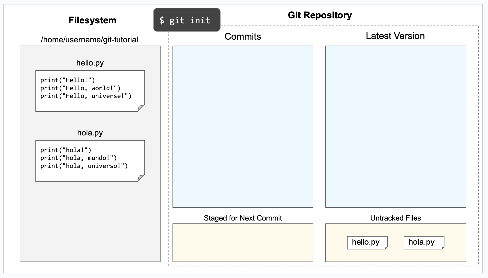
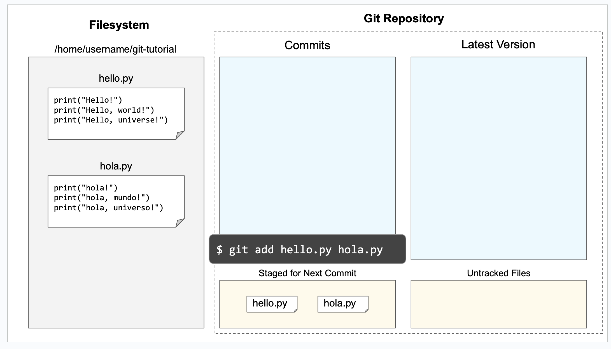
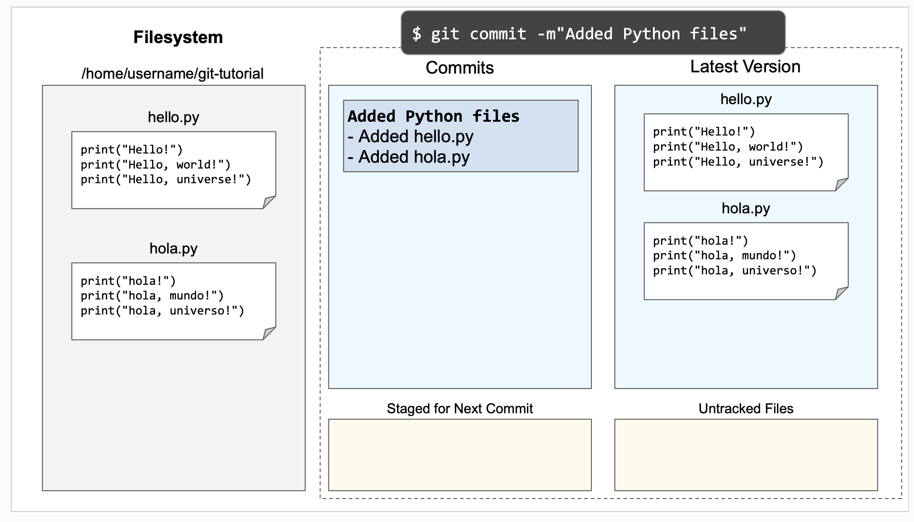
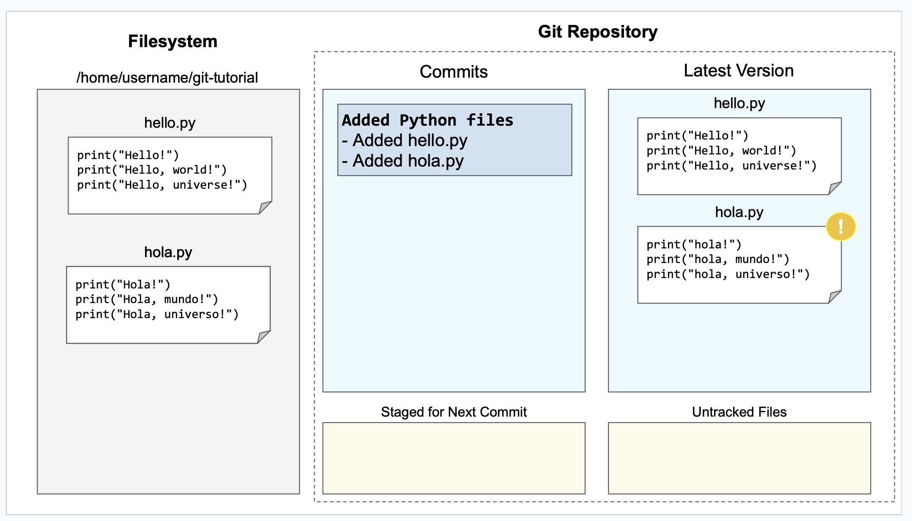
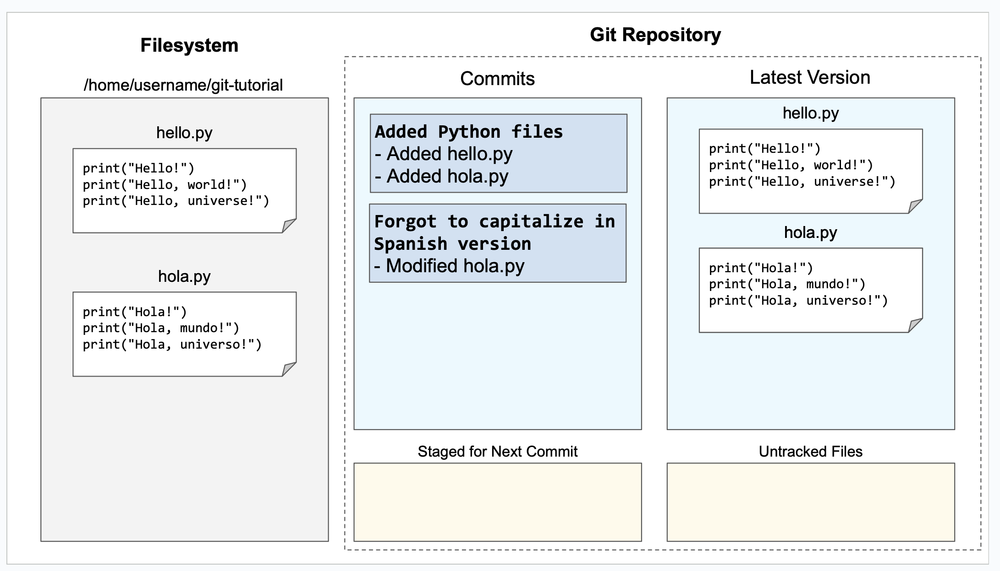

.. _tutorial-git-local:

Git Tutorial - Working Locally
==============================

.. note::
   
    This section assumes you have:

    - picked up the :ref:`tutorial materials <tutorial-git-materials>`,
    - opened a terminal window and connected to one of the CS Linux servers, and
    - navigated to your ``git-tutorial`` directory.

This section explains how to convert an existing directory into a Git
repository and how to package up changes into a commit.

Converting an existing directory into a repository
--------------------------------------------------

The first step when placing a directory under version control using Git
is to run the git initialization command from within the directory.
Use ``pwd`` to make sure that you are in your
``/home/CNETID/git-tutorial`` directory.  Once you are in the
right directory, run::

  $ git init

The result should be::

  Initialized empty Git repository in /home/CNETID/git-tutorial/.git/

(If the directory listed in the result is something other than
``/home/CNETID/git-tutorial/.git/``, please ask for help.)

This command creates a hidden folder, named ``.git``, used by Git to
track the state of the repository.  Notice that the message indicates
that the repository is empty, which may be surprising given that the
directory holds two files.  This seeming anomaly illustrates a
fundamental aspect of working with Git: Git's understanding of the
state of the repository and the actual state of the files in the file
system are not always the same.  This section explains the commands needed
to bring Git's view of the files up to date.

Here is a figure that shows the contents of the files in the file
system and Git's view of those files.

The Git repository side of the figure has four areas:

- the list of commits,
- the latest version of the files (from Git's perspective),
- a list of files that are staged to be part of the next commit, and
- a list of untracked files.

The first three are empty, since we have not committed anything to the
repository yet.  The untracked files section lists files that exist in
the directory, but that have not been placed under Git's control.  In
this case, the "Untracked files" section includes ``hello.py`` and
``hola.py`` because they exist in the directory and have not been
placed under Git's control.

The ``git status`` command will allow you view to some of the
information shown in this figure.  Here is the result of running this
command immediately after initializing the repository::

  $ git status
  On branch master

  No commits yet

  Untracked files:
    (use "git add <file>..." to include in what will be committed)
  	  hello.py
	  hola.py

  nothing added to commit but untracked files present (use "git add" to track)

The first line contains the name of the branch:
``master``.  We'll change this name to the more commonly used name
``main``, in a few steps.

The next line tells us that no commits have been added to this
repository yet and that there are two files in the directory that Git
is not tracking yet.  Notice that Git provides a helpful hint about how to
add the files to the list of files that will be part of the next
commit.

We'll take advantage of this hint in a minute.  First, it is important
to understand that creating a commit is a two step process.  First,
you need to *stage* the files that you want to be part of the commit
and then, once you have staged the right set of files, you need to
create the actual commit.

The command for staging a file for the next commit is ``git add``.
(Yes, it is somewhat confusing that the add command does not directly
add files to the repository.)

We can stage files for a commit one at a time or in a batch.  Here is
the command to add (stage) both of our files at once::

  $ git add hello.py hola.py

This command is silent, that is, it does not generate any output when
it runs successfully.

We can run ``git status`` to verify that Git's view of the files has
changed::

  $ git status
  On branch master

  No commits yet

  Changes to be committed:
    (use "git rm --cached <file>..." to unstage)
  	  new file:   hello.py  [text is green in actual output]
	  new file:   hola.py   [text is green in actual output]

Notice that ``hello.py`` and ``hola.py`` have moved from the
"Untracked files" section to the new section "Changes to be committed",
which holds the files that have been staged to be part of the next
commit.

Here is a figure that shows Git's updated view of the repository:

Now that the files are staged, we can package them into a commit using
the ``git commit`` command.  Each commit has an associated commit
message.  These messages should be descriptive enough to help you (and
your collaborators) find specific versions as needed.  Short commit
message can be provided as part of the commit command using the ``-m``
flag.

.. warning::

   If you forget the ``-m`` parameter, Git will think that you forgot
   to specify a commit message. It will graciously open up a default
   editor so that you can enter such a message. This behavior can be
   useful if you want to enter a longer commit message (including
   multi-line messages), but is irritating most of the time.

Here is the result of committing our staged files::

  $ git commit -m"Added Python files"
  [master (root-commit) e1d3a0f] Add Python files
   2 files changed, 6 insertions(+)
   create mode 100644 hello.py
   create mode 100644 hola.py

If you run this command, your result will look slightly different. In
particular, your result will have a different value in place of
``e1d3a0f``.

Here is the result of running ``git status`` after the commit::

  $ git status
  On branch master
  nothing to commit, working tree clean

This message tells us that Git's view of the files and the actual
files in the file system are in sync.

Here's a figure that provides a more complete view of Git's updated
view of the repository:

Notice as expected:

- a commit has been created,
- the files are the same in Git and on the file system, and
- there are no untracked files and no files staged for commit.

The file system and Git are now in sync.

Now that we have created a commit, we can rename the branch to
``main`` using the following command::

  $ git branch -M main

This command does not generate any output and only needs to be run
*once* per repository.  We can verify that it ran successfully using
``git status``::

  $ git status
  On branch main
  nothing to commit, working tree clean

Notice that the branch name has changed from ``master`` to ``main``,
which is the name that is now commonly used for the primary branch.

In the first few sections of this tutorial, you will be working with
the ``main`` branch.  We introduce branches more generally in a later
section.

Changing tracked files
----------------------

Let's make a change to the files to fix the capitalization in
``hola.py``.  Using an editor, change ``h`` to ``H`` in all three
print statements.  (Make sure to save your changes.)

As this figure illustrates, once you modify the file on disk, Git's
view of the file becomes out-of-date:

Notice that the file system version of ``hola.py`` and Git's view are
different.  This difference is highlighted in the figure with an
exclamation point.  Using ``git status`` this change is reflected
in a new section named "Changes not staged for commit"::

  $ git status 
  On branch main
  Changes not staged for commit:
    (use "git add <file>..." to update what will be committed)
    (use "git restore <file>..." to discard changes in working directory)
  	  modified:   hola.py

  no changes added to commit (use "git add" and/or "git commit -a")

To get the repository back up to date, we need to stage the changed
file (again) and we need to create the commit.  There are two ways to
stage the file.  We can explicitly add the file using::
  
    $ git add hola.py
    
or we can use a git shortcut::

    $ git add --update .

The ``--update`` flag for the ``git add`` command tells Git to stage
files that it is tracking *and* that have changed since the last
commit. The period tells Git to add only
files in the current directory (and its subdirectories).  Technically,
the period is optional, but it is good practice to be thoughtful about
adding files to your repository.  In this case, being thoughtful means
limiting the scope of the ``add`` command to the current directory.

You can also use the ``-u`` as the short form of the ``--update`` flag::

    $ git add -u .  

On a related note, **never** use either of the following two commands::

   $ git add *    # NEVER DO THIS
   $ git add .    # OR THIS

These commands add *everything* in the current directory (including
files in subdirectories), which will likely add files, such as, editor
backup files, large data files, etc, that should not be stored in a
repository.  Again, you should also be thoughtful about the files that
you choose to include in your repository.

Let's package this change into a commit::

  $ git add --update .
  $ git commit -m"Forgot to capitalize in Spanish version"
  [master 94be5be] Forgot to capitalize in Spanish version
   1 file changed, 3 insertions(+), 3 deletions(-)

   
Now the two views of the files are in sync:

and the status is clean::

  $ git status .
  On branch main
  nothing to commit, working tree clean

Notice that we added a space and a period to the ``git status``
command to indicate that we are only interested in looking at the
status of the files in the current directory (including any
subdirectories).  In a large repository, it can be useful to focus
your attention on the current directory.

Exercises
---------

Modifying Existing Files
~~~~~~~~~~~~~~~~~~~~~~~~

In this exercise, you will make some changes to the files and
package them up into a commit.

**Step 1**:

Add the line::

    print("Hello, multiverse!")

to the end of ``hello.py`` and the line::

    print("Hola, multiverso!")

to the end of ``hola.py``.  Make sure to save the files after you make the necessary changes.

**Step 2**

Run ``git status .`` to see the current state of the files.  Both
``hello.py`` and ``hola.py`` should appear in the "Changes not staged
for commit" section of the output.  If one or both are missing, verify that
you saved the files.

An aside: the Linux `cat` command is useful for looking at small
files.  For example, we could check the changes to ``hello.py`` by
running::

  $ cat hello.py 
  print("Hello!")
  print("Hello, world!")
  print("Hello, universe!")
  print("Hello, multiverse!")

Getting in the habit of frequently running ``git status .`` and
verifying that the results match your expectations will reduce
the likelihood that you run into problems with Git.

**Step 3**

Stage the files for commit using ``git add -u .``.

Then use ``git status .`` to verify that the changed files are now staged.

**Step 4**

Commit the files using ``git commit``.  Don't forget to include the
``-m`` flag and a commit message in double quotes (such as, ``"Added more
salutations"``).

Again, use ``git status .`` to verify that the commit has been
completed.  Does the result say ``"nothing to commit, working tree
clean"`` or does it show one or more changes not staged for commit?

Adding a New File
~~~~~~~~~~~~~~~~~

In this exercise, you will create a new file and add it to the
repository:

**Step 1**

Create a new file named ``bonjour.py`` with the contents::

  print("Bonjour!")
  print("Bonjour le monde!")
  print("Bonjour l’univers!")
  print("Bonjour multivers!")

Make sure to save your changes!

**Step 2**

Run ``git status .`` to verify that there is now a new untracked file
named ``bonjour.py`` in the directory.

**Step 3**

Use ``git add bonjour.py`` to add the file to the repository.

**Step 4**

Use ``git status .`` to verify that the file has been staged for the next commit.

**Step 5**

Create a new commit.  Don't forget the ``-m`` option and the commit
message in double quotes, such as ``"Added French version"``.

**Step 6**

Use ``git status .`` to verify that your working tree is now clean.

Summary
-------

This section of the tutorial introduced you to the commands needed to
create and manage a git repository locally.  The next section will
explain how to setup your GitHub account.

