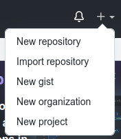
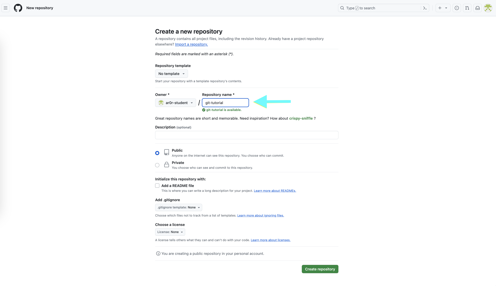
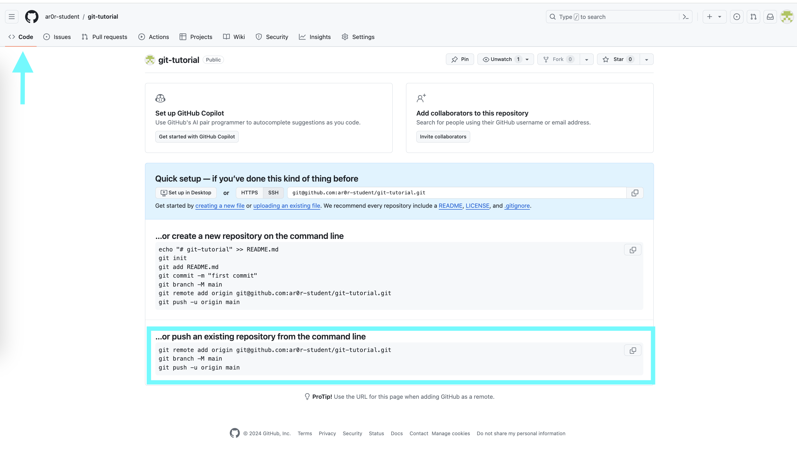
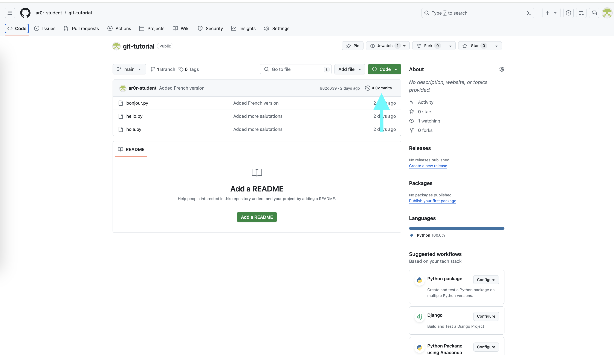
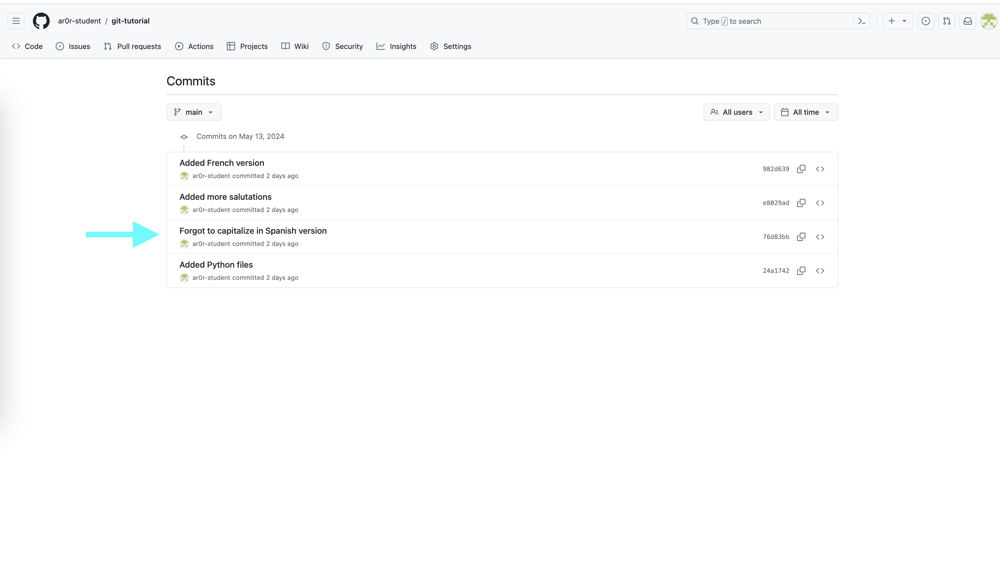
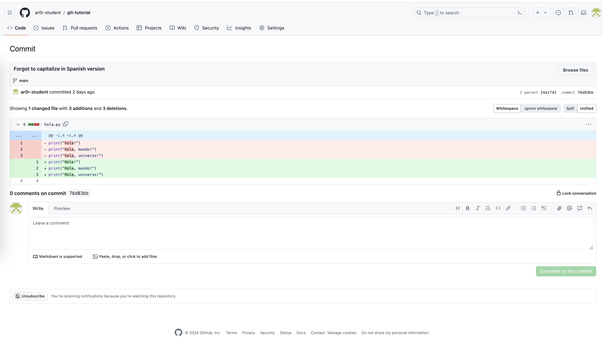
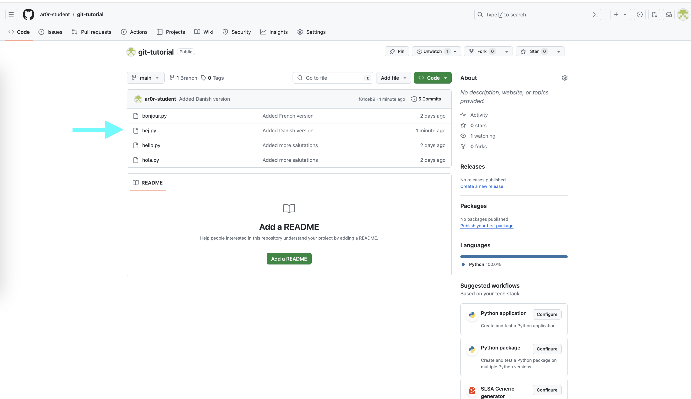
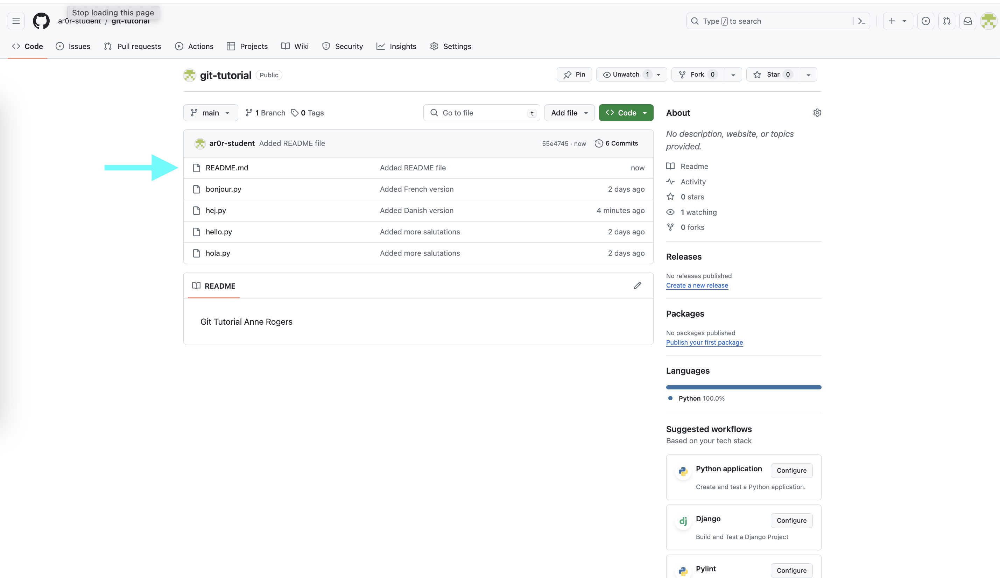

.. _tutorial-git-remote:

Git Tutorial - Working with Remote Repositories
================================================

.. note::
   
    This section assumes you have:

    - completed the :ref:`tutorial-git-local` and :ref:`tutorial-git-prepare-github` sections of the tutorial and
    - opened a terminal window that is connected to one of the CS Linux servers.

In the :ref:`tutorial-git-local` section, we covered how to convert an
existing directory into a repository and how to create commits.  In
this part, you will learn how to link up your repository with GitHub.

Creating a Repository on Git
----------------------------

To link our local repository to a repository on GitHub, we need to
first create an empty repository on GitHub.  To do this, log into
GitHub, and click on the "+" icon on the top-right of the page, and
then on "New Repository":

Then, under "Repository name" enter ``git-tutorial``.  Do not
change any other setting, and click on the green "Create repository"
button.

Note that you will see your GitHub username rather than
``ar0r-student`` underneath ``Owner``.

Once you complete this step, you will be taken to a page where you can
browse your repository through GitHub’s web interface.  To start, this
page will include instructions for setting up a new repository and for
connecting an existing repository (our case).

Since we want to link an existing local repository to this new remote
repository on GitHub, we fall into the second case.

In your terminal window, verify that you are in your ``git-tutorial``
directory using ``pwd`` and if, not nagivate to it.

The first step is to set the URL (that is, the Uniform Resource
Locator) for the remote repository.  To do so, copy and run the first
line in the "..or push an existing repository from the command line"
section of the setup page.  The command will have the form::

  $ git remote add origin URL

where URL is the URL for your repository. Copy-and-paste the line from
your browser instead of retyping it to reduce the likelihood that you
make a mistake when entering it.  This command does not generate any
output.

The URL should start with ``git@github.com:``.  If the URL starts with
``http://`` instead, please ask for help.

You can verify that you did this step correctly by running::

  $ git config --get remote.origin.url

It should show the actual URL for your repository:
::
   
  git@github.com:GITHUB_USERNAME/git-tutorial.git

where ``GITHUB_USERNAME`` is your actual GitHub username.  If the
result of this command does not look right, please ask for help.

We have already set the branch name for ``git-tutorial``, so we
can skip the next step in the instructions.

Next, you need to push your local commits to the repository on GitHub using ``git push``::

  $ git push -u origin main
  Enumerating objects: 14, done.
  Counting objects: 100% (14/14), done.
  Delta compression using up to 16 threads
  Compressing objects: 100% (14/14), done.
  Writing objects: 100% (14/14), 1.22 KiB | 1.22 MiB/s, done.
  Total 14 (delta 2), reused 0 (delta 0)
  remote: Resolving deltas: 100% (2/2), done.
  To github.com:GITHUB_USERNAME/git-tutorial.git
    * [new branch]      main -> main
  Branch 'main' set up to track remote branch 'main' from 'origin'.

You may be asked some variant of the following question::

  Warning: the ECDSA host key for 'github.com' differs from the key for the IP address '140.82.114.3'
  Offending key for IP in /home/CNETID/.ssh/known_hosts:1
  Matching host key in /home/CNETID/.ssh/known_hosts:10
  Are you sure you want to continue connecting (yes/no)?

If so, respond ``yes``.  Unfortunately, you may get asked this
question the next few times you use a command to interact with GitHub.
It is safe to say yes.

If you run ``git status`` in your terminal window after you have
completed the push, you will see something like::

  $ git status
  On branch main
  Your branch is up to date with 'origin/main'.

  nothing to commit, working tree clean

which tells you that the local and remote copies of your repository
are in sync.

If you switch back to your browser and click on ``Code``, you should
see something like this:

If you click on the names of the files, you will see that the contents of
the files on GitHub is the same as the files in the copy of your
repository on the CS Linux servers.

If you click on ``commits``, you will be taken to a page that shows
the commit log in reverse chronological order (that is, the most
recent commit is shown first).

If you click on a specific commit, GitHub will show you the
exact changes that were made.  For example, clicking on
the commit with the message ``"Forgot to capitalize in Spanish version"``
yields:

Lines starting with a ``-`` (shown with a red background) were
removed.  Lines starting with a ``+`` (shown with a green background)
were added.

Making Changes and Re-Synchronizing
-----------------------------------

You now have two copies of your repository: one on the CS Linux
servers and one on GitHub.  Anyone who has permission to access your
GitHub repository will be able to see the repository as it exists on
GitHub.  They will **not** be able to see changes that you have made
locally until you push them.

We'll explore this behavior in this section.  Create a new
file ``hej.py`` with the following contents::

  print("Hej")
  print("Hej Verden")
  print("Hej Univers")
  print("Hej Multivers")

and then create a commit for this file::

  $ git add hej.py
  $ git commit -m"Added Danish version"

If you run ``git status``, you will see a message that tells you that
your local copy of the repository is "ahead" of the remote copy on
GitHub by one commit::

  $ git status .
  On branch main
  Your branch is ahead of 'origin/main' by 1 commit.
    (use "git push" to publish your local commits)

If you switch to your browser and click on ``Code`` to get back to the
code page, you will see that the repository on GitHub does not include
``hej.py``.  To bring GitHub up to date, you need to push your work by
running::

  $ git push

The output will be something like::  

  Enumerating objects: 4, done.
  Counting objects: 100% (4/4), done.
  Delta compression using up to 16 threads
  Compressing objects: 100% (3/3), done.
  Writing objects: 100% (3/3), 378 bytes | 378.00 KiB/s, done.
  Total 3 (delta 0), reused 0 (delta 0)
  To github.com:GITHUB_USERNAME/git-tutorial.git

Now if you run ``git status`` it will show you that the two
versions are in sync::

  $ git status
  On branch main
  Your branch is up to date with 'origin/main'.

  nothing to commit, working tree clean

If you refresh the browser page that is open to your
``git-tutorial`` repository on GitHub, you should now see
``hej.py``.

In general, synchronizing (aka, syncing) your local and remote
repositories is a three step process:

#. add/stage the new/changed files,
#. create a commit, and then
#. push the new commit to the server.

**When you are first working with git, it is good practice to end
every work session by syncing your local and remote repositories.
Similarly, before you ask a question about your code in a class, you should sync your
repository with GitHub to ensure that the course staff can see the
most recent version of your code.**

The more disciplined you are about frequently syncing your repository
and verifying that your repository is in a clean state, the less
likely it is that you will run into a difficult-to-fix Git problem.

Exercise: Syncing a change with a remote repository
---------------------------------------------------

Create a file named ``README.md`` that contains ``Git Tutorial``
and your name. Add this file to your local repository, create a
commit, and sync it with GitHub.

When you are finished, ``git status`` should show that your working
tree is clean and up to date with ``origin/main`` and ``README.md``
should appear when you refresh the browser page that is open to your
``git-tutorial`` repository on GitHub.

If you need to take a break, this would be a good time to stop.

Summary
-------

In this section, you learned how to connect a local repository to a
remote server, and learned how to push local changes to that server.
The next section explains how to view the commit log.

  
  
  

  
  

	   

  

	   

	   

