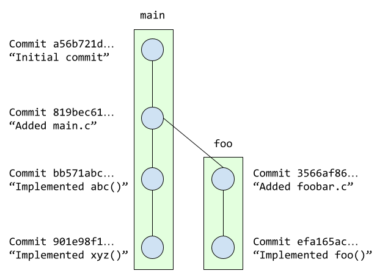

.. _tutorial-git:

Git Tutorial
============

In some of your previous CS courses, you may have become familiar with
using either Subversion (SVN) or Git to store a copy of your code
in a remote server, and to submit your work for grading.
In the course project, you will be using Git for its intended purpose:
as a version control tool that will facilitate collaboration between
multiple developers.

In a nutshell, Git is a *version control system* that maintains files in a
*repository* that contains not just files, but also a record of all the
changes made to those files. Git tracks every version of a file or
directory using *commits*. When you have made changes to one or more
files, you can logically group those changes into a “commit” that gets
added to your repository. You can think of commits as “checkpoints” in
your work, representing the work you’ve done since the previous
checkpoint. This mechanism makes it possible to look at and even revert
to older versions of a file by going back to your code as it was when
you “checkpointed” it with a commit.

For each homework assignment, a Git repository will be created for you on
`GitHub <https://github.com/>`__, a web-based hosting service for Git
repositories. However, before that repository can be created for you,
you need to have a GitHub account. If you do not yet have one, you can
get an account here: https://github.com/join. Once you create your
account, you may want to get the `Student Developer
Pack <https://education.github.com/pack>`__, which will give you access
to a lot of other features (please note that having the Student
Developer Pack is not necessary for CS 220; it’s just a nice benefit you
get as a student)

Where should you do this homework assignment?
---------------------------------------------

For this homework, we will specifically need you to work on a CS environment.
You can this in one of several ways:

-  Going to the
   `Computer Science Instructional Laboratory (CSIL) <https://csil.cs.uchicago.edu/>`__
   in the first floor of Crerar Library and using one of the Linux
   machines in CSIL 3, CSIL 4, or CSIL 5.
-  Using SSH, which will allow you to open a command-line terminal on a
   CS machine. The CS techstaff provides `detailed
   instructions <https://howto.cs.uchicago.edu/remote_access>`__ on how
   to do this.
-  Connecting to a `Virtual
   Desktop <https://howto.cs.uchicago.edu/techstaff:vdesk>`__. This will
   show you, on your computer, effectively the exact same desktop you
   would see if you physically logged into a CSIL machine. However, this
   option may not work well for low-bandwidth Internet connections.

Throughout the homework assignment, you will have to make some simple edits
to a few text files. If you are using SSH, we suggest you use a command-line
editor for this (like Vi, emacs, nano, etc.), or Ubuntu's built-in Text Editor
if using the Virtual Desktop. You do not need to use a full-featured code editor
in this homework assignment.

In future homeworks, there will be more flexibility on where you can do your
work, including working locally on your own computer.

How to complete this homework
-----------------------------

This homework is divided into three parts. The first two parts provide
a tutorial-style introduction to various aspects of Git. All you need
to do is follow the instructions
(we will be able to tell whether you followed our instructions by
looking at your repository). That said, please make sure you understand
what is accomplished in each step and, if you have any questions, please
don't hesitate to `ask for help <help.html>`__.

The third part of the homework involves a series of exercises
that require you to find a new Git command (or series
of Git commands) on your own. This will involve explaining how you solved
a given exercise, and you will submit your answers on
`Gradescope <https://gradescope.com/>`__, which you can access through
our Canvas site.

Once in Gradescope, simply select assignment “Homework #1: Git”, and fill in
the answers for the Part III exercises. Please note that you will also see
"questions" corresponding to Parts I and II, but you will not be able to
enter any answers there, since those will be based
on the graders’ inspection of your GitHub repository (but we still need
to include those tasks on Gradescope so we can grade them as part of
this homework).

To see how this homework assignment will be graded, please see the
`Homework 1 Rubric <hw1_rubric.html>`__

Creating your homework repository
---------------------------------

For each homework assignment, we will provide you with an *invitation URL*
that will allow you sign up for the homework assignment on GitHub. When you
open the invitation URL in a browser tab, you will have to complete
the following steps:

#. You will need to select your name (and CnetID) from a list. This step will allow us to know what student is associated with each GitHub account. This step is only done for the very first invitation you accept.

#. You must click “Accept this assignment” or your repository will not actually be created.

This will result in the creation of a repository called
``hwN-GITHUB_USERNAME`` inside our ``uchicago-cmsc22000-2022`` organization
on GitHub (a GitHub “organization” is basically a way to group together
related repositories). For example, if your GitHub username is
``jrandom``, your repository will be called ``hw1-jrandom``. This
repository will be private, and can only be viewed by you and the CS 220
course staff.

Part I: First steps with Git
----------------------------

You will start by initializing your repository. Your
repository is hosted on GitHub, but you can create a local copy in your
home directory (we will refer to this as your *local repository*).

First, make sure you are logged into the GitHub website, and go to
https://github.com/uchicago-cmsc22000-2022 (you may want to bookmark this
page, as you'll likely be accessing it a lot throughout the quarter).
Your homework repository,
``uchicago-cmsc22000-2022/hwN-GITHUB_USERNAME`` should appear under
“Repositories”.

Click on the link for your repository. This will take you to a page where you can browse your
repository through GitHub’s web interface. However, you haven’t
initialized your repository yet, so GitHub will provide you with the
instructions to initialize your repository.

Don't try to run these commands from the terminal just yet! You will first
need to perform some setup steps that will allow you to access
your Git repository from the command-line.

Creating an SSH Key
~~~~~~~~~~~~~~~~~~~

When you log into the GitHub website, you use the username and
password associated with your GitHub account. However, when using
Git commands from the terminal, things are a bit different.
In particular, GitHub uses two mechanisms for authenticating yourself
from the terminal: Personal Access Tokens and SSH Keys. We will
be using SSH keys.

In a nutshell, an SSH key is a file that resides in your home directory,
and which you can think of as a file that stores a secure password
(SSH keys are a bit more complex than that but, for our purposes,
we can just think of them as extra-secure passwords)

To create an SSH key, run the following command from the terminal::

    $ ssh-keygen

You will see the following prompt::

    Generating public/private rsa key pair.
    Enter file in which to save the key (/home/username/.ssh/id_rsa):

Press Enter (this will select the default file path shown in the prompt: ``/home/username/.ssh/id_rsa``

.. note::

   If, after pressing Enter, you see the following message::

        /home/username/.ssh/id_rsa already exists.
        Overwrite (y/n)?

   This means there is already an SSH key in your home directory.
   You should proceed as follows:

   1. If you are already familiar with SSH keys, and know for certain
      that you'd like to use your existing SSH key, type "n" and
      skip ahead to the "Uploading your SSH key to GitHub" section below.
   2. If you do not know why you have an SSH key in your directory,
      it's possible it was created for you if you've taken another
      CMSC class in the past. Type "n" and then run the following commands
      to create a backup of your existing key::

            mv ~/.ssh/id_rsa ~/.ssh/id_rsa.bak
            mv ~/.ssh/id_rsa.pub ~/.ssh/id_rsa.pub.bak

      Then, re-run the ``ssh-keygen`` command, press Enter when prompted
      for the file name, and follow the rest of the
      instructions in this section.

Next, you will see this prompt::

    Enter passphrase (empty for no passphrase):

Just press Enter here. You will be asked to confirm (just press Enter again)::

    Enter same passphrase again:

.. note::

    While it may seem counterintuitive, we don't want our SSH
    key to have a passphrase (this is an added layer of security which we won't
    need for this class; your GitHub account will still be secure even if your
    SSH key doesn't have a password)

If all goes well, you should see something like this::

    Your identification has been saved in /home/username/.ssh/id_rsa
    Your public key has been saved in /home/username/.ssh/id_rsa.pub
    The key fingerprint is:
    SHA256:cBUUs2FeMCIrBlTyv/PGpBtNz0v235zvLykpoWIOS9I username@machine
    The key's randomart image is:
    +---[RSA 3072]----+
    | .+.. . ..@+.    |
    |   +   o = *     |
    |    + o . o      |
    |   . o o         |
    |      . S        |
    |   .   +.o.      |
    |  . E ++..=. . . |
    |   o o+++o.oo oo.|
    |    .oo+. ...o.+O|
    +----[SHA256]-----+

This means your key was created correctly.

Uploading your SSH key to GitHub
~~~~~~~~~~~~~~~~~~~~~~~~~~~~~~~~

Now, we need to instruct GitHub to accept our SSH key. To do this, log into https://github.com/
and go to your Settings page (by clicking on the top-right account icon, and then selecting "Settings"
in the drop-down menu. Then, click on "SSH and GPG keys".

Now, click on the green "New SSH key" button. This will take you to a page where you can upload your
SSH key. You will be asked for two values: a "Title" and the key itself. The title can be anything
you want, but we suggest something like "CS SSH Key".

The value of the key is contained in the ``.ssh/id_rsa.pub`` file in your home directory. To print
out the contents of that file, we can just use the ``cat`` command::

    $ cat ~/.ssh/id_rsa.pub

This will print a few lines of output starting with ``ssh-rsa`` and ending in something like ``username@machine``.
Copy the whole output to the clipboard; you can do this by clicking and dragging the mouse from the first
character to the last character, and then pressing Ctrl-Shift-C.

Then, paste the key into the "Key" field on the GitHub page. Then click on the green "Add SSH Key"
button.

To verify that you correctly uploaded the key, try running the following command::

    ssh -T git@github.com

You may see a message like this::

    The authenticity of host 'github.com (...)' can't be established.
    RSA key fingerprint is SHA256:nThbg6kXUpJWGl7E1IGOCspRomTxdCARLviKw6E5SY8.
    Are you sure you want to continue connecting (yes/no)?

You can safely enter "yes" here. You should then see a message like this::

    Hi username! You've successfully authenticated, but GitHub does
    not provide shell access.

This means your SSH key is properly set up (don't worry about the "does not provide shell access"; that is
normal).

If you are unable to set up your SSH key, please make sure to ask for help. You will not
be able to complete the rest of the homework until you've set up your SSH key.

If you would like to set up SSH access from your personal computer at a later time,
GitHub provides some pretty detailed documentation on how to do this in a number
of different operating systems: `Connecting to GitHub with SSH <https://docs.github.com/en/github/authenticating-to-github/connecting-to-github-with-ssh>`__
Please note that we may not be able to assist you with SSH issues on your own computer.

Initializing your repository (continued)
~~~~~~~~~~~~~~~~~~~~~~~~~~~~~~~~~~~~~~~~

Ok, now we're actually ready to initialize your repository.
Do the following:

-  Create a directory in your home directory for CMSC 22000. The name
   and location of this directory is not important, so if you already
   have a preferred directory structure, you’re welcome to use it.
   Otherwise, we suggest you simply do this:

   ::

      cd
      mkdir -p cs220/hw1
      cd cs220/hw1

   (the ``-p`` flag to mkdir will create all the parent directories if
   needed; i.e., if you don't already have a ``cs220`` directory, it will
   create one, and then will create a ``hw1`` directory inside it)

-  Inside that folder, create a file called ``README.md`` and add your
   full name to the file. Remember you can create an empty file by
   running the command ``touch README.md`` and then opening that file
   with your editor of choice.

-  On your repository’s GitHub page (on the GitHub website), right
   under “Quick setup — if you’ve done this kind of thing before”
   there is a URL field with two buttons: HTTPS and SSH.
   Make sure that “SSH” is selected.

Now, from inside your CMSC 22000 directory, run the commands that appear
under “…or create a new repository on the command line” *except* the
first one (the one that starts with ``echo``).

Don’t worry about what each individual command does; we will be seeing
what most of these commands do in this homework. However, if you encounter
any error messages, please make sure to let us know.

You can verify that your repository was correctly set up by going back
to your repository’s page on GitHub, you should now see it contains a
``README.md`` file. If you click on it, you can see its contents.

Creating a commit
~~~~~~~~~~~~~~~~~

If you make changes to your repository, the way to store those changes
(and the updated versions of the modified files) is by creating a
*commit*. So, let’s start by making some changes:

-  Edit ``README.md`` to also include your CNetID on the same line as your name
-  Create a new file called ``test.txt`` that contains a single line with the text ``Hello, world!``

Creating a commit is a two-step process. First, you have to indicate
what files you want to include in your commit. Let’s say we want to
create a commit that only includes the updated ``README.md`` file. We
can specify this operation explicitly using the ``git add`` command from
the terminal:

::

   git add README.md

This command will not print any output if it is successful.

To create the commit, use the ``git commit`` command. This command will
take all the files you added with ``git add`` and will bundle them into
a commit:

::

   git commit -m "Updated README.md"

The text after the ``-m`` is a short message that describes the changes
you have made since your last commit. Common examples of commit messages
might be “Finished homework 1” or “Implemented insert function for data
struct”.

.. warning::

   If you forget the ``-m`` parameter, Git will think that
   you forgot to specify a commit message. It will graciously open up a
   default editor so that you can enter such a message. This can be useful
   if you want to enter a longer commit message (including multi-line
   messages). We will experiment with this later.

Once you run the above command, you will see something like the
following output:

::

   [main 3e39c15] Updated README.md
    1 file changed, 1 insertion(+), 1 deletion(-)

You’ve created a commit, but you’re not done yet: you haven’t uploaded
it to GitHub yet. Forgetting this step is actually a very common
pitfall, so don’t forget to upload your changes. You must use the
``git push`` command for your changes to be uploaded to the Git
server. *If you don’t, the course staff will not be able to see your work*.
Simply run the following command from the Linux command-line:

::

   git push

This should output something like this:

::

    Enumerating objects: 5, done.
    Counting objects: 100% (5/5), done.
    Writing objects: 100% (3/3), 279 bytes | 279.00 KiB/s, done.
    Total 3 (delta 0), reused 0 (delta 0)
    To https://github.com/uchicago-cmsc22000-2022/hw1-GITHUB_USERNAME.git
       392555e..0c85752  main -> main

You can ignore most of those messages. The important thing is to not see
any warnings or error messages.

.. warning::

   When you push for the first time, you may get a message
   saying that ``push.default is unset``, and suggesting two possible
   commands to remedy the situation. While the rest of the commands in this homework
   will work fine if you don’t run either of these commands, you should run the
   command to use “simple” (this will prevent the warning from appearing
   every time you push)

You can verify that your commit was correctly pushed to GitHub by
going to your repository on the GitHub website. The ``README.md`` file should now
show the updated content (your name and CNetID)

In general, if you’re concerned about whether the course staff are seeing the
right version of your work, you can just go to GitHub. Whatever is shown
on your repository’s page is what the course staff will see. If you wrote
some code, and it doesn’t show up on GitHub, make sure you didn’t forget
to add your files, create a commit, and push the most recent commit to
the server.

``git add`` revisited and ``git status``
~~~~~~~~~~~~~~~~~~~~~~~~~~~~~~~~~~~~~~~~

Let’s make a further change to ``README.md``: Add a line with the text
``CMSC 22000 - Introduction to Software Development``.

So, at this point, we have a file we have already committed
(``README.md``) but where the *local* version is now out of sync with
the version on GitHub. Furthermore, earlier we created a ``test.txt``
file. Is it a part of our repository? You can use the following command
to ask Git for a summary of the files it is tracking:

::

   git status

This command should output something like this:

::

    On branch main
    Your branch is up to date with 'origin/main'.

    Changes not staged for commit:
      (use "git add <file>..." to update what will be committed)
      (use "git restore <file>..." to discard changes in working directory)
        modified:   README.md

    Untracked files:
      (use "git add <file>..." to include in what will be committed)
        test.txt

    no changes added to commit (use "git add" and/or "git commit -a")

.. note::

   When working on CS machines, you should see the message above.  At
   some point, you will start using git with your own machine.
   depending on the version of Git you have installed, the message
   under ``Changes not staged for commit`` may refer to a command
   called ``git checkout`` (instead of ``git restore``).

Notice that there are two types of files listed here:

-  ``Changes not staged for commit``: This is a list of files that Git
   knows about and have been modified since your last commit, but which
   have not been added to a commit (with ``git add``). Note that we
   *did* use ``git add`` previously with ``README.md`` (which is why Git
   is “tracking” that file), but we have not run ``git add`` since our
   last commit, which means the change we made to ``README.md`` is not
   currently scheduled to be included in any commit. Remember: committing is
   a two-step process (you ``git add`` the files that will be part of
   the commit, and then you create the commit).

-  ``Untracked files``: This is a list of files that Git has found in
   the same directory as your repository, but which Git isn’t tracking.

.. warning::

   You may see some automatically generated files in your
   Untracked files section. Files that start with a pound sign (#) or end
   with a tilde should *not* be added to your repository. Files that end
   with a tilde are backup files created by some editors that are intended
   to help you restore your files if your computer crashes. In general,
   files that are automatically generated should not be committed to your
   repository. Other people should be able to generate their own versions,
   if necessary.

So, let’s go ahead and add ``README.md``:

::

   git add README.md

And re-run ``git status``. You should see something like this:

::

    On branch main
    Your branch is up to date with 'origin/main'.

    Changes to be committed:
      (use "git restore --staged <file>..." to unstage)
        modified:   README.md

    Untracked files:
      (use "git add <file>..." to include in what will be committed)
        test.txt

.. note::

   When working on CS machines, you should see the message above.
   When using your git on own machine and depending on the version of
   Git you have installed, the message under ``Changes to be
   committed`` may refer to a command called ``git reset`` (instead of
   ``git restore``).

Notice how there is now a new category of files:
``Changes to be committed``. Adding ``README.md`` not only added the
file to your repository, it also staged it into the next commit (which,
remember, won’t happen until you actually run ``git commit``).

If we now add ``test.txt``:

::

   git add test.txt

The output of ``git status`` should now look like this:

::

    On branch main
    Your branch is up to date with 'origin/main'.

    Changes to be committed:
      (use "git restore --staged <file>..." to unstage)
        modified:   README.md
        new file:   test.txt

Now, we are going to create a commit with these changes. Notice how we
are not going to use the ``-m`` parameter to ``git commit``:

::

   git commit

When you omit ``-m``, Git will open a terminal text editor where you can
write your commit message, including multi-line commit messages. By
default, the CS machines will use `nano <https://www.nano-editor.org/>`__ for this.
You should see something like this:

::

    # Please enter the commit message for your changes. Lines starting
    # with '#' will be ignored, and an empty message aborts the commit.
    #
    # On branch main
    # Your branch is up to date with 'origin/main'.
    #
    # Changes to be committed:
    #       modified:   README.md
    #       new file:   test.txt
    #

Now, type in the following commit message above the lines that start with ``#``:

::

   Homework 1 updates:

   - Added test.txt
   - Updated README.md file

In nano, you can save the file and exit by pressing Control-X, entering "Y" when
prompted to "save modified buffer" (i.e., whether to save the file before exiting),
and then Enter (you will be asked to confirm the filename to save; do not modify this
in any way, just confirm by pressing Enter).

This will complete the commit, and you will see a message like this:

::

    [main 1810c54] Homework 1 updates:
     2 files changed, 3 insertions(+), 1 deletion(-)
     create mode 100644 test.txt

.. note::

    If you want to change your default command-line editor, add a line like this:

    ::

       export EDITOR=myfavoriteeditor

    At the end of the ``.bashrc`` file in your home directory (make sure you
    replace ``myfavoriteeditor`` with the command for your favorite
    command-line editor: ``vi``, ``emacs``, ``nano``, ``mcedit``, etc.)

Now, edit ``README.md`` and ``test.txt`` and add an extra line to each of them with the text
``Git is pretty cool``. Running ``git status`` should now show the
following:

::

    On branch main
    Your branch is ahead of 'origin/main' by 1 commit.
      (use "git push" to publish your local commits)

    Changes not staged for commit:
      (use "git add <file>..." to update what will be committed)
      (use "git restore <file>..." to discard changes in working directory)
        modified:   README.md
        modified:   test.txt

If we want to create a commit with these changes, we could simply run
``git add README.md test.txt``, but this can get cumbersome if we want to
add a lot of files. Fortunately, we can also do
this:

::

   git add -u

This command will add every file that Git is tracking, and will ignore untracked
files. There are a few other shortcuts for adding multiple files, like
``git add .`` and ``git add --all``, but we strongly suggest you avoid them,
since they can result in adding files you did not intend to add to your
repository.

So, if you run ``git add -u`` and create a commit:

::

   git commit -m "A few more changes"

``git status`` will now show this:

::

    On branch main
    Your branch is ahead of 'origin/main' by 2 commits.
      (use "git push" to publish your local commits)

    nothing to commit, working tree clean

The message ``Your branch is ahead of 'origin/main' by 2 commits.`` is
telling you that your local repository contains two commits that have
not yet been uploaded to GitHub. In fact, if you go to your repository
on the GitHub website, you’ll see that the two commits we just created
are nowhere to be seen. As helpfully pointed out by the above output,
all we need to do is run ``git push``, which should show something like
this:

::

    Enumerating objects: 10, done.
    Counting objects: 100% (10/10), done.
    Delta compression using up to 16 threads
    Compressing objects: 100% (6/6), done.
    Writing objects: 100% (8/8), 728 bytes | 728.00 KiB/s, done.
    Total 8 (delta 1), reused 0 (delta 0)
    remote: Resolving deltas: 100% (1/1), done.
    To git@github.com:uchicago-cmsc22000-2022/hw1-GITHUB_USERNAME.git
       0c85752..e3f9ef1  main -> main

Now go to GitHub. Do you see the updates in your repository? Click on
“Commits” (above the file listing in your repository). If you click on
the individual commits, you will be able to see the exact changes that
were included in each commit.

Now, ``git status`` will look like this:

::

    On branch main
    Your branch is up to date with 'origin/main'.

    nothing to commit, working tree clean

If you see ``nothing to commit, working tree clean``, that means
that there are no changes in your local repository since the last commit
you created (and, additionally, the above output also tells us that all
our commits have also been uploaded to GitHub)

Working from multiple locations
~~~~~~~~~~~~~~~~~~~~~~~~~~~~~~~

So far, you have a local repository in your CS home directory, which you
have been uploading to GitHub using the ``git push`` command. However,
if you work from multiple locations (e.g., on a CS machine but also from
your laptop), you will need to be able to create a local repository in
those locations too. You can do this by running the ``git clone``
command (don’t run this command just yet):

::

   git clone git@github.com:uchicago-cmsc22000-2022/hw1-GITHUB_USERNAME.git

This will create a local repository that “clones” the version of the
repository that is currently stored on GitHub.
For the purposes of this homework, we'll create this second copy in a
separate directory of the same machine where you've been running Git
commands so far. Open a second terminal window, and run the following:

::

   mkdir -p /tmp/$USER/cs220
   cd /tmp/$USER/cs220
   git clone git@github.com:uchicago-cmsc22000-2022/hw1-GITHUB_USERNAME.git

Make sure to replace ``GITHUB_USERNAME`` with your GitHub username!

Take into account that, when you run ``git clone``, the repository is
not cloned *into* the current directory. Instead, a *new* directory
(with the same name as the repository) will be created in the current
directory, and you will need to ``cd`` into it to use Git commands for
that repository.

You now have two local copies of the repository: one in your home
directory (``/home/USER/cs220/hw1``), which we will refer to as your
*home* repository for now and one in ``/tmp``
(``/tmp/USER/cs220/hw1-GITHUB_USERNAME``) which we will
refer to as your *temp* repository.

Now, switch to the window that is open to your home repository, add a
line to ``test.txt`` with the text ``One more change!``. Create a
commit for that change::

    git commit -m"Adding one more change"

And push it to GitHub (you should know how to
do this by now, but make sure to ask for help if
you’re unsure of how to proceed).

Next, switch to the window that is open to your temp repository, check
if that change appears in the ``test.txt`` file. It will not, because
you have not yet downloaded the latest commits from the
repository. You can do this by running this command:

::

   git pull

This should output something like this:

::

    remote: Enumerating objects: 5, done.
    remote: Counting objects: 100% (5/5), done.
    remote: Compressing objects: 100% (2/2), done.
    remote: Total 3 (delta 0), reused 3 (delta 0), pack-reused 0
    Unpacking objects: 100% (3/3), 312 bytes | 20.00 KiB/s, done.
    From git@github.com:uchicago-cmsc22000-2022/hw1-GITHUB_USERNAME.git
       e3f9ef1..5716877  main       -> origin/main
    Updating e3f9ef1..5716877
    Fast-forward
     test.txt | 3 ++-
     1 file changed, 2 insertions(+), 1 deletion(-)

If you have multiple local repositories (e.g., one on a CS machine and
one on your laptop), it is very important that you remember to run
``git pull`` before you start working, and that you ``git push`` any
changes you make. Otherwise, your local repositories (and the repository
on GitHub) may *diverge* leading to a messy situation called a *merge
conflict* (we discuss conflicts in more detail below). This will be
specially important once you start using Git for its intended purpose:
to collaborate with multiple developers, where each developer will have
their own local repository, and it will become easier for some
developers’ code to diverge from others’.

Discarding changes and unstaging
~~~~~~~~~~~~~~~~~~~~~~~~~~~~~~~~

One of the benefits of using a version control system is that it is very
easy to inspect the history of changes to a given file, as well as to
undo changes we did not intend to make.

For example, edit ``test.txt`` to remove all its contents. Make sure you
do this in your home repository (``/home/USER/cs220/hw1``)
and not in the temp repository you created earlier.

``git status`` will tell us this:

::

    On branch main
    Your branch is up to date with 'origin/main'.

    Changes not staged for commit:
      (use "git add <file>..." to update what will be committed)
      (use "git restore <file>..." to discard changes in working directory)
        modified:   test.txt

If we want to discard the changes we made to ``test.txt``, all we have
to do is follow the helpful advice provided by the above output:

::

   git restore test.txt

.. note::

   In older versions of Git, ``git status`` may refer to the ``git checkout`` command.
   In that case, run this command instead::

        git checkout -- test.txt

If you open ``test.txt``, you’ll see that its contents have been
magically restored!

Now, edit ``test.txt`` and ``README.md`` to add an additional line with
the text ``Hopefully our last change...``. Run ``git add -u`` but don’t
commit it just yet. ``git status`` will show this:

::

    On branch main
    Your branch is up to date with 'origin/main'.

    Changes to be committed:
      (use "git restore --staged <file>..." to unstage)
        modified:   README.md
        modified:   test.txt

Now, let’s say we realized we want to commit the changes to
``README.md``, but not to ``test.txt``. However, we’ve already told git
that we want to include ``test.txt`` in the commit. Fortunately, we can
“un-include” it (or “unstage” it, in Git lingo) by running this:

::

   git restore --staged test.txt

.. note::

   In older versions of Git, ``git status`` may refer to the ``git reset`` command.
   In that case, run this command instead::

        git reset HEAD test.txt

Now, ``git status`` will show the following:

::

    On branch main
    Your branch is up to date with 'origin/main'.

    Changes to be committed:
      (use "git restore --staged <file>..." to unstage)
        modified:   README.md

    Changes not staged for commit:
      (use "git add <file>..." to update what will be committed)
      (use "git restore <file>..." to discard changes in working directory)
        modified:   test.txt

Go ahead and commit this change::

   git commit -m"Our last change?"

The commit will now include only ``README.md``.

We're nearing the end of the first part of the homework so, before
continuing to the second part of the homework, let's make sure all
our changes have been committed and pushed::

    git add -u
    git commit -m"Wrapping up first part of the homework"
    git push

Before continuing, make sure ``git status`` shows this::

    On branch main
    Your branch is up to date with 'origin/main'.

    nothing to commit, working tree clean

Looking at the commit log
~~~~~~~~~~~~~~~~~~~~~~~~~

Once you have made multiple commits, you can see these commits, their
dates, commit messages, author, etc. by typing ``git log``. This command
will open a scrollable interface (using the up/down arrow keys) that you
can get out of by pressing the ``q`` key. As we saw earlier, you can
also see the history of commits through on GitHub’s web interface, but
it is also useful to be able to access the commit log directly from the
terminal, without having to open a browser.

Each commit will have a *commit hash* (usually referred to as the
*commit SHA*) that looks something like this:

::

   9119c6ffcebc2e3540d587180236aaf1222ee63c

This is a unique identifier that we can use to refer to that commit
elsewhere. For example, choose any commit from the commit log and run
the following:

::

   git show COMMIT_SHA

Make sure to replace ``COMMIT_SHA`` with a commit SHA that appears in
your commit log.

This will show you the changes that were included in that commit. The
output of ``git show`` can be a bit hard to parse at first but the most
important thing to take into account is that any line starting with a
``+`` denotes a line that was added, and any line starting with a ``-``
denotes a line that was removed.

Pro tip: in any place where you have to refer to a commit SHA, you can
just write the first few characters of the commit SHA. For example, for
commit ``9119c6ffcebc2e3540d587180236aaf1222ee63c`` we could write just
this:

::

   git show 9119c6f

Git will only complain if there is more than one commit that starts with
that same prefix.

Part II: Working collaboratively with Git
-----------------------------------------

Suppose you are working with a classmate on a homework assignment that
requires producing a single file called ``hw1.c`` that includes the
implementation of some functions. If the file is located in a shared
filesystem (like the CS filesystem where the same home directories
appear on all the CS machines), the two of you could edit it at the same
time, but you’d have to be careful not to overwrite each other’s work.

For example, suppose you both open the file and it contains the
following:

::

   int foo()
   {
       // Write your code here
   }

You decide to work on function ``bar()`` and your partner decides to
work on function ``baz()``. So, you end up with this file:

::

   int foo()
   {
       // Write your code here
   }

   int bar()
   {
       // ...
   }

And your partner ends up with this:

::

   int foo()
   {
       // Write your code here
   }

   int baz()
   {
       // ...
   }

If you save the file, and then your partner saves it after you, their
version of the file will overwrite yours, so all your work on ``bar()``
will be overwritten.

Ideally, we would like to end up with a consolidated version of the file
that looks like this:

::

   int foo()
   {
       // Write your code here
   }

   int bar()
   {
       // ...
   }

   int baz()
   {
       // ...
   }

Of course, instead of using a shared filesystem, you could instead
decide that only one person can edit the file at a time, but that would
involve a lot of overhead in coordinating each other’s work.

Consider this other scenario: let’s say that the ``foo()`` function
involves implementing two sub-tasks, which you divide amongst
yourselves, and you each replace the ``// Write your code here`` with
your code (for the sake of simplicity, let’s assume that each sub-task
is implemented with a single ``printf``). Your code might look like
this:

::

   int foo()
   {
       printf("Implemented task 1\n");
   }

And your partner’s code might look like this:

::

   int foo()
   {
       printf("Implemented task 2\n");
   }

This actually represents a *conflict* in your code: you each have
divergent replacements for the ``// Write your code here`` line, and it
is not clear which version is the correct one. In fact, while there may
be cases where we simply want to use one version over another, in this
case we would like to *merge* these two versions together to produce
something like this:

::

   int foo()
   {
       printf("Implemented task 1\n");
       printf("Implemented task 2\n");
   }

Notice how, earlier, there was no conflict when implementing ``bar()``
and ``baz()`` because you were adding code to ``hw1.c``, instead of
replacing existing code with different versions.

Version control systems like Git are very useful when dealing with
scenarios like the ones above. They will allow two (or more) developers
to work concurrently on the same code and, whenever possible, will
automatically merge together changes that do not conflict. When a
conflict does arise, Git provides a specific mechanism to resolve that
conflict, which we discuss in the following sections.

Branches
~~~~~~~~

So far, the commits in your homework repository have created a linear
sequence of changes like this:

This is known as the ``main`` branch of your repository (Git itself uses
the name ``master`` by default, but GitHub `uses the name "main" <https://github.com/github/renaming>`__).
But, what
is a "branch"? A branch, loosely, is an
**independent commit history** than can be manipulated in its own right.
So far, you have been working with only one branch (the ``main`` branch) and,
thus, with a single linear history of commits.

However, Git (and most version control systems) allow you to create
*multiple* branches. These branches are not completely independent of
each other as, ordinarily, a branch must be “branched off” from an
existing commit. So, for example, we could have the following:

Here, besides the ``main`` branch, we have an additional ``foo`` branch
which could be used to work on a separate feature of a project (or, in this
case, on an additional ``foobar.c`` file where we are implementing a ``foo()``
function).  This
separate branch allows us to work on this task independently from other
tasks; this may seem over-complicated, but suppose you were working on
this homework with a classmate: branches would allow you to work independently
without having to step on each other’s toes. This is similar to the
first example we showed above (where two developers could be working on
separate functions, ``bar()`` and ``baz()``).

To experiment with branches, start by adding a file called ``echo.c``
to your repository, with the following contents:

::

    /* echo.c - echo user input */
    /* [AUTHOR GOES HERE] */
    /* Last updated: 3/28/22 */

    #include <stdio.h>
    #include <stdlib.h>
    #include <string.h>

    int main(){
        char input[500];
        while(fgets(input, 500, stdin)){  //read from STDIN (aka command-line)
            printf("%s\n", input);  //print out what user typed in
            memset(input, 0, strlen(input));  //reset string to all 0's
        }
        return 1;
    }

Make sure to add and commit the file::

    git add echo.c
    git commit -m"Added echo.c"

Now, let’s create a new branch in your repository. The
branch will be called ``add-author`` and you can create it by running
this:

::

   git checkout -b add-author

If you run ``git branch``, you can see the list of branches in the
repository, with the current branch highlighted with an asterisk:

::

   * add-author
     main

The *current branch* of a local repository is the branch where any new
commits will be added to. Remember, a single branch is a linear sequence
of commits and, when we have multiple branches (as shown in the diagram
above), a commit could be placed after the last commit, or *head*, of
any branch. The head of the current branch is referred to as the
``HEAD`` (in all caps) of the repository.

You can switch the current branch by using the ``git checkout`` command.
For example:

::

    $ git checkout main
    Switched to branch 'main'
    Your branch is up to date with 'origin/main'.
    $ git branch
      add-author
    * main
    $ git checkout add-author
    Switched to branch 'add-author'
    $ git branch
    * add-author
      main

Now, let’s add a commit to the ``add-author`` branch. Simply edit the
``echo.c`` file and replace ``[AUTHOR GOES HERE]`` with your name. Let's
add and commit this change::

    git add echo.c
    git commit -m"Updated author in echo.c"

Now, let's push this change. We'll actually be prevented from doing so:

::

   $ git push
   fatal: The current branch add-author has no upstream branch.
   To push the current branch and set the remote as upstream, use

       git push --set-upstream origin add-author

**This means the push has not been completed**. The reason for this is
that we haven’t told Git where to push this new branch (it will not
assume that it has to be pushed to the GitHub repository). Fortunately,
you can resolve this issue simply by running the verbatim command
provided in the error message:

::

    $ git push --set-upstream origin add-author
    Enumerating objects: 5, done.
    Counting objects: 100% (5/5), done.
    Delta compression using up to 16 threads
    Compressing objects: 100% (3/3), done.
    Writing objects: 100% (3/3), 367 bytes | 367.00 KiB/s, done.
    Total 3 (delta 1), reused 0 (delta 0)
    remote: Resolving deltas: 100% (1/1), completed with 1 local object.
    remote:
    remote: Create a pull request for 'add-author' on GitHub by visiting:
    remote:      https://github.com/uchicago-cmsc22000-2022/hw1-GITHUB_USERNAME/pull/new/add-author
    remote:
    To git@github.com:uchicago-cmsc22000-2022/hw1-GITHUB_USERNAME.git
     * [new branch]      add-author -> add-author
    Branch 'add-author' set up to track remote branch 'add-author' from 'origin'.

Note: You should ignore the "pull request" instructions in the above message.
We will cover pull requests later in the quarter.

If you now go to your repository on GitHub,
and click on the “Branch” pull-down list, you will see ``add-author`` in
the list of branches.

Please note that, from this point onwards, you'll be able to push this
new branch just by running ``git push`` (the ``--set-upstream`` option
is only necessary the first time you push a new branch)

Merging
~~~~~~~

The ``main`` branch is, by convention, the “stable” branch of the
repository, in the sense that it should only contain stable (not broken)
code. So, it is very common to create separate branches to implement
specific tasks, features, etc. and to then *merge* them back to the
``main`` branch once that work is finished. This keeps the ``main``
branch much cleaner, as it only contains the “final” version of our code
at any point, instead of lots of commits that may represent work in
progress.

When we merge a branch with another branch, we basically take all the
changes done in all the commits in the origin branch, and add them to
the destination branch. This is done by creating a new commit, called a
*merge commit*, to merge together the heads of the two branches. For
example, in this diagram, commit ``854bff54`` merges ``foo`` into
``main``:

.. figure:: git-branches-3.png
   :alt: branches3

Now, let’s say we want to merge the changes from our ``add-author`` branch into
the ``main`` branch. We first need to switch to the ``main`` branch:

::

   git checkout main

Then, we use ``git merge`` to specify that we want to merge
``add-author`` into the current branch (``main``):

::

   git merge add-author

If the merge works, you should see the following:

::

    Updating 2a78570..a893dc8
    Fast-forward
     echo.c | 2 +-
     1 file changed, 1 insertion(+), 1 deletion(-)

You should open ``echo.c`` to verify that the merge was completed
successfully.

However, if you run ``git log``, you won’t see any special “merge
commit” in the log history:

::

    commit a893dc8d2843b1f00f1f083cf7a32931aaef909e (HEAD -> main, add-author)
    Author: Borja Sotomayor <borja@cs.uchicago.edu>
    Date:   Sat Mar 27 11:08:21 2021 -0500

        Updated author in echo.c

    commit 2a7857065581a0c003418c308cd0330b1021d32d (origin/main)
    Author: Borja Sotomayor <borja@cs.uchicago.edu>
    Date:   Sat Mar 27 11:00:12 2021 -0500

        Wrapping up first part of the homework

    commit 6b336a1d68b868da708c38bf3e1683155ae2967f
    Author: Borja Sotomayor <borja@cs.uchicago.edu>
    Date:   Sat Mar 27 10:53:21 2021 -0500

        Added echo.c

The reason for this is that this was a fairly trivial merge which could
be *fast-forwarded*, because the commit in ``add-author``
(``Updated author in echo.c``) descends directly from the
``Added echo.c`` commit in ``main``, so we can simply take
that commit and add it to ``main``.

Merge conflicts
~~~~~~~~~~~~~~~

Things get a bit trickier if we try to merge branches where
the code has diverged in some way. For example, let's create
a new branch called ``update-buffer-size``::

    git checkout -b update-buffer-size

Now, update ``echo.c`` so the size of the ``input`` array is ``1000``
instead of ``500`` (similarly, update the second parameter to ``fgets``
accordingly).

Let's commit and push this change::

    $ git add echo.c
    $ git commit -m"Updated buffer size to 1000"
    [update-buffer-size a72bbd0] Updated buffer size to 1000
     1 file changed, 2 insertions(+), 2 deletions(-)
    $ git push --set-upstream origin update-buffer-size
    Total 0 (delta 0), reused 0 (delta 0)
    remote:
    remote: Create a pull request for 'update-buffer-size' on GitHub by visiting:
    remote:      https://github.com/uchicago-cmsc22000-2022/hw1-GITHUB_USERNAME/pull/new/update-buffer-size
    remote:
    To git@github.com:uchicago-cmsc22000-2022/hw1-GITHUB_USERNAME.git
     * [new branch]      update-buffer-size -> update-buffer-size
    Branch 'update-buffer-size' set up to track remote branch 'update-buffer-size' from 'origin'.

Now, let's switch to the ``main`` branch::

    git checkout main

The buffer size in ``echo.c`` will still be 500. Let's make a change
that will conflict with the change we made on a separate branch:
change the buffer to ``250``, and commit that change::

    $ git add echo.c
    $ git commit -m"Updated buffer size to 250"
    [main e5ec414] Updated buffer size to 250
     1 file changed, 2 insertions(+), 2 deletions(-)

So, we're now in a situation where the ``main`` branch and the ``update-buffer-size``
branches have each made conflicting changes to the same lines. While we've artificially
created this situation, take into account that this can easily happen in a project
with multiple developers: one developer could decide to change the buffer size to
1000, while another decides that 250 is enough.

Let's see what happens if we try to merge ``update-buffer-size``:

::

    $ git merge update-buffer-size
    Auto-merging echo.c
    CONFLICT (content): Merge conflict in echo.c
    Automatic merge failed; fix conflicts and then commit the result.

Git has detected a merge conflict! A merge conflict is basically Git telling us
“I see two conflicting changes on these two branches, and I don’t know
how to resolve them automatically; you need to tell me how to do it”.

Merge conflicts will also be shown on ``git status``:

::

    $ git status
    On branch main
    Your branch is ahead of 'origin/main' by 2 commits.
      (use "git push" to publish your local commits)

    You have unmerged paths.
      (fix conflicts and run "git commit")
      (use "git merge --abort" to abort the merge)

    Unmerged paths:
      (use "git add <file>..." to mark resolution)
        both modified:   echo.c

    no changes added to commit (use "git add" and/or "git commit -a")

If you open ``echo.c``, you will see something like this:

::

    int main(){
    <<<<<<< HEAD
        char input[250];
        while(fgets(input, 250, stdin)){  //read from STDIN (aka command-line)
    =======
        char input[1000];
        while(fgets(input, 1000, stdin)){  //read from STDIN (aka command-line)
    >>>>>>> update-buffer-size
            printf("%s\n", input);  //print out what user typed in
            memset(input, 0, strlen(input));  //reset string to all 0's
        }
        return 1;
    }

In general, any time you see something like this:

::

   <<<<<<< branch1

   =======

   >>>>>>> branch2

This is Git telling you “this is the version of the code in branch
``branch1`` and the version of the code in ``branch2``; tell me which
one to use”.

In some cases, this will just involve editing the file to keep the
exact version in one of the two branches. However, we are not required
to do so. For example, the developer handling this merge conflict
may look at this and realize that the buffer size should actually be
300. In that case, we would just replace this:

::

    <<<<<<< HEAD
        char input[250];
        while(fgets(input, 250, stdin)){  //read from STDIN (aka command-line)
    =======
        char input[1000];
        while(fgets(input, 1000, stdin)){  //read from STDIN (aka command-line)
    >>>>>>> update-buffer-size

with this:

::

    char input[300];
    while(fgets(input, 300, stdin)){  //read from STDIN (aka command-line)

i.e., the full ``echo.c`` file should look like this::

    /* echo.c - echo user input */
    /* YOUR_NAME */
    /* Last updated: 3/28/22 */

    #include <stdio.h>
    #include <stdlib.h>
    #include <string.h>

    int main(){
        char input[300];
        while(fgets(input, 300, stdin)){  //read from STDIN (aka command-line)
            printf("%s\n", input);  //print out what user typed in
            memset(input, 0, strlen(input));  //reset string to all 0's
        }
        return 1;
    }

Now, we need to tell Git that we’ve resolved the merge conflict. We do
this by using ``git add``:

::

   git add echo.c

Note how now ``git status`` recognizes that the merge conflict has been
resolved, but has yet to be committed:

::

    $ git status
    On branch main
    Your branch is ahead of 'origin/main' by 2 commits.
      (use "git push" to publish your local commits)

    All conflicts fixed but you are still merging.
      (use "git commit" to conclude merge)

    Changes to be committed:
        modified:   echo.c

So, all we need to do is to run this command:

::

   git commit

This will open up an editor with a default commit message like
``Merge branch 'update-buffer-size' into main``. You could change this
to something like ``Merging 'update-buffer-size' (buffer should actually be 300)``
to indicate that you did not actually accept the changes from the ``update-buffer-size``
branch but, for the purposes of this homework, you can also just use the default message.

Once you save the commit message, the
merge will be completed and you will see something like this:

::

   [main e58a1ba] Merge branch 'update-buffer-size' into main

That is the *merge commit* for this merge; if you run ``git log``, you
will see that the commit history now includes the commit from
``update-buffer-size``, as well as the merge commit. Notice how it includes a
``Merge:`` line telling us which two commits were merged:

::

    commit e58a1baa2d6d408027a04d19ca322ef4ceaae9da (HEAD -> main)
    Merge: e5ec414 a72bbd0
    Author: Borja Sotomayor <borja@cs.uchicago.edu>
    Date:   Sat Mar 27 11:25:43 2021 -0500

        Merge branch 'update-buffer-size' into main

    commit e5ec414fb5422487f3d0469583461c9a260432d9
    Author: Borja Sotomayor <borja@cs.uchicago.edu>
    Date:   Sat Mar 27 11:15:04 2021 -0500

        Updated buffer size to 250

    commit a72bbd0ee5302906177cc9f62d4ff55e1a02c999 (update-buffer-size)
    Author: Borja Sotomayor <borja@cs.uchicago.edu>
    Date:   Sat Mar 27 11:12:57 2021 -0500

        Updated buffer size to 1000

Before continuing with the rest of the homework, make sure to ``git push``
your work.

Part III: Additional Exercises
------------------------------

The remainder of the homework involves a series of short exercises
that require you to find a new Git command (or series
of Git commands) on your own (i.e., these exercises cannot be solved
just with the commands we've explained so far).

This is a very useful skill to develop:
most software developers never take a course on Git or read a full book
on Git before starting to use it; they learn the basics (like you did in
this homework), and then rely on online documentation to fill the gaps.

So, for the following tasks, you are allowed to obtain the answers in
any way you want **EXCEPT** by asking someone (other than a CS 220
instructor or TA) to help you. This means you cannot ask for hints,
solutions, pointers to documentation, etc. from *anyone* (classmates,
roommates, friends, parents, etc.). There is one exception, though: if
someone asks a question on the ``#course-homework`` channel on Slack, you
are allowed to help them out there, as long as you don’t provide them
with the answer (however, you are allowed to provide them with links to
resources they may find useful to figure out the task). See our `Getting Help <help.html>`__ page for more details on the
``#course-homework`` channel.

Please note that you are welcome to take the answer verbatim from a
website, online reference, online forum, etc. as long as you provide
*attribution* (i.e., you need to tell us where you found the answer). Of
course, you must also follow the instructions you find in those
references to complete the task you’ve been given.

Pro tip: Sometimes, just Googling for “how do I…” will yield the answer
or, at least, some solid leads.

Finally, remember that, for these exercises, we will be looking at repository
to check whether you performed the requested actions, but you will also have
to provide a brief explanation on Gradescope.

Exercise 1
~~~~~~~~~~

(5 points) Add the following line to the ``test.txt`` file:

::

   Yet another change!

Create a commit for this change with commit message ``Updated README.md for Exercise 1``
(yes, exactly that commit message) but make sure you *don’t push it*.

Wait! What an embarrassing mistake! (you means to say you're updating ``test.txt``,
not ``README.md``). Find out how you can edit the commit
message of an existing commit (i.e., the solution is not to create a new
commit; you have to find out how to edit the commit message of the
commit you just created). Update the commit message to be ``Updated test.txt for Exercise 1``.

On Gradescope, explain how you updated the commit message (feel
free to simply copy-paste the command you ran and its output). Make sure
to explain how you found out the answer to this questions! (including
citing any relevant sources).

Exercise 2
~~~~~~~~~~

(5 points) Take a look at the following project on GitHub:
https://github.com/junegunn/fzf. All you need to know about this project
is that it provides a very handy tool called ``fzf`` that is run from
the terminal, and which can take some number of command-line arguments.

Clone this repository on your machine, but make sure you clone it in a
directory *outside* the local repository you’ve been using so far in
this homework. Then, find the exact commit where the authors of this project
added a ``--no-mouse`` option to the ``fzf`` command (hint: commit
messages will usually mention when a new feature is added, and this
project is no exception).

Take into account that, while you should be able to find this out using
only Git commands, you may need to find out a convenient way of
exploring the commit log (instead of just scrolling endlessly until you
find some mention of the ``--no-mouse`` option).

On Gradescope, provide the commit SHA and commit message of the commit
that added the ``--no-mouse`` option, and explain how you located that commit.

.. warning::

   You should ignore any Git instructions provided in the
   ``fzf`` documentation (specially in their ``README`` file). These will
   lead you down the wrong path.

Exercise 3
~~~~~~~~~~

(5 point) Edit ``README.md`` (in your repository, not in the ``fzf``
repository you just cloned) and add any content to the file. Figure out
how you can get Git to tell you the changes you’ve made to the file
relative to the latest commit. Note that this is different from using
``git show``, as we have not yet committed these changes.

On Gradescope, specify what command you used.

Before continuing, undo your changes using ``git restore``.

Exercise 4
~~~~~~~~~~

(5 points) Create a file called ``mistake.txt`` with any content. Add,
commit, and push it to your repository.

Actually, adding that file was a mistake (duh!). Figure out how to
remove that file from your repository, while keeping a record of the
fact that the file existed at some point. In other words, we are not
asking you to *undo* the commit that created the file. We’re asking you
to create a commit that will remove the file.

On Gradescope, explain how you did this.

Note: The next task asks you to do something similar, and this task can
technically be accomplished using the same (more general) mechanism in
the next exercise. For this task, you should find a command that specifically
allows you to remove files.

Exercise 5
~~~~~~~~~~

(5 points) Edit ``README.md`` to add the text ``This is a mistake``.
Add and commit (but do not push) this change. Edit the file again to add
the test ``This is also a mistake``. Add and commit (but do not push)
this change.

Now, let’s say we want to remove those two changes. We could, of course,
just edit the file again, remove those lines, and add/commit the updated
file (the commit could have a message like
``Reverting changes from commits A and B``). However, if those two
commits contained a large number of changes, removing those changes
manually could get really messy. Fortunately, Git provides a command
that will take one or more commits, and create a new commit with the
opposite changes from those commits (effectively undoing those commits)

On Gradescope, explain what command you used. Remember to actually
run the command and push your changes!

Note: You may encounter instructions online on how to “undo” a commit
(in the sense of completely removing it from the commit log). This is
not what we’re asking you to do: you must find a command that
specifically takes one or more commits, and undoes them by creating a
new commit (thus preserving the record of those original commits).

Acknowledgements
----------------

Parts of this homework are based on a Git lab originally written for CMSC 12100
by Prof. Anne Rogers, and edited by numerous TAs over the years. The
Working Collaboratively part of the homework is based on materials
originally written by Isha Mehrotra (SB'19)