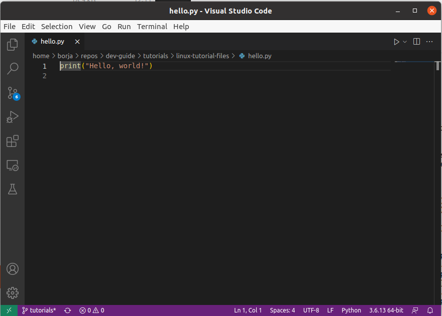

.. _tutorial-linux-basics:

Tutorial - Linux Basics
=======================

Linux is an operating system, just like Windows and MacOS. It allows
you (the user) to interact with your computer, and provides many
of the same tools you're accustomed to in Windows and MacOS (web
browsers, word processors, etc.)

In almost all CS classes, instructors will assume that you know your
way around a Linux environment, and may require that you compile and
run code in a Linux system. While there are many things you'll
be able to do from a Linux desktop environment, it is also important
that you be come comfortable using the *terminal*, a command-line
interface for interacting with the filesystem, running programs, etc.

In this tutorial you will learn how to use
the terminal to perform some basic operations in Linux, including how to:

#. Use basic terminal commands
#. Edit, compile, and run a program
#. Use keyboard shortcuts.

TODO:

(1) Point students using ssh to the VSCode installation instructions.
(2) add .c, .java, .c++ programs to distribution and to the ls examples.
(3) Label the work in edit, compile, run section as "Exercises"
    

Where should you do this tutorial?
----------------------------------

Since one of the goals of this tutorial is for you to be able to use
the CS department's Linux environment, we strongly suggest you work
through this tutorial on a :ref:`UChicago CS software environment <software-environment>`.
While you can work through the tutorial in one of our computer labs,
we recommend :ref:`using SSH <ssh>` to log into a CS Linux server from
your personal computer, as this will likely be the primary way you'll
be interacting with the CS department's Linux systems.

It should also be possible for you to work through this
tutorial in other UNIX environments, such as the MacOS terminal
or `Ubuntu WSL <https://ubuntu.com/wsl>`__ on Windows, but we
recommend against it, since you should try to become familiar
specifically with the Linux environment provided by the CS department.

Terminal/Shell
--------------

On your personal computer, you probably navigate your hard drive by
double clicking on icons. While convenient for simple tasks, this
approach is limited. For example, imagine that you want to delete all of
the music files over 5 MB that you haven't listened to in over a
year. This task is very hard to do with the standard double-click
interface but is relatively simple using the terminal.

If you are using a desktop environment (e.g., you are sitting in CSIL
or you're using the Virtual Desktop), you can start a terminal by
clicking on the Application icon (3x3 grid of dots) at the bottom left of
the screen:

Then, type "terminal" in the input box. Click the "terminal"
icon to open a terminal window.  You can also use the keyboard shortcut: ``Ctrl+Alt+t.``

If you are using SSH, connecting to a CS Linux server will directly
open a terminal for you.

Regardless of how you open the terminal, you will see something
like this::

    username@computer:~$

where ``username`` has been replaced by your CNetID and ``computer``
is the name of the machine you happen to be using.  This string is
called the prompt.  When you start typing, the characters you type
will appear to the right of the ``$``.

The program that runs within a terminal window and processes the
commands the you type is called a *shell*.  We use ``bash``, which is
the default shell on most Linux distributions, but there are other
popular shells, such as ``ksh``, ``tcsh``, etc.

In the remaining sections, we will introduce a new concept or skill
in each section, and will provide a few simple examples. In fact, we show many
examples of sample output throughout the tutorial. Bear in mind that the
output you see when you run through our examples may vary a bit; this is normal.
We have also included a few exercises in each section so you can practice
those skills.

Navigating the File System
--------------------------

Files in Linux are stored in directories/folders, just like in
macOS/Windows. Directories can hold files or other subdirectories and
there are special directories for your personal files, your Desktop,
etc.:

+------------------+------------------+-------------------+----------------------------------------+
| Name             | Linux            | Mac               | Windows                                |
+==================+==================+===================+========================================+
| Root directory   | /                | /                 | C:\\                                   |
+------------------+------------------+-------------------+----------------------------------------+
| Home directory   | /home/username   | /Users/username   | C:\\Documents and Settings\\username   |
+------------------+------------------+-------------------+----------------------------------------+

.. image:: filesystem.username.svg
   :align: center
   :width: 650
   :height: 250

The figure above illustrates how Linux organizes the file system. Your
own computer might have a slightly different organization
(e.g., you might replace ``/`` with ``C:``), but the idea is the
same.

For the above and from this point forward, consider that the text
"username" is replaced with your own actual username, which is just
your CNetID.

.. note::

    If you are connected to a CS machine, either because you're physically sitting
    at a CSIL machine or have logged in remotely via SSH or the Remote Desktop,
    that machine is connected to a *network file system*. This means that there is effectively
    one very large hard drive shared by all the CS machines, and that you
    will have access to those files regardless of what machine you use.
    For example, if you create some files while logged into a CSIL machine,
    and then sit at a different CSIL machine the next day (or SSH into the CS Linux servers),
    you will see the exact same files there.

Show Files
~~~~~~~~~~

The terminal will start in your home directory, ``/home/username/``,
which is a special directory assigned to your user account. Any CS
machine that you use (either in CSIL or remotely) will automatically
connect to your home directory and all files that you created or
changed in previous work sessions will be available to you.

Two very useful commands are ``pwd`` and ``ls``:

+---------+--------------------------------------------------------------+
| ``pwd`` | Prints your current working directory - tells you where you  |
|         | are in your directory tree.                                  |
+---------+--------------------------------------------------------------+
| ``ls``  | Lists all of the files in the current directory.             |
+---------+--------------------------------------------------------------+

The following is an example using these two commands in a terminal window::

    username@computer:~$ pwd
    /home/username/
    username@computer:~$ ls
    Desktop  Documents  Downloads  Music  Pictures  Public  Templates  Videos
    username@computer:~$

Try these commands yourself to verify that everything looks similar.

Notice that the directory path and list of files that you see if you
open your home folder graphically are identical to those provided by
``pwd`` and ``ls``, respectively. The only difference is how you get
the information, how the information is displayed, and how easy it is
to write a script that, say, processes all the Python files in a
directory.

Change Directory
~~~~~~~~~~~~~~~~

+-------------------+--------------------------------------------------------------+
|``cd <path-name>`` |     change to the directory path-name                        |
+-------------------+--------------------------------------------------------------+
|  ``cd ..``        |            move up/back one directory                        |
+-------------------+--------------------------------------------------------------+
|   ``cd``          |             move to your home directory                      |
+-------------------+--------------------------------------------------------------+
|   ``cd -``        |             move to the previous directory you were in       |
+-------------------+--------------------------------------------------------------+

How can we move around in the file system? If we were using a
graphical system, we would double click on folders and occasionally
click the "back" arrow. In order to change directories in
the terminal, we use ``cd`` (change directory) followed by the name of
the destination directory. (A note about notation: we will use text
inside angle brackets, such as ``<path-name>`` as a place holder.  The
text informally describes the type of value that should be supplied.
In the case of ``<path-name>``, the desired value is the path-name for
a file or directory.  More about path-names later.)  For example if we want to
change to the ``Desktop`` directory, we type the following in the
terminal::

    cd Desktop

Here is an example of changing to the desktop directory in the terminal.
We use ``pwd`` and ``ls`` to verify where we are and where we can go::

    username@computer:~$ pwd
    /home/username/
    username@computer:~$ ls
    Desktop  Documents  Downloads  Music  Pictures  Public  Templates  Videos
    username@computer:~$ cd Desktop
    username@computer:~/Desktop$ pwd
    /home/username/Desktop/
    username@computer:~/Desktop$ ls

    username@computer:~/Desktop$

Notice that after we ``cd`` into the ``Desktop`` the command ``pwd`` now
prints out::

    /home/username/Desktop/

rather than::

    /home/username/

In the beginning, there are no files in the Desktop directory, which is
why the output of ``ls`` in this directory is empty.

We can move up one step in the directory tree (e.g., from
``/home/username/Desktop`` to ``/home/username`` or from
``/home/username`` to ``/home``) by typing ``cd ..`` Here "up" is
represented by "``..``" In this context, this command will move us up
one level back to our home directory::

    username@computer:~/Desktop$ pwd
    /home/username/Desktop/
    username@computer:~/Desktop$ cd ..
    username@computer:~$ pwd
    /home/username/

Notice that the current working directory is also shown in the prompt string.

+-------------------+--------------------------------------------------------------+
| ``~``             |         shortcut for your home directory                     |
+-------------------+--------------------------------------------------------------+
| ``.``             |         shortcut for the current working directory           |
+-------------------+--------------------------------------------------------------+
| ``..``            |shortcut for one level up from your current working directory |
+-------------------+--------------------------------------------------------------+

The tilde (~) directory is the same as your home directory: that is, ``~`` is shorthand for ``/home/username``.  Here's another useful shorthand: a single dot (``.``) refers to the current directory.

Usually when you use ``cd``, you will specify what is called a
*relative* path, that is, you are telling the computer to take you to
a directory where the location of the directory is described relative
to the current directory. The only reason that the computer knows that
we can ``cd`` to ``Desktop`` is because ``Desktop`` is a folder within
the ``/home/username`` directory.  But, if we use a ``/`` at the
*beginning* of our path, we are specifying an absolute path or one
that is relative to the the "root" or top of the file system.  For
example::

        username@computer:~$ pwd
        /home/username/
        username@computer:~$ cd /home/username/Desktop
        username@computer:~/Desktop$ pwd
        /home/username/Desktop
        username@computer:~/Desktop$ cd /home/username
        username@computer:~$ pwd
        /home/username

These commands achieve the same thing as the ones above: we ``cd``
into ``Desktop``, a folder within our home directory, and then back to
our home directory.  Paths that start with a ``/`` are known as
*absolute paths* because they always lead to the same place,
regardless of your current working directory.

Running ``cd`` without an argument will take you back to your home
directory without regard to your current location in the file system.
For example::

    username@computer:~/Desktop$ cd
    username@computer:~$ pwd
    /home/username

Finally, running ``cd -`` will take you to the previous directory you
were in. For example, suppose we go into the ``Desktop`` directory and,
from there, switch to the ``Documents`` directory. If we wanted to
go back to the ``Desktop`` directory, we can just write ``cd -``::

        username@computer:~$ cd Desktop
        username@computer:~/Desktop$ cd ../Documents
        username@computer:~/Documents$  cd -
        username@computer:~/Desktop$ pwd
        /home/username/Desktop

To improve the readability of our examples, we will use ``$`` as the
prompt rather than the full text ``username@computer:~$`` in the rest
of this tutorial.  Keep in
mind, though, that the prompt shows your current working directory.

Pick Up the Tutorial Materials
~~~~~~~~~~~~~~~~~~~~~~~~~~~~~~

For the remainder of this tutorial, we will need a series of files that you
will use in certain examples and exercises. To fetch these files,
run the following commands::

    cd
    wget -nv https://uchicago-cs.github.io/dev-guide/_static/linux-tutorial-files.zip
    unzip linux-tutorial-files.zip

After you run these commands, your home directory will contain a
``linux-tutorial-files`` directory that has some files
for us to play with. You will learn how to manipulate these files in
the next section.

Exercises
^^^^^^^^^

Use ``pwd``, ``ls``, and ``cd`` to explore the tutorial files and to
navigate to the ``linux-tutorial-files`` directory. The next examples
will assume that your current directory is the ``linux-tutorial-files`` directory.

Useful commands
~~~~~~~~~~~~~~~

+---------------------------------+----------------------------------------------+
|   ``cp`` <source> <destination> | copy the source file to the new destination  |
+---------------------------------+----------------------------------------------+
|   ``mv`` <source> <destination> | move the source file to the new destination  |
+---------------------------------+----------------------------------------------+
|    ``rm`` <file>                | remove or delete a file                      |
+---------------------------------+----------------------------------------------+
|    ``mkdir`` <directoryname>    | make a new empty directory                   |
+---------------------------------+----------------------------------------------+
|    ``cat`` <path-name>          | print the contents of a file to the terminal |
+---------------------------------+----------------------------------------------+

Sometimes it is useful to make a copy of a file. To copy a file, use
the command::

    cp <source> <destination>

where ``<source>`` is replaced by the name of the file you want to
copy and ``<destination>`` is replaced by the desired name for the
copy. An example of copying the file ``test.txt`` to ``copy.txt`` is
below::

    $ cp test.txt copy.txt

``<destination>`` can also be replaced with a path to a directory.  In
this case, the copy will be stored in the specified directory and will
have the same name as the source.

Move (``mv``) has exactly the same syntax, but does not keep the
original file. Remove (``rm``) will delete the file from your
directory.

If you want to copy or remove an entire directory along with its
files, the normal ``cp`` and ``rm`` commands will not work. Use ``cp -r`` instead of ``cp`` or ``rm -r``  instead of ``rm`` to copy or remove directories (the ``r`` stands for "recursive").

.. warning::

    Running ``rm -r`` cannot be undone. If you want to remove the entire contents
    of a directory, make sure you're certain *before* you use ``rm -r`` that you want to remove
    *everything* in the named directory.

Some useful terminology: the ``-r`` argument in ``cp -r`` or ``rm -r`` is known as a *flag*.  Flags help determine the behavior of a program.  In this case, the flag allows ``cp`` and ``rm`` to work with a directory tree, rather than just a single file. Most commands can accept a number
of different flags; later in this tutorial, we'll see how to look up the documentation for
specific commands, where we will be able to see the list of supported flags in each command.

You can make a new directory with ``mkdir <directoryname>``, where
the placeholder ``<directoryname>`` is replaced with the desired name for the new directory.

Sometimes, we may want to take a look at the contents of a file from the terminal, without
opening the file in an editor. We can do this with the ``cat`` command. For example::

    $ cat test.txt
    Linux Tutorial - Test file
    ==========================

    Name: Firstname Lastname

Later in the tutorial, we'll see how to edit this file.

Exercises
^^^^^^^^^

Try the following tasks to practice and check your understanding of
these terminal commands.

1. Copy ``test.txt`` to ``copy.txt`` and use ``ls`` to ensure that both files exist.

2. Move the file ``copy.txt`` to the name ``copy2.txt``. Use ``ls`` to
   verify that this command worked.

3. Make a new directory named ``backups`` using the ``mkdir`` command.

4. Copy the file ``copy2.txt`` to the ``backups`` directory.

5. Verify that step (4) was successful by listing the files in the
   ``backups`` directory.

6. Now that we have a copy of ``test.txt`` in the ``backups`` directory we
   no longer need ``copy2.txt``. Remove the file ``copy2.txt`` in the ``linux-tutorial-files``
   directory.

7. Print the contents of the ``hello.py`` file.

It can be tedious (and, when you are tired, challenging) to spell
directory or file names exactly, so the terminal provides an
auto-complete mechanism to guide you through your folder
explorations. To access this functionality simply start typing
whatever name you are interested in the context of a command and then
hit tab. If there is only one way to finish that term hitting tab will
fill in the rest of the term, for instance, if we typed ``ls b`` and
then hit tab it would automatically finish the word ``ls backups`` and
then await our hitting enter. If there is MORE than one way to finish
a term, like if we had another folder called ``backups-old``, then
hitting tab twice will cause the terminal to display all of the
options available.

Training yourself to use auto-completion (aka tab completion) will save
you time and reduce the inevitable frustration that arises from
mistyping filenames when you are tired or distracted.

Wild Cards (using an asterisk)
~~~~~~~~~~~~~~~~~~~~~~~~~~~~~~

Sometimes when we enter a string, we want part of it to be variable, or a wildcard. A common task is to list all files that end with a given extension, such as ``.txt``.  The wildcard functionality, through an asterisk, allows us to simply say::

    $ ls *.txt

The wildcard can represent a string of any length consisting of any characters - including the empty string.

It is important to be **careful** using wildcards, especially for commands like ``rm`` that cannot be undone. A command like::

    $ rm *             ### DO NOT RUN THIS COMMAND!

will delete **all** of the files in your working directory!

FYI, the text that follows a ``#`` on the linux command-line is
treated as a comment and is ignored.

Exercises
^^^^^^^^^

#. Navigate to your home directory.  What do you see when you run ``ls linux-tutorial*``?  What about ``ls linux-tutorial*/*.py``?

.. _tutorial-linux-basics-man-pages:

Man Pages
---------

A man page (short for manual page) documents or describes topics related to working with Linux. These topics include specific Linux programs, certain programming functions, standards, and conventions, and abstract concepts.

To get the man page for a Linux command, you can type::

    man <command name>

So in order to get the man page for ``ls``, you would type::

    man ls

This command displays a man page that gives information on the ``ls`` command, including a description of the command, a list of the flags it supports, instructions on how to use it, and other information.

Each man page has a description. The ``-k`` flag for ``man`` allows you to search these descriptions using a keyword. For example::

    man -k printf

This searches all the descriptions for the keyword ``printf`` and prints the names of the man pages with matches.

Learning how to read man pages is an important skill.

Exercise
~~~~~~~~

By default, the ``ls`` command does not include files with names that start with a dot (``.``).
The ``linux-tutorial-files`` directory contains a file that starts with a dot.  Use ``man`` to identify the flag to use with ``ls`` to include this file when listing the contents of ``linux-tutorial-files``.

Editing files
-------------

In many of your classes, you will have to edit text files containing programming code.
While there are many graphical editors you could use (either on a CS Linux environment,
or on your own computer), it is also important to be familiar with *terminal editors*
that run exclusively from a terminal and don't require a desktop environment.
These editors can be particularly useful if you *only* have access to a terminal
(e.g., if you're logging into a CS Linux server using SSH).

Using a terminal editor
~~~~~~~~~~~~~~~~~~~~~~~

List the files in the ``linux-tutorial-files`` directory. You should see the following::

    backups hello.py  my_echo.py  my-input.txt  test.txt

Let's say we wanted to edit the file ``test.txt``. There are many different terminal
editors we could use, but we will start with a simple and fairly intuitive one: ``nano``.
To edit the file, run the following::

    nano test.txt

This will open the ``test.txt`` file in the nano editor, which will look something like this:

.. image:: nano.png
   :align: center

The way you interact with this editor will be very similar to how you use a text editor (or
a word processor) in a graphical desktop environment: you can use the arrow keys to move
around the text, and typing text will insert that text at the location of the cursor.
You can also use the Backspace key to delete text.

Try removing the text ``Firstname Lastname`` and replacing it with your name. Then,
save the file by pressing Ctrl-O (i.e., the Control key and the O key at the same time).
You will see the following prompt at the bottom of the screen::

    File Name to Write: test.txt

You can just press Enter to confirm you'd like to save the changes to the same file
(however, you could also specify a different file).

The bottom of the screen actually specifies some of the most common commands you
can run in the editor. For example, ``^O Write Out`` refers to what we just did:
Pressing Ctrl-O allows your "write out" (i.e., save) the file (a common abbreviation
for the Control key is ``^``).

Another common command is ``^X Exit``. Just press Control-X to exit the editor.

While ``nano`` is a simple and intuitive editor, there are many other editors
out there. If you're interested in a more powerful terminal editor, you
may want to check out `Vim <https://www.vim.org/>`__ or `Emacs <https://www.gnu.org/software/emacs/>`__.

Using a graphical editor
~~~~~~~~~~~~~~~~~~~~~~~~

If you are using a desktop environment, you can also use a number of different
graphical editors. We will use `Visual Studio Code
<https://code.visualstudio.com>`_, which is good for writing code.

You can open a specific file, say ``hello.py``, using the ``code``
command from the Linux command-line by typing::

    code hello.py

When you run this command, you will get a new window that looks like this:

Specifically, you'll see the following text::

    print("Hello, world!")

If the file is blank, quit ``code`` and ensure that the file
``hello.py`` exists in your local directory (use ``ls`` to list the
files in your local directory). If it does not, use ``cd`` to navigate
to the ``linux-tutorial-files`` directory.

For now, we will use Visual Studio Code (``code``) in a very basic
way.  You can navigate to a particular place in a file using the arrow
keys (or your mouse) and then type typical characters and delete them
as you would in a regular text editor.  You can save your changes
using the Save option in the File menu or use the keyboard
shortcut ``Ctrl-s``.  To quit, you can use the Exit option in the File
menu or the keyboard shortcut ``Ctrl-q``.

As an aside, you can also launch ``code`` from the application
launcher: simply click the Application button (at the top left of your
screen), type "code" in the input box, and then click on the Visual
Studio Code icon.  You can then use the "Open File..." option in the
File menu to open the correct file.

The edit/compile/run cycle in the terminal
------------------------------------------

When writing code, you will very often go through several cycles
of the edit/compile/run cycle:

1. Edit: You edit the source code file to add or modify some code.
2. Compile: You compile the code into a runnable executable (only in compiled
   languages; e.g., this step doesn't apply in Python)
3. Run: You run the executable to verify that the code you added/modified
   works as expected.

We have previously covered how to edit files from the terminal, but
now we'll see the basic commands to compile and run your code from the terminal.
We have included four example programs in the tutorial files which you
can use for this purpose:

- ``hello.py`` (Python)
- ``hello.c`` (C)
- ``hello.cpp`` (C++)
- ``Hello.java`` (Java)

Python
~~~~~~

In Python, given a ``.py`` file, such as our ``hello.py`` file, we can run it from the terminal like this::

    $ python3 hello.py
    Hello, world!

Now, try editing the file (e.g., change the message from ``Hello, world!`` to ``Hello, universe!``)
and running the program again. You should now see the updated message.

C
~

C is a *compiled* language, which means that we first need to compile our program
to produce an executable file. For example, we can compile our ``hello.c`` program
like this::

    gcc hello.c -o hello

We are using the ``gcc`` compiler, but some classes may use the ``clang`` compiler.
The first parameter (``hello.c``) specifies the C file we want to compile, and
the ``-o`` option specifies the executable file we want to produce.

Running the above command will produce a ``hello`` file that you can run like this::

    $ ./hello
    Hello, world!

Now, try editing ``hello.c`` (e.g., change the message from ``Hello, world!`` to ``Hello, universe!``).
If you re-run ``./hello``, you'll see that the old message is still being printed out:
this is because you need to compile the ``hello.c`` file to produce an updated executable.
Once you do so, you should see the updated message when you run ``./hello``

C++
~~~

The process for compiling/running programs in C++ is basically the same
as in C, except we will use the ``g++`` compiler::

    $ g++ hello.cpp -o hello++
    $ ./hello++
    Hello, world!

Java
~~~~

Like C/C++, Java is a compiled language, although the Java compiler
doesn't produce an executable in the same way that the C/C++ compiler
does (we'll see why momentarily).

To compile a Java file, you need to run this::

    javac Hello.java

Unlike the C/C++ example we just saw, this will actually produce a
file called ``Hello.class`` that is not directly runnable from the terminal
(i.e., running ``./Hello.class`` like we did in the C/C++ example won't
work). Instead, we need to use the ``java`` command to run it::

    $ java Hello
    Hello, world!

Notice how we don't have to include the ``.class`` extension.

Now, try editing ``Hello.java`` (e.g., change the message from ``Hello, world!`` to ``Hello, universe!``).
If you re-compile the file and run it again, you should see the updated message.

Tips and Tricks
---------------

Terminating a program
~~~~~~~~~~~~~~~~~~~~~

Sometimes, a program will run indefinitely or misbehave. When this
happens, you can type ``Ctrl-C`` to send an interrupt signal to the
running program, which usually causes it to terminate. On occasion,
you may need to type ``Ctrl-C`` a few times.  As noted earlier, typing
``Ctrl-D`` sends an end of input signal, which tells the program that
no more information is coming.

Keyboard shortcuts
~~~~~~~~~~~~~~~~~~

Used in the terminal, the keyboard shortcut ``Ctrl-P`` will roll
back to the previous command.  If you type ``Ctrl-P`` twice, you will
roll back by two commands.  If you type ``Ctrl-P`` too many times, you
can use ``Ctrl-N`` to move forward.  You can also use the arrow keys:
up for previous (backward), down for next (forward).

Here are few more useful shortcuts:

- ``Ctrl-A`` will move you to the beginning of a line.
- ``Ctrl-E`` will move you to the end of a line.
- ``Ctrl-U`` will erase everything from where you are in a line back to the beginning.
- ``Ctrl-K`` will erase everything from where you are to the end of the line.
- ``Ctrl-L`` will clear the text from current terminal

Play around with these commands.  Being able to scroll back to, edit,
and then rerun previously used commands saves time and typing!  And
like auto-completion, getting in the habit of using keyboard shortcuts
will reduce frustration as well save time.

Acknowledgments
----------------

Parts of this tutorial are based on a Linux lab originally written for CMSC 12100
by Prof. Anne Rogers and Prof. Borja Sotomayor, and edited by numerous instructors
and TAs over the years.
