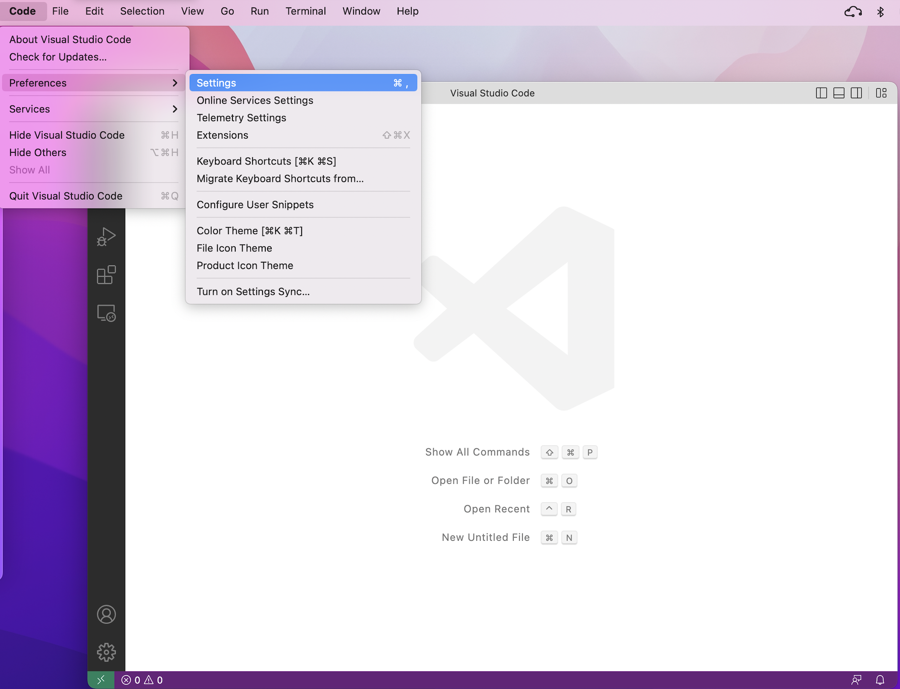
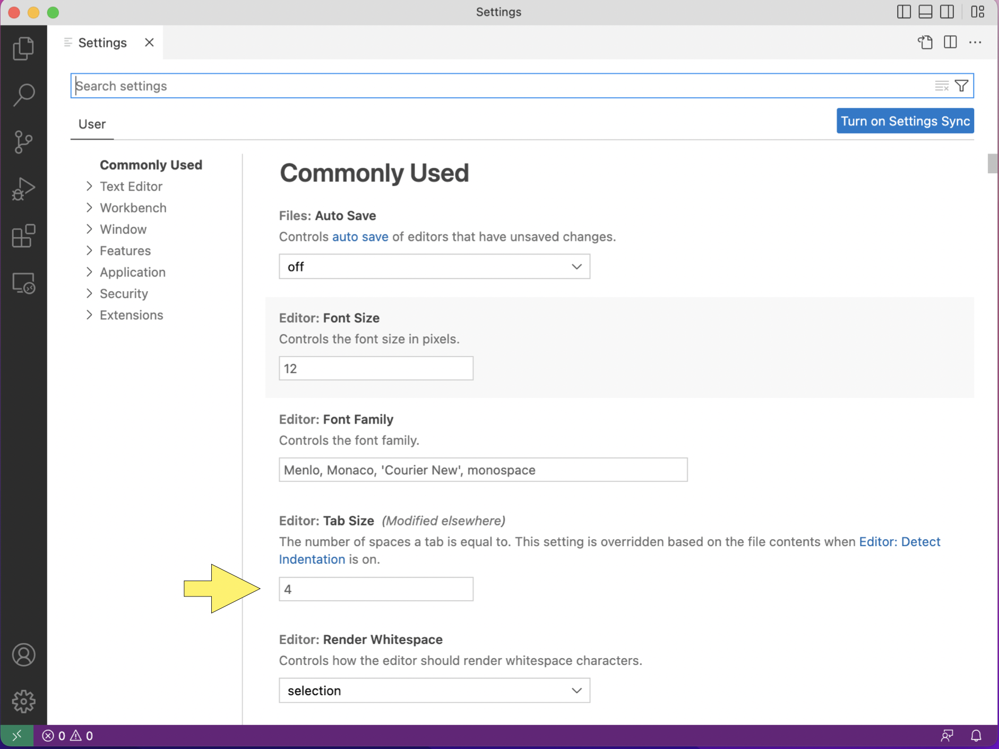
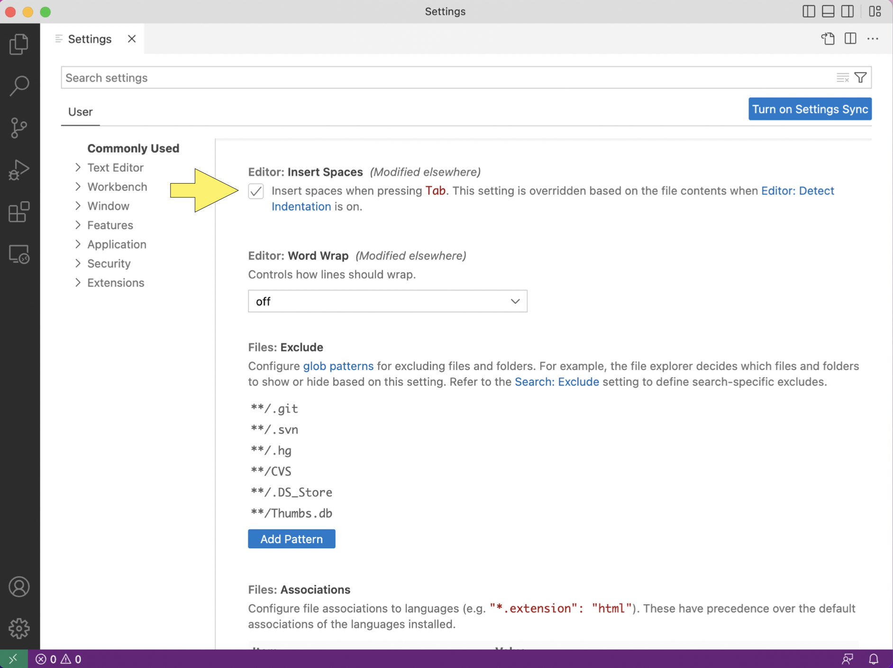
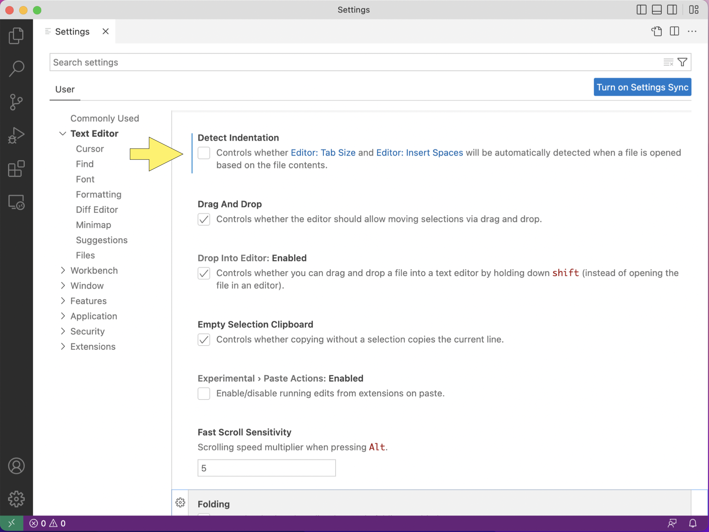
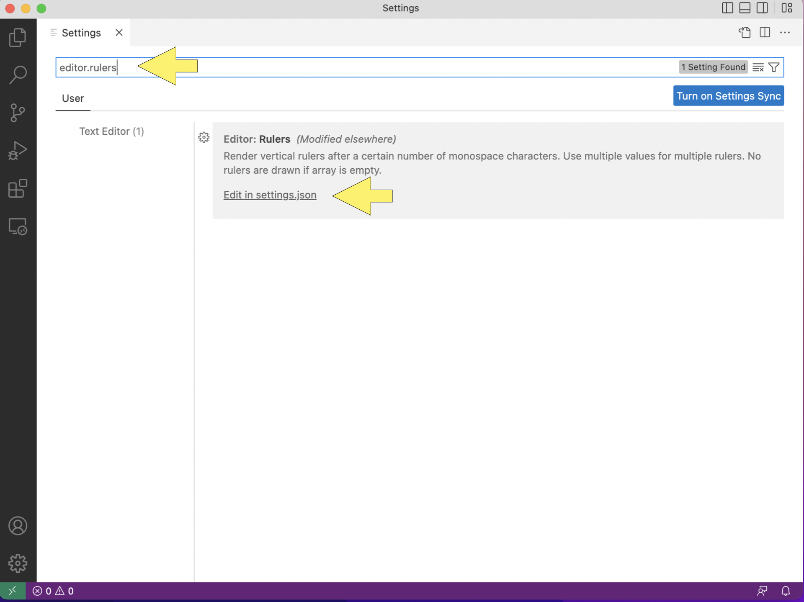
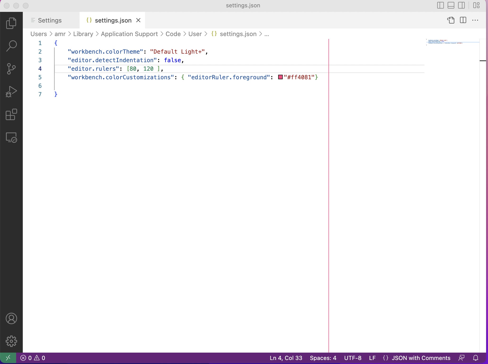
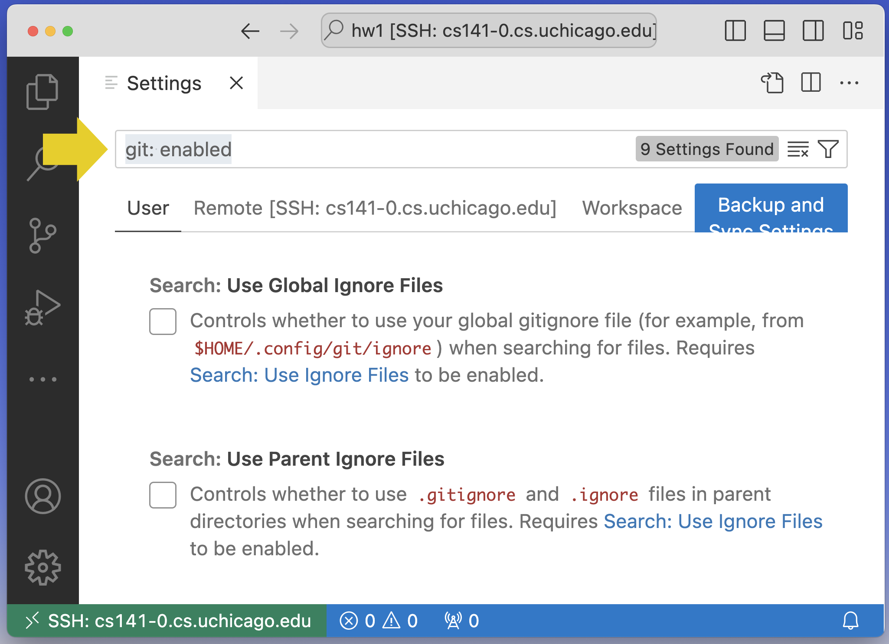
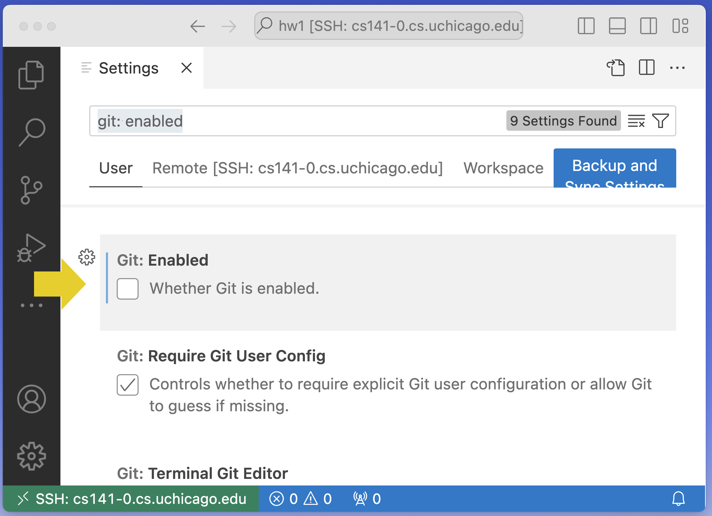

.. _vscode-config:

Configuring Visual Studio Code
==============================

In this page, you will find instructions on how to set some common configuration
options. Many of these will make it easier to conform to our style guides.

If you are planning to primarily use VS Code with SSH, please make sure you
connect to a CS Linux Server (as described in :ref:`vscode-ssh`) before
following these instructions.

.. _vscode-install-extensions:

Install Language Extensions for VS Code
---------------------------------------

In the left sidebar of VS Code, there is an icon
consisting of four squares, with one square separated off from the
other three. This is the icon for VSCode extensions. Click it
(alternatively, you can press Ctrl-Shift-X, or Command-Shift-X on
macOS).

.. figure:: code-img/install-ext-1.png

This opens the *Extensions* panel. From here, you can search for and install extensions. You should install the extensions for the language(s) you intend to use:

- **Python**

  - Python

- **C/C++**

  - C/C++
  - C/C++ Extension Pack

- **Java**

  - Extension Pack for Java

Please note that all of these extensions should list "Microsoft" as the publisher of the extension.

To install an extension, click in the search bar ("Search Extensions in Marketplace") and start typing the name of the extension. When it appears, make sure the name and publisher matches exactly, and click *Install*.

.. figure:: code-img/install-ext-4.png

Space Indentation
-----------------

Your editor should be set such that tabs are equivalent to four spaces. This guide focuses on how to configure indentation in VS Code. First, set the tab size to four spaces. Go to *Settings...*, *Settings*, and select *Commonly Used*.

Under *Commonly Used* find *Editor: Tab Size* and set it to four.

Next, set tabs as spaces. Go to *Commonly Used* again, and set *Editor: Insert Spaces* to true.

Lastly, turn off detect indentation. Go to *Editor: Detect Indentation* and set it to false.

Rulers
------

Your code should, generally, not have lines longer than 80 characters. To make sure you do not go over that line limit, you should configure VS Code to render line rulers. Go to *Preferences*, *Settings*, and look up *Editor: Rulers*.

Open the *settings.json* file and copy the following to the file.

.. code-block::

    "editor.rulers": [80,120],

    "workbench.colorCustomizations": {
        "editorRuler.foreground": "#ff4081"
    }

Add the code after the last item within the curly braces.  The result should look like this: 

(If you have set other settings, you may see additional information in the file.)

Make sure to save the file using ``Ctrl-s``, if you are using a
Windows or Linux Machine or ``Command-s``, if you are using a MacOS
machine.  If your changes worked properly, you will see a vertical
red-line at 80 characters.  If your VSCode window is wide enough, you
will see a second vertical line at 120 characters.

Turning off Git Integration
---------------------------

Git is a version control system that is in many CS courses at
UChicago.

By default, VSCode has tools for working with Git installed.  While
this integration can be helpful for programmers who have a good
understanding of Git, it can cause problems for new programmers.  As a
result, some instructors will ask you to disable VSCode + Git
integration.  This section explains how to do so.

To turn off Git integration, open the VSCode settings panel (either by
using the menu as you did in the previous section or using the
keyboard shortcut ``Control+,`` (``Command+,`` for MacOS users), that
is, hold down the control key and type a comma.

In the settings search bar, type ``git: enabled`` as shown below:

Scroll through the results to find the ``Git: Enabled`` option and
click to remove the checkmark.  The result should be:

You can then close the settings panel by clicking the ``X`` in the
``Settings`` tab.

Once are you comfortable with using Git for solo projects and for
group projects, you can reverse this process to turn Git integration
back on.

Terminal
--------

When you open a terminal in a CS Linux system (whether it be on a
desktop environment or via SSH), the exact type of terminal that will
be running is a `Bash
<https://en.wikipedia.org/wiki/Bash_(Unix_shell)>`__ shell. So, we
recommend that you set up VS Code to run a Bash shell in the built-in
terminal.  You can skip this step if you are using VSCode with SSH
integration.

If you are running on a Windows machine, you should install `Git for Windows <https://gitforwindows.org/>`__,
which provides a Bash emulation layer called "Git Bash". While this is not a full-featured Bash shell,
it will allow you to run Git commands as if you were in a Bash shell.

If you are on a Linux or Mac, Bash is already pre-installed.

Regardless of what operating system you use, you should make sure that Bash is set up as your
default shell in VS Code:

#. Open the integrated terminal by pressing :code:`Ctrl-Shift-``
#. Click on the drop down next to the plus sign.
#. Click *Select Profile*
#. Select bash or Git Bash.

