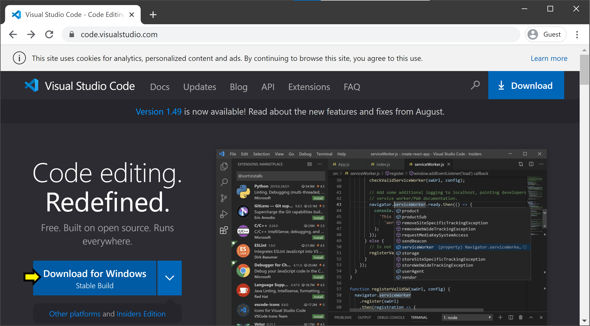
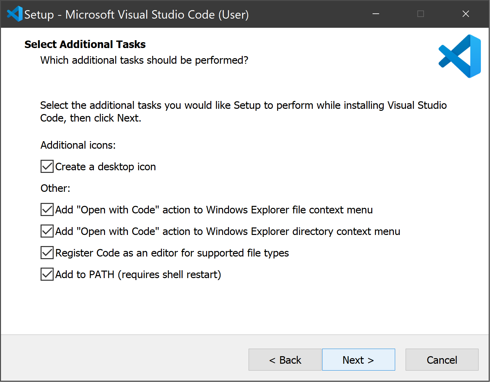
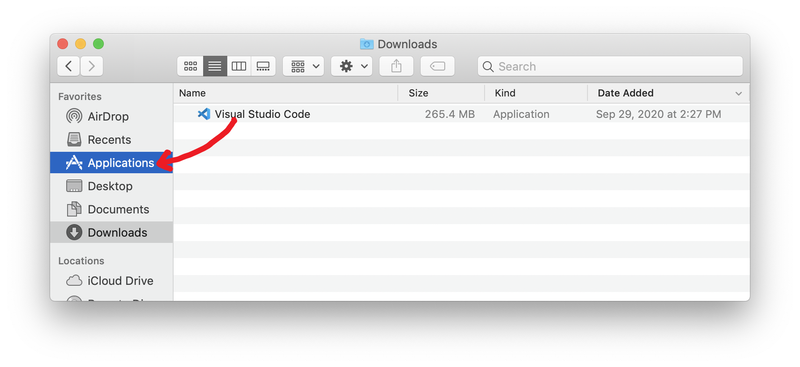
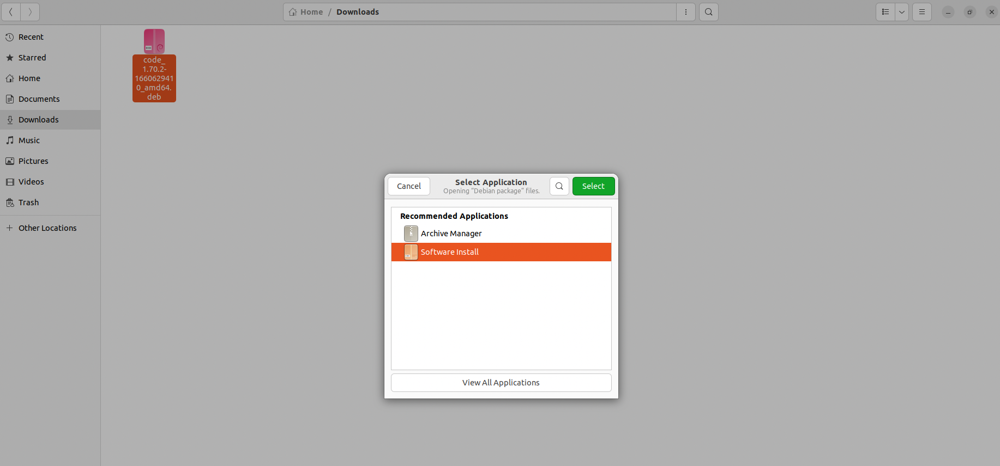

.. _vscode-install:

Installing Visual Studio Code
=============================

.. Todo::
    Linux: how to pick matching installer -- Add Annotations

Follow the instructions for your operating system:

Windows
~~~~~~~

Go to https://code.visualstudio.com/. You should see a blue button labeled *Download for Windows, Universal Build*.

Click this button to download. Once it is downloaded, run the installer (``VSCodeUserSetup-<version>.exe``).

After you accept the licence agreement, click *Next >*. On the page titled *Select Additional Tasks*, we recommend you check all the boxes (but it is up to you).

Click *Next >*, then click *Install*. When the progress bar fills, click *Finish*.

macOS
~~~~~

Go to https://code.visualstudio.com/. You should see a blue button labeled *Download for Mac Universal, Stable Build*.

.. figure:: code-img/install-code-mac-1.png

Click on this button to download. When the download is complete, you will have a new application file called *Visual Studio Code* (You might instead have zip file, with a name like ``VSCode-darwin-universal.zip``; in this case, open the file to unzip it, and the *Visual Studio Code* application file should appear). Open a *Finder* window and navigate to *Downloads* (it will likely be listed under "Favorites" in the left sidebar). Locate the file named *Visual Studio Code*, and drag it on top of *Applications* in the left side bar.

Now, you can find VSCode in your Applications folder, and can open it with a click.

Linux
~~~~~

Go to https://code.visualstudio.com/. You should see two blue buttons labeled *.deb* and *.rpm*. Since most of you will be using Ubuntu, click on the *.deb* button.

.. figure:: code-img/install-code-deb-1.png

Open the directory where you downloaded the .deb file and right click on it. Click on *open with* and select *Software Install*. Follow the prompts on the installer to install the package.

