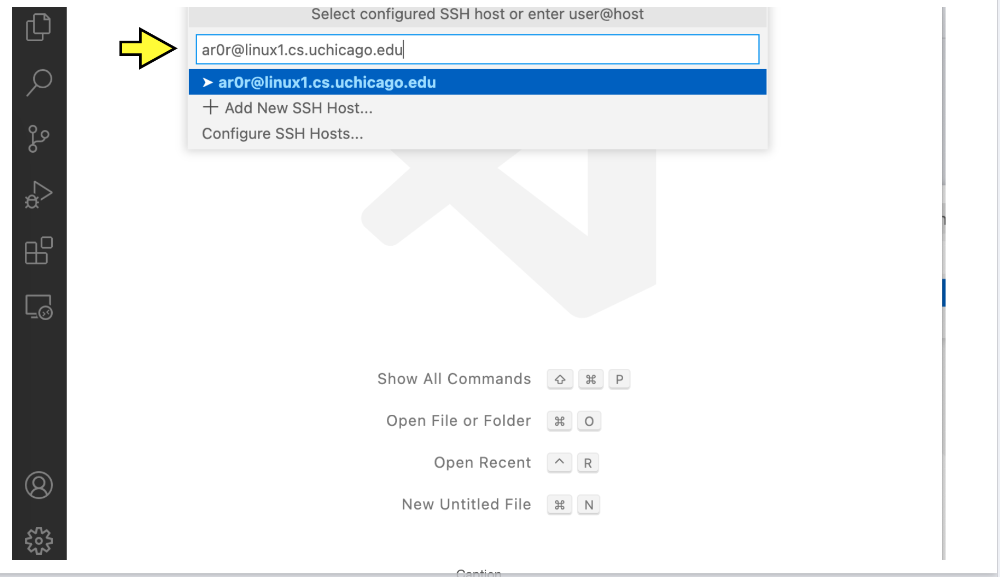
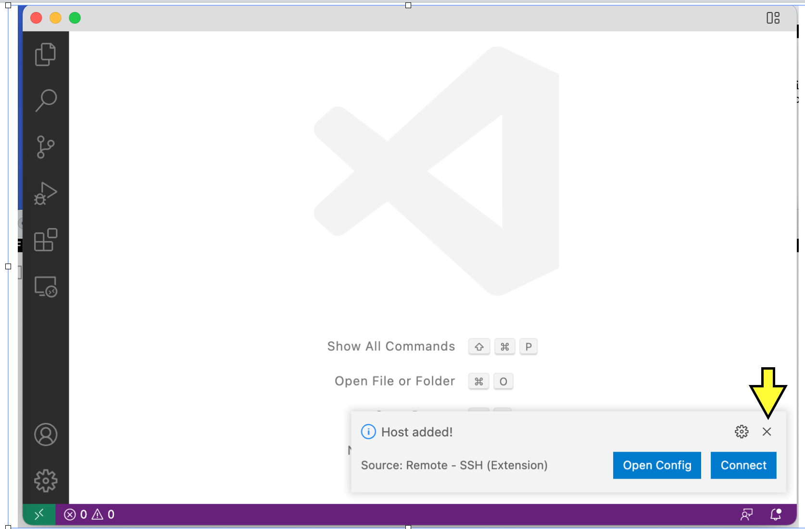
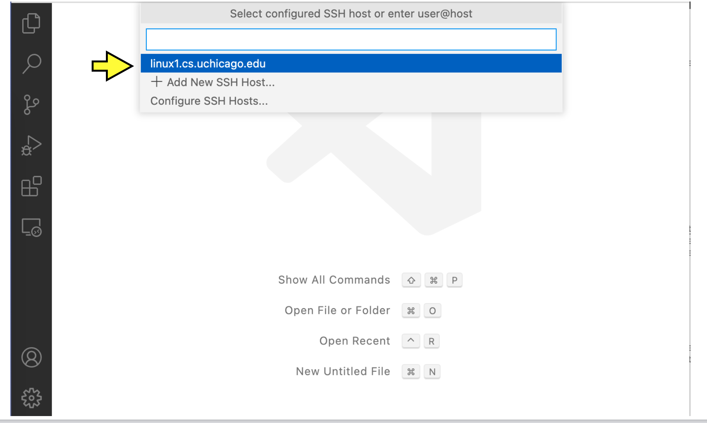
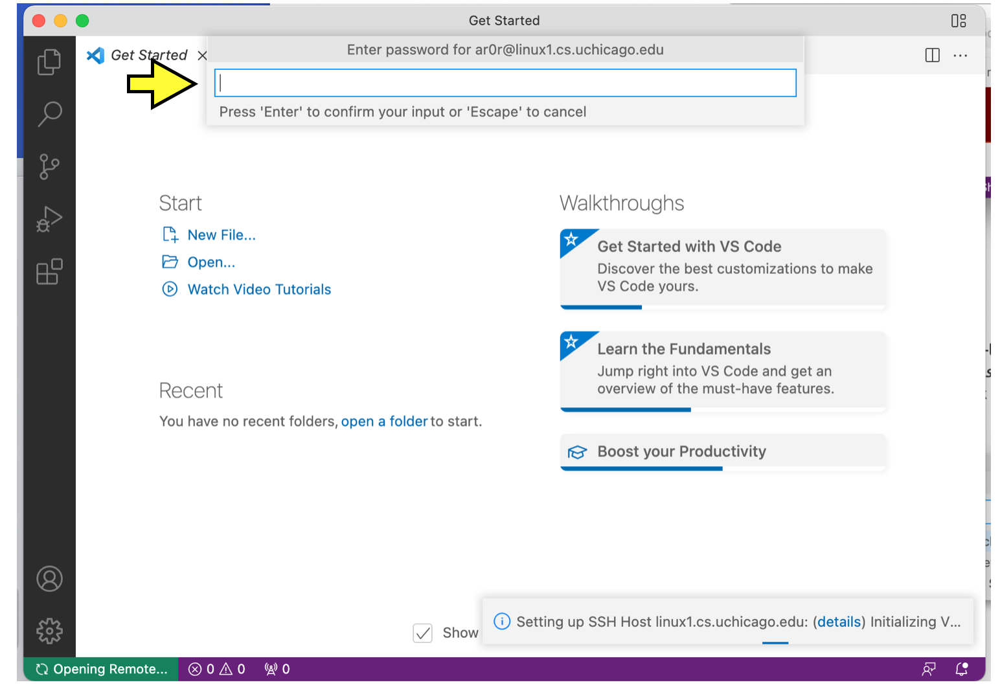
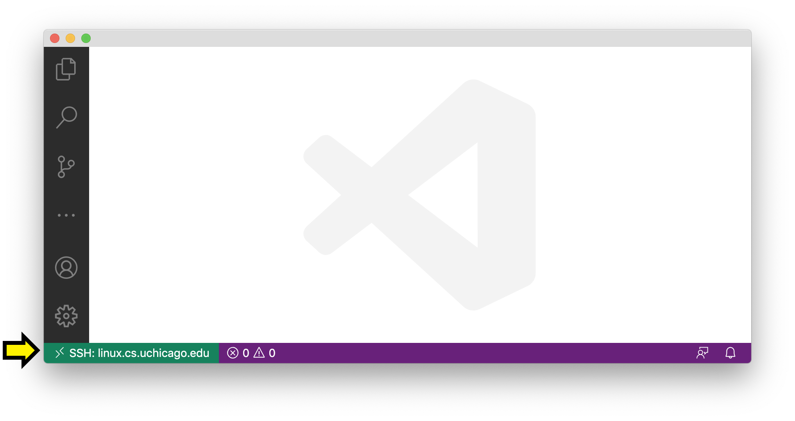
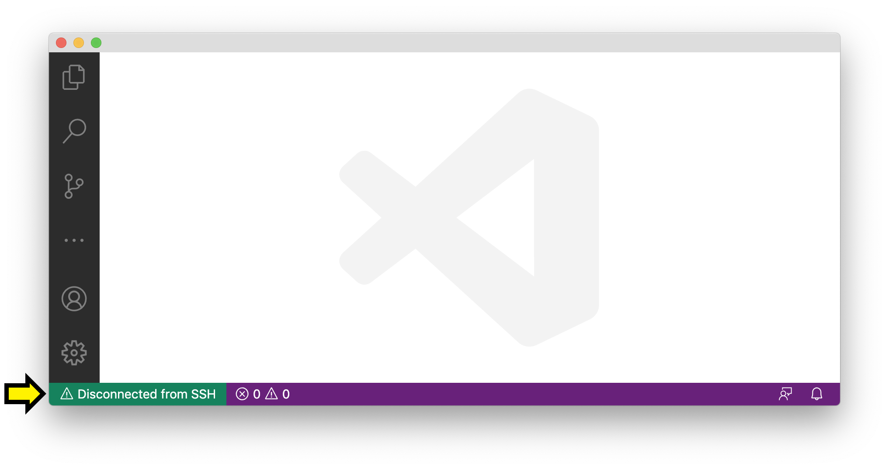

.. _vscode-ssh:

Using Visual Studio Code and SSH
================================

VS Code provides a convenient mechanism to connect remotely to the CS Linux servers
from inside VS Code, using SSH. This means you can run VSCode on your personal computer
to edit files that live in the CS Linux servers, as well as interact
with those files from a terminal built into VSCode (e.g., to run your
code).

In this page, we will specifically explain how to connect
to the CS Linux servers. We assume that you are already familiar
with SSH; if you are not, please make sure to read the :ref:`ssh` page.

Server assignments
------------------

In the instructions below, you will be asked to connect to a Linux
server.  The main linux server (``linux.cs.uchicago.edu``) acts as a front
end for specific linux machines (named ``linux1.cs.uchicago.edu``
through ``linux7.cs.uchicago.edu``).  VS Code works best when connected
with a specific machine rather than to the front end.

We would like to avoid having everyone using
``linux1.cs.uchicago.edu``, so we suggest you connect
to one of the following servers, based on the first
letter of your CNetID:

+------------+--------------------------------+
| A,B        | linux1.cs.uchicago.edu         |
+------------+--------------------------------+
| C,D,E,F    | linux2.cs.uchicago.edu         |
+------------+--------------------------------+
| G,H,I,J    | linux3.cs.uchicago.edu         |
+------------+--------------------------------+
| K,L,M      | linux4.cs.uchicago.edu         |
+------------+--------------------------------+
| N,O,P,Q,R  | linux5.cs.uchicago.edu         |
+------------+--------------------------------+
| S,T,U,V    | linux6.cs.uchicago.edu         |
+------------+--------------------------------+
| W, X, Y, Z | linux7.cs.uchicago.edu         |
+------------+--------------------------------+

For example, Anne Rogers would use ``linux1.cs.uchicago.edu``, because
her CNetID (``ar0r``) starts with an ``A``, while Hannah Morgan would
use ``linux3.cs.uchicago.edu`` because her CNetID (``hmmorgan``)
starts with an ``H``.

In the instructions below, you will be asked to replace ``username``
with your CNetID and ``LINUX_SERVER`` with your assigned linux server.
For example, if the text says run the command:

::

   ssh username@LINUX_SERVER

Anne Rogers would run:

::

   ssh ar0r@linux1.cs.uchicago.edu

because her CnetID (username) is ``ar0r`` and her assigned linux
server is ``linux1.cs.uchicago,edu``.

Remotely connecting to the CS Linux servers
-------------------------------------------

You will be able to use Visual Studio Code to connect remotely to the
Linux computers on campus to (1) use the terminal (to execute shell
commands, compile and run code, run automated tests, etc.),
and (2) to edit text files (usually code).

Open Visual Studio Code now.

Initial setup
~~~~~~~~~~~~~

You only need to follow the steps in this section once (or more accurately, once per computer that you will use to connect remotely). If you've already done this part, you can continue to "Connecting".

First, you will need to install an extension that will allow VS Code
to use SSH. In the left sidebar of VS Code, there is an icon
consisting of four squares, with one square separated off from the
other three. This is the icon for VSCode extensions. Click it
(alternatively, you can press Ctrl-Shift-X, or Command-Shift-X on
macOS).

.. figure:: code-img/install-ext-1.png

This opens the *Extensions* panel. From here, you can search for and install extensions. Search for "the "Remote - SSH" and click "Install".

Once you do so, there should be a green rectangle with an icon that looks like *><*, but skewed in the lower-left corner of VSCode. Click on this icon.

.. figure:: code-img/connect-1.png

In the menu that appears, click *Remote-SSH: Connect to Host...*.

.. figure:: code-img/connect-2.png

You should see the heading *Select configured SSH host or enter user@host*.

Click *+ Add New SSH Host...*.

.. figure:: code-img/connect-3.png

A textbox will appear with the heading *Enter SSH Connection Commnand*. In the box, type

.. code-block:: bash

    ssh username@LINUX_SERVER

with ``username`` replaced by your CNetID  and ``LINUX_SERVER`` is replaced with your assigned Linux server, and press enter.  This example uses Anne Rogers' CNetID and assigned Linux server.  Make sure to use **your** CnetID and assigned Linux server.

Next, you will see the heading *Select SSH configuration file to update*. Press enter to select the first option (which should contain the string "User" or "home" and the username you use on your laptop).

.. figure:: code-img/connect-5.png

If you see a a pop-up that looks like this:

click the ``x`` to make it go away.  (Don't connect just yet.)

You are ready to connect.

Connecting
~~~~~~~~~~

Click the green rectangle in the lower-left corner with the *><* icon. Click *Remote-SSH: Connect to Host...*. You should see the heading *Select configured SSH host or enter user@host*. This time, you should see the option ``LINUX_SERVER`` (where ``LINUX_SERVER`` is your assigned linux server) (if not, you should retry "Initial Setup"). Click on this option.

A new VSCode Window will open. After a moment, you will see a pop-up.

You may see a pop-up prompting *Select the platform of the remote host*; if so, click *Linux*. You will then see a box with the heading *Enter password for username@LINUX_SERVER* (with *username* replaced by your CNetID  and ``LINUX_SERVER`` is replaced with your assigned linux server). Enter the password corresponding to your CNetID, and press enter.

If the connection is not successful, you may be given an option to try again; click *Retry*.

If you succeed at connecting, there will be a green box in the lower-left corner of the window with the text *SSH: LINUX_SERVER*.

Getting Disconnected
~~~~~~~~~~~~~~~~~~~~

If at any point you get disconnected from the server unintentionally, this will be indicated in the green box in the lower-left corner (with text such as "Disconnected from SSH").

VSCode may show a pop-up asking if you want to reconnect. You can follow the prompts to reconnect. If that does not work, go back and follow the steps under *Connecting* again.

If you would like to disconnect from the server intentionally, click the green box in the lower-left corner with the text *SSH: LINUX_SERVER*, then click *Close Remote Connection*.

Adding SSH Keys
---------------

.. todo::
    Write intro paragraph with raison d'etre for adding ssh keys.

Adding SSH keys to allow log in with the linux servers can be accomplished in two steps. First, we mus generate a key to use with the SSH server. To generate the key, simply run these commands in the terminal.

.. code-block:: bash

    ssh-keygen -t rsa -N '' -f ~/.ssh/id_rsa
    cat ~/.ssh/id_rsa.pub >> ~/.ssh/authorized_keys
    chmod 0600 ~/.ssh/authorized_keys

After generating the key, we now need a way to tell SSH to use it whenever we try to connect to the department Linux servers. To accomplish this, run the following command to edit the configuration file,

.. code-block:: bash

    nano ~/.ssh/config

and add the following text to it.

.. code-block:: bash

    Host uchicago
    Hostname <linux num>.cs.uchicago.edu
    User <CNet ID>
    IdentityFile ~/.ssh/id_rsa

Make sure to replace `<linux num>` with the Linux server you are assigned to and `<CNet ID>` with your own CNet ID.

Now, you should be able to sign onto the Linux severs by running this command.

.. code-block:: bash

    ssh uchicago

Using the terminal
------------------

.. todo::
    Installing and setting up gitbash and default for Windows
    Settingu bash as default for Mac

Have your VSCode window open, and check that you are connected to SSH. Open the *View* menu from the menu bar and click *Terminal* (as a shortcut, you can instead press Ctrl-Backtick, even on macOS). This will split the window into two panes. The top pane will be empty for now (or may have some "welcome" text). The bottom pane has the terminal.

.. figure:: code-img/connect-10.png

You will see the bottom pane has several tabs: *Terminal*, *Debug Console*, *Problems*, and *Output* (if your window is narrow, some of these may be hidden under a three-dots menu icon). We only care about *Terminal* for now, so make sure that is selected. To the right of these tabs, you will see a dropdown menu and some additional icons. You will use these later, but you won't need them for now.

In the body of the bottom pane, you will see a Linux prompt of the form

.. code-block:: bash

    username@computer:~$

Editing text files
------------------

You can open a file to edit using the file menu on VSCode or by
running the ``code`` command in the VSCode terminal window.  For
example, to open a file called ``hello.c``, you would run:

.. code-block:: bash

    code hello.c

If you already have a file in your CS home directory named ``hello.c``, you will see the file open in the top pane of your VSCode window.  If you don't already have a file named ``hello.c``, you will see a new file in the top pane.

When you save a file (using the menu or ``Ctrl-s``) while using with
VSCode via ssh, you are saving to the CS Linux servers on campus (it may
take a few moments). Make sure to save often!

.. admonition:: Hint

    The ``code`` terminal command works from within VSCode when you are connected to the campus Linux computers by SSH. In this case, you are opening files stored on the CS Linux severs on campus, not files stored locally on your own computer. While not necessary for this class, it is also possible to use the ``code`` command in your computer's own terminal to open files on your own computer (or just to launch VSCode).

    To enable this feature...

    - *...on Windows:* This feature is enabled by default. If you are familiar with Windows PowerShell or Command Prompt, you can open VSCode by typing ``code`` at the prompt. If you are not familiar with Windows PowerShell or Command Prompt, you do not need to learn them for this class; while they look a bit like the Linux terminal, they use different commands.

    - *...on macOS:* Open VSCode, then press Command-Shift-P to open the Command Palette. Begin typing *Shell Command: Install 'code' command in PATH*, and click on the option when it appears. From this point on, you will be able to open VSCode from the macOS terminal by typing ``code``.

Troubleshooting
---------------

If you run into issues with VSCode and SSH, please make sure to check out
the troubleshooting guide prepared by the CS Techstaff: https://howto.cs.uchicago.edu/techstaff:vscode

